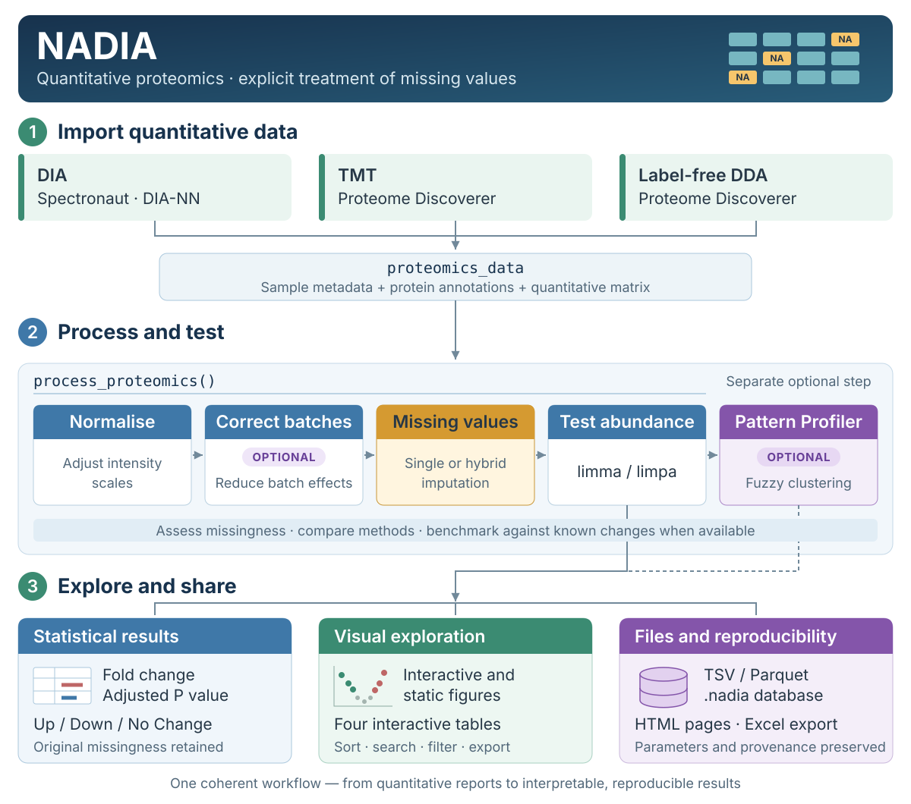

# NADIA 

<div align="justify">

**Missing Value-Aware Differential Abundance Analysis of DIA Proteomics Data**

NADIA provides a complete workflow for the analysis of protein quantification
data from bottom-up proteomics. It starts from quantification reports exported by
Spectronaut, DIA-NN or Proteome Discoverer and produces processed matrices,
differential abundance results, tables and visualisations.

<p><a href="vignettes/figures/nadia-workflow-overview.svg"></a></p>

*NADIA at a glance: a common workflow from quantification reports to interpretable,
reproducible results, with explicit attention to missing values.*

The name NADIA is derived from **Missing Value-Aware Differential Abundance
Analysis of DIA Proteomics Data**, which summarises the package's main purpose:
analysing differential protein abundance while explicitly accounting for missing
values. The name also brings together **NA**, the notation used by R for missing
values, and **DIA**, data-independent acquisition, the proteomics context in which
the package was initially developed. Although NADIA also processes TMT and
label-free DDA data, the assessment and treatment of missing values remain central
to its workflow because they are particularly frequent and consequential in DIA
experiments.

## Why missing values matter

DIA proteomics datasets often contain a substantial proportion of missing
values. These values do not always represent random measurement failures. A
protein may fall below the limit of detection in one condition and be
quantifiable in another, producing precisely the pattern that a differential
abundance analysis sets out to identify.

For this reason, removing every protein that contains missing values may discard
relevant biological signal. Equally, imputing them without considering the likely
mechanism of missingness may attenuate real differences or introduce artificial
ones.

This relationship can be observed in the example dataset included with NADIA. The
table below groups differential-abundance results by the percentage of missing
values within each comparison and their classification as Up, Down or No Change:

| Missing values | Up | Down | No Change |
|---|---|---|---|
| 0% | 795 | 209 | 3761 |
| 1–25% | 90 | 57 | 239 |
| 26–50% | 70 | 619 | 54 |
| > 50% | 30 | 52 | 15 |

*Note*: counts refer to protein group–comparison pairs, not unique proteins.
The same protein group may appear in more than one comparison.

Most results with no missing values are classified as No Change. Among results
with 26–50% missing values, Down classifications are much more frequent than Up
classifications: 619 compared with 70.

This pattern is consistent with abundance-dependent missingness, although it
does not establish the cause of each missing value. When a protein falls below
the detection limit in one condition, missing values can concentrate in the
lower-abundance group.
NADIA is designed to retain, examine and explicitly handle this information,
rather than to remove it or impute it without assessing the consequences.

## What NADIA covers

NADIA covers five main areas, from importing quantification reports to exploring
and exporting reproducible results:

1. *Import and preprocessing* — Reads quantification reports from Spectronaut
   and DIA-NN, as well as TMT and label-free (DDA) experiments processed with
   Proteome Discoverer. Every format is converted into a common
   `proteomics_data` object, so that the rest of the workflow is independent of
   the source software.
2. *Processing and differential abundance* — Offers 13 normalisation methods,
   batch-effect assessment and correction, and 20 individual imputation methods.
   Hybrid imputation strategies handle values assumed to be missing at random
   (MAR) and missing not at random (MNAR) separately. Differential abundance is
   analysed with `limma` or `limpa`.
3. *Method assessment and selection* — Compares normalisation and imputation
   methods using data-derived metrics. Where a known reference
   is available, such as a *spike-in* experiment, NADIA evaluates sensitivity,
   specificity and the recovery of the expected changes, and ranks normalisation
   and imputation combinations using the OpDEA approach.
4. *Results exploration and visualisation* — Produces interactive figures with
   Highcharts, including volcano plots, boxplots, principal component analysis
   (PCA) plots and protein cluster
   profiles. It also produces static figures with ggplot2 and ComplexHeatmap, and
   identifies proteins with similar profiles through fuzzy clustering.
5. *Tables and export* — Presents the results in interactive tables and exports
   the processed matrices, the differential abundance results and the data used
   by the visualisations in formats suited to archiving or further analysis. The
   analysis can also be saved as a single `.nadia` file: a DuckDB database that
   avoids unnecessary duplication and preserves results, parameters and provenance.

## Method choice is not cosmetic

Normalisation and imputation are not merely technical steps. They can
substantially change the outcome of a differential abundance analysis.

The table below compares four normalisation and imputation combinations applied
to the same dataset, using the same statistical model and the same significance
and fold-change thresholds:

| Pipeline | Up | Down | No Change |
|---|---|---|---|
| `cycloess` + `combo` | 985 | 937 | 4069 |
| `cycloess` + `knn` | 872 | 179 | 4940 |
| `quantile` + `combo` | 902 | 2825 | 2264 |
| `log2` + `min` | 761 | 778 | 4452 |

*Note*: counts refer to protein group–comparison pairs; the same protein group
may appear in more than one comparison.

The number of results classified as Down ranges from 179 to 2,825, a roughly
sixteen-fold difference. The total number classified as differentially abundant
also changes considerably: from around 1,050 with `cycloess` + `knn` to more than
3,700 with `quantile` + `combo`.

This variability does not by itself indicate which pipeline is correct. It shows
that the choice of normalisation and imputation method should be assessed on the
data, rather than adopted by convention alone. It also shows why a reproducible
analysis must state which methods and parameters produced the final table:
without that information, two analyses of the same quantification matrix can lead
to very different conclusions.

`vignette("choosing-methods")` shows how to compare the alternatives when no
known reference is available. When the experiment contains a spike-in with
expected changes, `vignette("benchmarking")` evaluates them against that
reference.

## Installation

NADIA requires R 4.6 or later. While the package is under development and not yet
available on Bioconductor, it can be installed from its GitHub repository:

```r
# install.packages("remotes")
remotes::install_github("sciordia/NADIA", build_vignettes = TRUE)
library(NADIA)
```

The mandatory dependencies declared in the `Imports:` field of `DESCRIPTION` are
installed automatically. The dependencies declared in `Suggests:` are only needed
for particular optional functions or methods. `mice`, for instance, is required
when that imputation method is selected, `pROC` computes the AUC and pAUC
benchmarking metrics, and `Mfuzz` is used by the Pattern Profiler.

When an optional dependency is missing, NADIA names the required package and
explains how to install it. All the package dependencies can be checked or
installed through the helper functions included in the repository:

```r
source("install_dependencies.R")         # from a clone of the repository
install_nadia_deps(dry_run = TRUE)       # only report what is missing
install_nadia_deps(optional = FALSE)     # only the essentials
```

Once NADIA is available on Bioconductor, the recommended installation will be:

```r
if (!requireNamespace("BiocManager", quietly = TRUE))
    install.packages("BiocManager")
BiocManager::install("NADIA")
```

### A note on Highcharts licensing

NADIA uses the R package `highcharter`, distributed under the MIT licence, to
generate some of its interactive visualisations. `highcharter` acts as an interface
to the Highcharts JavaScript library, which is distributed under its own
licensing terms.

NADIA's licence neither grants nor implies a licence to use Highcharts. Depending
on the context in which the visualisations are used — personal, educational,
academic, institutional, governmental or commercial — a specific Highcharts
licence may be required. Users should consult the current
[Highsoft terms](https://www.highcharts.com/license) and ensure that their use
complies with the applicable licence.

NADIA's statistical analysis does not depend on producing interactive figures.
The static visualisations produced with ggplot2 and ComplexHeatmap can be used
instead, and the complete workflow can be run without generating a single
Highcharts figure.

## A first analysis

NADIA includes `nadia_dia`, a preprocessed DIA dataset with three conditions,
four replicates per condition and 2,000 protein groups. Approximately 8% of its
intensity measurements are missing.

The example below normalises the data with `cycloess`, applies the hybrid `combo`
imputation strategy and runs the differential abundance analysis with `limma`:

```r
library(NADIA)

# Preprocessed example dataset
data(nadia_dia)

res <- process_proteomics(
    nadia_dia,
    norm_method = "cycloess",
    imp_method  = "combo",
    mar_method  = "Impseqrob",   # Default MAR method for combo
    mnar_method = "min",         # Default MNAR method for combo
    de_method   = "limma"
)

head(res$DEPs_results)
```

Here, `combo` applies a hybrid imputation strategy: `Impseqrob` handles values
classified as MAR, and `min` handles those classified as MNAR. These are the
defaults when `mar_method` and `mnar_method` are omitted; either method can be
changed through its corresponding argument. The imputed matrix is stored in the
`Impseqrob_min` assay.

`process_proteomics()` coordinates the main stages of the analysis and returns a
list containing the processed object, the differential abundance results and the
tables used by the visualisation modules. `res$DEPs_results` holds one row per
protein group and comparison analysed.

The function writes no files unless a directory is given through `export_dir`.

Alongside `logFC`, `P.Value`, `adj.P.Val` and the classification in `Change`, the
results table retains information about the values that were missing before
imputation:

- `MissGlobal` — the percentage of missing values for that protein group across
  all samples, including conditions outside the current comparison.
- `MissComp` — the percentage of missing values across samples in the two
  conditions being compared. It can differ from `MissGlobal` when the experiment
  includes more than two conditions.
- `MissCND1` and `MissCND2` — the percentage of missing values in each of the two
  conditions separately.

These columns help distinguish estimates supported by observed intensities from
those that depend heavily on imputation; they do not establish biological
significance on their own. A protein quantified in only one condition may be
absent from the other or below its detection limit. Its `logFC` and statistical
significance should therefore be interpreted in the context of the imputation
method used.

To start from a Spectronaut quantification report instead, import it with
`preprocess_spectronaut()`. The resulting `prep` object can be passed directly
to the same processing function:

```r
prep <- preprocess_spectronaut(
    system.file("extdata", "nadia_dia_report.tsv.gz", package = "NADIA"),
    condition_order = c("A", "B", "D")
)

res_from_report <- process_proteomics(
    prep,
    norm_method = "cycloess",
    imp_method  = "combo",
    de_method   = "limma"
)
```

## Documentation and suggested reading

NADIA includes nine vignettes documenting the complete workflow and its main
modules. To get started, read `vignette("NADIA")`, which walks through
an analysis from the quantification data to the differential abundance results
and their visualisations.

Use the following guide to find the vignette that addresses your question:

<div class="vignette-guide-table">

| Vignette | Question it answers |
|---|---|
| `NADIA` | How do I run a complete analysis with NADIA? |
| `input-formats` | How do I import DIA, TMT or label-free (DDA) data? |
| `missing-values` | What do the missing values mean and how should I impute them? |
| `choosing-methods` | How do I compare normalisation and imputation methods without a known reference? |
| `benchmarking` | How do I evaluate pipelines when I have a *spike-in* experiment with expected changes? |
| `batch-correction` | How do I detect batch effects, correct them and assess the correction? |
| `pattern-profiler` | How do I identify proteins with similar profiles across conditions? |
| `visualization` | How do I customise the interactive and static figures? |
| `results-and-export` | How do I export, archive and share the analysis results? |

</div>

Every vignette contains executable code and generates its results from the
datasets shipped with the package, so the examples can be reproduced and adapted
to other experiments.

The installed vignettes can be browsed with `browseVignettes("NADIA")`.

## Package architecture

NADIA has a modular architecture. The functions below can be used independently
in a custom workflow or through the main analysis pipeline.

### Import and preprocessing

The preprocessing functions convert the different input formats into a common
structure:

- `preprocess_spectronaut()` handles Spectronaut quantification reports in long
  format.
- `preprocess_diann()` handles wide-format DIA-NN protein-group matrices
  (`report.pg_matrix.tsv`).
- `preprocess_tmt()` handles TMT reports exported by Proteome Discoverer.
- `preprocess_lfq()` handles label-free reports exported by Proteome Discoverer.

For the three wide formats, NADIA reads the experimental design from column
names following the `Abundance: <condition>_<replicate>` convention.
Alternatively, a two-column sample annotation file can be supplied through
`annot_path`.

All four return a `proteomics_data` object with the same basic structure: sample
metadata, protein annotation and the quantification matrix. The later stages
therefore apply in the same way regardless of the source software or
quantification design.

### Main processing

`process_proteomics()` coordinates the central stages of the analysis:

1. normalisation
2. optional batch-effect correction
3. imputation of missing values
4. differential abundance analysis

Pattern Profiler is a separate optional step. It is run afterwards with
`pattern_profiler_analysis()`, which identifies proteins with similar abundance
profiles from the processed object and the differential abundance results.

From normalisation onwards, NADIA stores the data in a `SummarizedExperiment`.
Assays contain quantitative matrices with protein groups in rows and samples in
columns; `rowData` and `colData` store the corresponding protein annotations and
sample metadata. These components remain aligned when the object is subsetted.

Separate assays preserve the input, log-transformed, normalised and imputed
matrices. The function also returns the differential-abundance results and the
tables used by the visualisation modules.

The main stages can be run individually through `normalize_proteomics()`,
`batch_correct_proteomics()`, `impute_proteomics()` and
`de_analysis_proteomics()`.

### Assessment and benchmarking

The assessment modules are separate from the main processing:

- `normalization_metrics()` compares normalisation methods using observable
  properties of the data.
- `imputation_metrics()` evaluates imputation methods by simulating missing
  values.
- `benchmarking_proteomics()` compares one pipeline against the expected changes
  of a *spike-in* experiment.
- `benchmarking_multiple()` ranks multiple normalisation and imputation
  combinations.

### Visualisation and presentation of results

The visualisation functions mainly accept tables and data frames, so they can be
used both with the results of `process_proteomics()` and with results produced
elsewhere.

NADIA provides interactive volcano, boxplot, PCA and cluster-profile figures,
static figures through ggplot2 and ComplexHeatmap, and interactive tables built
on reactable.

## Example data and provenance

The example data shipped with NADIA come from quantitative proteomics experiments
conducted at the Proteomics Facility of the Centro Nacional de Biotecnología
(CNB-CSIC).

The package includes:

- `nadia_dia`, a preprocessed `proteomics_data` object that allows the main
  workflow to be run directly;
- trimmed Spectronaut, DIA-NN, TMT and label-free (DDA) quantification reports,
  stored in `inst/extdata/`, which demonstrate the import and preprocessing
  functions for each format;
- the additional information needed for the *spike-in* benchmarking examples.

All four reports include conditions A, B and D. The Spectronaut, DIA-NN and LFQ
examples contain four replicates per condition. Spectronaut and DIA-NN process
the same twelve DIA injections, allowing the effects of data processing on
missingness to be compared before imputation.

The TMT report comes from a separate experiment with the same three-proteome
spike-in design. It contains eight replicates per condition across two TMT mixes:
replicates 1–4 belong to the first mix, and replicates 5–8 to the second. Four
internal-standard channels link the mixes, providing a real batch structure for
the batch-correction examples.

The distributed reports contain a random subset of 2,000 protein groups drawn
from the full experiments. Random selection, rather than selecting only the most
complete proteins, helps preserve realistic missing-value patterns.

The full experimental datasets are unpublished and are not included in the
package or repository. The script `inst/scripts/make_extdata.R` documents how
the example reports and the `nadia_dia` object were prepared from the original
data.

These data are provided solely to demonstrate, test and reproduce the behaviour
of the package. They should not be treated as reference datasets from which to
draw biological conclusions about the original experiments.

## License

NADIA is free and open-source software distributed under the terms of the GNU
General Public License, version 3 or any later version. The code may be used,
modified and redistributed in accordance with the conditions of that licence. See
the `LICENSE` file and the `License:` field of `DESCRIPTION` for further details.

Copyright © 2025–2026 Sergio Ciordia.

</div>
