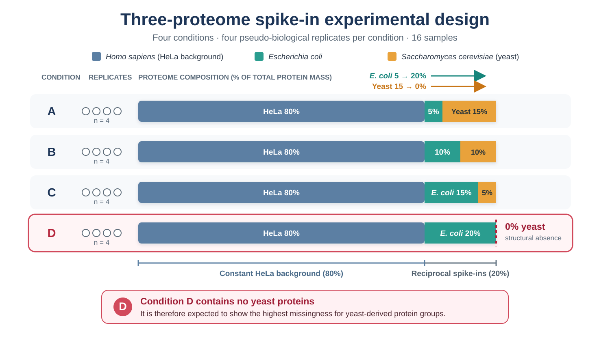
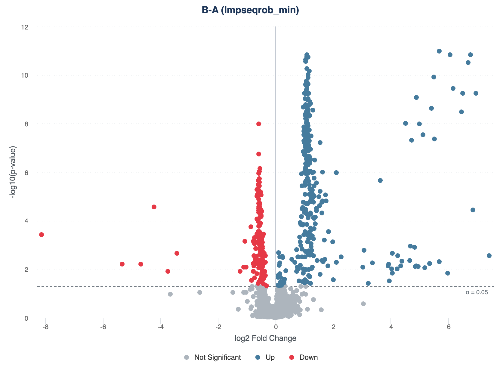

```{r setup, include = FALSE}
knitr::opts_chunk$set(collapse = TRUE, comment = "#>", crop = NULL)
```

<style type="text/css">
.workflow-roadmap table {
  width: calc(100% - 95px);
  margin-left: 65px;
  margin-right: 30px;
  table-layout: fixed;
}
.workflow-roadmap col:nth-child(1) {
  width: 7% !important;
}
.workflow-roadmap col:nth-child(2) {
  width: 56% !important;
}
.workflow-roadmap col:nth-child(3) {
  width: 37% !important;
}
.workflow-roadmap th:first-child,
.workflow-roadmap td:first-child {
  text-align: center !important;
}
@media screen and (max-width: 767px) {
  .workflow-roadmap {
    overflow-x: auto;
  }
  .workflow-roadmap table {
    min-width: 760px;
    width: 760px;
    margin-left: 0;
    margin-right: 0;
  }
}

/* Give the experimental-design figure more room without changing other figures. */
@media screen and (min-width: 992px) {
  #fig\:three-proteome-design + img {
    width: 112% !important;
    max-width: none !important;
    margin-left: -6%;
  }
}
@media screen and (min-width: 1400px) {
  #fig\:three-proteome-design + img {
    width: 124% !important;
    margin-left: -12%;
  }
}
#fig\:three-proteome-design + img.three-proteome-clickable {
  cursor: zoom-in;
}
.figure-zoom-hint {
  margin: -0.15em 0 1.2em;
  text-align: center;
  color: #5f6f7e;
  font-size: 0.9em;
  font-style: italic;
}
#three-proteome-lightbox {
  display: none;
  position: fixed;
  inset: 0;
  z-index: 9999;
  padding: 24px;
  align-items: center;
  justify-content: center;
  background: rgba(15, 25, 35, 0.88);
  cursor: zoom-out;
}
#three-proteome-lightbox.is-open {
  display: flex;
}
#three-proteome-lightbox img {
  width: auto !important;
  height: auto !important;
  max-width: 96vw !important;
  max-height: 92vh !important;
  margin: 0 !important;
  padding: 0 !important;
  background: white;
  box-shadow: 0 6px 30px rgba(0, 0, 0, 0.35);
  cursor: default;
}
#three-proteome-lightbox button {
  position: absolute;
  top: 12px;
  right: 18px;
  border: 0;
  background: transparent;
  color: white;
  font-size: 36px;
  line-height: 1;
  cursor: pointer;
}
.default-call {
  margin: 1em 0 1.25em;
  border: 1px solid #c8d3dc;
  border-radius: 5px;
  background: #f7f9fb;
}
.default-call summary {
  padding: 0.75em 1em;
  color: #1d3557;
  font-weight: 600;
  cursor: pointer;
}
.default-call[open] summary {
  border-bottom: 1px solid #c8d3dc;
}
.default-call pre {
  margin: 1em;
}
</style>

# Introduction

NADIA provides a complete workflow for the analysis of protein quantification
data from bottom-up proteomics. It starts from quantification reports exported by
Spectronaut, DIA-NN or Proteome Discoverer and produces processed matrices,
differential abundance results, tables and visualisations.

The name NADIA is derived from **Missing Value-Aware Differential Abundance
Analysis of DIA Proteomics Data**, which summarises the package's main purpose:
analysing differential protein abundance while explicitly accounting for missing
values. The name also brings together **NA**, the notation used by R for missing
values, and **DIA**, data-independent acquisition, the proteomics context in which
the package was initially developed. Although NADIA also processes TMT and
label-free DDA data, the assessment and treatment of missing values remain central
to its workflow because they are particularly frequent and consequential in DIA
experiments.

These values do not always represent random measurement failures. Some may be
associated with abundances close to or below the limit of detection and may
therefore contain information relevant to differential abundance analysis.
Removing every affected protein may discard biological signal, whereas unsuitable
imputation may attenuate real differences or introduce artificial ones.

For this reason, NADIA treats normalisation and imputation as decisions that
should be evaluated rather than accepted as fixed preprocessing steps. The
package includes 13 normalisation methods and 20 imputation strategies, together
with functions for comparing their performance on the data themselves or against
a known reference.

This vignette provides a complete walkthrough of the workflow using a DIA
experiment: data import, filtering, log2 transformation, normalisation, optional
batch correction, imputation, differential abundance analysis, method assessment,
benchmarking and preparation of the results for downstream interpretation. The
remaining vignettes examine each module in greater detail and can be read
independently.

The suggested route through the documentation follows the order of the NADIA
workflow:

::: {.workflow-roadmap}

| Step | Workflow stage and documentation | Question it answers |
|---:|---|---|
| 1 | Import Spectronaut, DIA-NN, TMT and LFQ data into a common `proteomics_data` object: `vignette("input-formats")` | How do I import DIA, TMT or label-free (DDA) data? |
| 2 | Filter, transform to log2 and select among 13 normalisation options: *Filtering, log2 transformation and normalisation* in this vignette | How are proteins filtered, log2-transformed and normalised? |
| 3 | Optionally diagnose and correct batch effects using PVCA/BERT: `vignette("batch-correction")` | How do I diagnose, correct and verify a batch effect? |
| 4 | Select among 20 imputation options, including `combo`, `softHybrid` and `limpa`: `vignette("missing-values")` | What do the missing values mean and how should I impute them? |
| 5 | Perform differential abundance analysis with `limma` or `limpa`: *Differential abundance results* in this vignette and `vignette("missing-values")` | How do I obtain and interpret differential abundance results? |
| 6 | Assess normalisation and imputation methods: `vignette("choosing-methods")` | How do I compare methods when no known reference is available? |
| 7 | Benchmark complete pipelines against known references or spike-in experiments: `vignette("benchmarking")` | How do I evaluate pipelines using a spike-in experiment? |
| 8 | Run Pattern Profiler with Mfuzz: `vignette("pattern-profiler")` | How do I identify proteins with similar profiles across conditions? |
| 9 | Create Highcharts, ggplot2 and ComplexHeatmap visualisations and interactive `reactable` tables: `vignette("visualization")` and `vignette("results-and-export")` | How do I customise, export and share figures and result tables? |

:::

# Installation

Once NADIA is available on Bioconductor, it can be installed with `BiocManager`:

```{r install, eval = FALSE}
if (!requireNamespace("BiocManager", quietly = TRUE))
    install.packages("BiocManager")
BiocManager::install("NADIA")
```

After installation, the package is loaded into the R session:

```{r library, message = FALSE}
library(NADIA)
```

# Example data

The example datasets used by NADIA originate from a common three-proteome
spike-in experiment. Each sample contains a constant 80% *Homo sapiens* (HeLa)
background and a reciprocal mixture of *Escherichia coli* and *Saccharomyces
cerevisiae* proteins that accounts for the remaining 20%. Across conditions A to
D, the *E. coli* fraction increases from 5% to 20%, whereas the yeast fraction
decreases from 15% to 0%. The complete design comprises four pseudo-biological
replicates per condition, giving 16 samples in total.

```{r three-proteome-design, echo = FALSE, fig.align = "center", out.width = "100%", fig.cap = "Complete three-proteome spike-in design underlying the example datasets. For distribution with NADIA, the datasets retain conditions A, B and D and 2,000 protein groups.", fig.alt = "Three-proteome spike-in experimental design with four conditions and four replicates per condition. HeLa proteins remain at 80 percent in all conditions. Escherichia coli proteins increase from 5 percent in A to 20 percent in D, while yeast proteins decrease from 15 percent in A to zero in D. Condition D therefore contains no yeast proteins and is expected to show the highest missingness for yeast-derived protein groups."}

```

<div class="figure-zoom-hint">Click the figure to enlarge it; press Esc or click outside the image to close it.</div>

<script>
(function () {
  var anchor = document.getElementById("fig:three-proteome-design");
  var source = anchor ? anchor.nextElementSibling : null;
  if (!source || source.tagName !== "IMG") return;

  source.classList.add("three-proteome-clickable");
  source.setAttribute("tabindex", "0");
  source.setAttribute("title", "Click to enlarge the experimental design");

  var lightbox = document.createElement("div");
  lightbox.id = "three-proteome-lightbox";
  lightbox.setAttribute("role", "dialog");
  lightbox.setAttribute("aria-modal", "true");
  lightbox.setAttribute("aria-label", "Enlarged three-proteome experimental design");
  lightbox.setAttribute("aria-hidden", "true");

  var enlarged = source.cloneNode(true);
  enlarged.classList.remove("three-proteome-clickable");
  enlarged.removeAttribute("tabindex");
  enlarged.removeAttribute("title");
  enlarged.removeAttribute("width");

  var closeButton = document.createElement("button");
  closeButton.type = "button";
  closeButton.setAttribute("aria-label", "Close enlarged figure");
  closeButton.textContent = "\u00d7";

  lightbox.appendChild(enlarged);
  lightbox.appendChild(closeButton);
  document.body.appendChild(lightbox);

  function openLightbox() {
    lightbox.classList.add("is-open");
    lightbox.setAttribute("aria-hidden", "false");
    closeButton.focus();
  }
  function closeLightbox() {
    lightbox.classList.remove("is-open");
    lightbox.setAttribute("aria-hidden", "true");
    source.focus();
  }

  source.addEventListener("click", openLightbox);
  source.addEventListener("keydown", function (event) {
    if (event.key === "Enter" || event.key === " ") {
      event.preventDefault();
      openLightbox();
    }
  });
  enlarged.addEventListener("click", function (event) {
    event.stopPropagation();
  });
  closeButton.addEventListener("click", closeLightbox);
  lightbox.addEventListener("click", closeLightbox);
  document.addEventListener("keydown", function (event) {
    if (event.key === "Escape" && lightbox.classList.contains("is-open")) {
      closeLightbox();
    }
  });
}());
</script>

Condition D contains no yeast proteins. This structural absence means that
yeast-derived protein groups are expected to show the greatest proportion of
missing values in D, making this condition particularly informative for
demonstrating NADIA's missing-value-aware filtering, imputation and differential
abundance workflow.

To protect unpublished results from an ongoing study and comply with
Bioconductor package-size constraints, the datasets distributed with NADIA are
reduced to 2,000 protein groups and three representative conditions---A, B and
D---with four replicates per condition. Condition D is deliberately retained
because its absence of yeast proteins provides an informative biological
missingness scenario.

The 2,000 protein groups were selected at random from the full report using a
fixed seed, rather than by retaining the proteins with the highest abundance or
the most complete measurements. This is important because selecting only the
best-quantified proteins would remove much of the missingness that NADIA is
designed to examine. Random selection retains a missing-value structure close
to that of the full experiment, including condition-specific non-detection
patterns. Because selection was also independent of measured intensity, it does
not deliberately enrich the example for high-abundance proteins. The observed
abundance distribution should therefore be regarded as a representative
approximation of the full experiment, although it was not explicitly forced to
match it through stratified sampling.

The reduced DIA dataset used in this vignette was derived from a Spectronaut
quantification report and therefore contains 12 samples and 2,000 protein
groups.

The dataset is available in two forms. The first is a compressed quantification
report, which allows the import and preprocessing steps to be shown from the
beginning:

```{r data}
report <- system.file("extdata", "nadia_dia_report.tsv.gz", package = "NADIA")
dia <- preprocess_spectronaut(report, condition_order = c("A", "B", "D"),
                              verbose = FALSE)
dia
```

`preprocess_spectronaut()` converts the long-format report---one row for each
reported combination of run and protein group---into an object of class
`proteomics_data`.

A `proteomics_data` object separates the information contained in the report into
three coordinated tables:

- `metadata` contains one row per sample or LC-MS run, including the sample
  identifier, experimental condition, replicate, and any available run-level
  information;
- `protein_id` contains identification-level information for each protein group,
  including protein and gene annotations and, when available, run-specific
  evidence such as peptide and precursor counts, sequence coverage, and
  identification scores;
- `protein_quant` contains the protein-level quantification data. It includes the
  abundance measured for each protein group in each sample, together with the
  protein annotation and quantitative evidence required by the downstream
  workflow.

In this example, `metadata` contains 12 samples, whereas `protein_id` and
`protein_quant` each contain 2,000 protein groups.

The three tables have different roles. `metadata` defines the experimental
design, `protein_quant` provides the abundance matrix used for normalisation,
imputation and differential abundance analysis, and `protein_id` retains the more
detailed identification evidence for inspection and reporting.

Here, `condition_order = c("A", "B", "D")` selects the conditions to retain and
sets the order used in the subsequent stages of the analysis.

The same dataset is also distributed as an already preprocessed object, allowing
the remainder of the workflow to be run without reading the report again:

```{r data-obj}
data(nadia_dia)
identical(dim(nadia_dia$protein_quant), dim(dia$protein_quant))
```

`nadia_dia` is the object used throughout the rest of this vignette.

## How missing values are represented

Before processing the data, it is useful to check how missing values are
represented because the encoding depends on the export format.

The Spectronaut report used here is in long format: each row corresponds to a
reported combination of run and protein group. When no quantification is
available for a particular combination, that combination is absent from the
report. When `preprocess_spectronaut()` converts the report into the wide
`protein_quant` matrix, it completes the grid of protein groups and samples and
represents combinations absent from the report as `NA`:

```{r missing}
quant <- as.matrix(nadia_dia$protein_quant[
    grep("^PG.Quantity_", colnames(nadia_dia$protein_quant))])

round(100 * mean(is.na(quant)), 1)          # percentage of missing intensities
round(100 * mean(rowSums(is.na(quant)) == 0), 1)  # complete proteins
```

In the full experiment from which this reduced dataset was obtained, 11,679 of
the 16 × 10,437 possible combinations of samples and protein groups were absent,
corresponding to approximately 7% of the matrix. In `nadia_dia`, around 8% of the
intensities are missing and approximately one quarter of the protein groups
contain at least one missing value.

These missing entries are subsequently handled according to the filtering and
imputation settings selected for the analysis.

Other export formats may encode absence differently. An empty cell may be
converted directly to `NA` during import, and `NaN` is also recognised as missing
by functions such as `is.na()`. Some reports use zero as a marker of absence. In
an intensity matrix, zero requires explicit treatment because `log2(0)` produces
`-Inf` rather than a missing value.

For this reason, `normalize_proteomics()` converts values equal to zero into `NA`
before applying the logarithmic transformation and reports the number of
conversions when `verbose = TRUE`. No conversion is performed for `nadia_dia`
because the example matrix contains no zeros.

At this stage, no assumption is made about whether an individual missing value
should be regarded as MAR or MNAR. `vignette("missing-values")` describes the
working assumptions used by NADIA and explains how missing values are assigned to
the available imputation strategies.

# Filtering, log2 transformation and normalisation

Before imputation and statistical analysis, NADIA prepares the quantitative
matrix in three stages. First, values equal to zero are represented as `NA`, and
proteins are retained according to their presence within the experimental groups.
The filtering criteria are controlled by two arguments in
`process_proteomics()`:

- `min_reps_filter` is the minimum number of quantified replicates that a protein
  must have within a condition for that condition to satisfy the filter. When it
  is `NULL`, NADIA uses half the number of replicates in the smallest condition,
  rounded down. In `nadia_dia`, all conditions contain four replicates, so the
  automatically selected value is two;
- `min_groups_filter` is the minimum number of conditions that must satisfy
  `min_reps_filter`. Its default value is one, meaning that a protein is retained
  if it has sufficient observations in at least one condition.

The effect of the two criteria can be examined without running the later stages
of the workflow. `normalize_proteomics()` exposes the same arguments as
`min_reps` and `min_groups`, respectively. The following code applies several
combinations and records how many of the 2,000 protein groups are retained or
removed:

```{r filtering-combinations}
filter_grid <- expand.grid(
    min_reps_filter   = 1:4,
    min_groups_filter = 1:3
)

filter_counts <- do.call(rbind, lapply(seq_len(nrow(filter_grid)), function(i) {
    filtered <- normalize_proteomics(
        nadia_dia,
        min_reps    = filter_grid$min_reps_filter[i],
        min_groups  = filter_grid$min_groups_filter[i],
        norm_method = "log2",
        verbose     = FALSE
    )$filter_summary

    data.frame(
        min_reps_filter   = filter_grid$min_reps_filter[i],
        min_groups_filter = filter_grid$min_groups_filter[i],
        proteins_before   = filtered$n_total,
        proteins_retained = filtered$n_keep,
        proteins_filtered = filtered$n_drop
    )
}))

filter_counts
```

The default filtering rule for this dataset corresponds to
`min_reps_filter = 2` and `min_groups_filter = 1`: it retains 1,997 of the 2,000
protein groups. Increasing either parameter makes the criterion more stringent.
For example, requiring all four replicates in all three conditions retains 1,444
protein groups and removes 556.

Second, the retained intensities are transformed to the log2 scale. Third, NADIA
applies the method selected through `norm_method`. Thirteen options are available,
including `log2`, which retains the log2-transformed values without additional
normalisation. The untransformed matrix (the `raw` assay), the log2-transformed
matrix and the normalised matrix are kept as separate assays in the resulting
`SummarizedExperiment` whenever they represent distinct processing stages.

The *Normalisation* section of `vignette("choosing-methods")` shows how to run and
compare alternative normalisation methods. A separate optional filter,
`max_na_prop`, can remove proteins with a high overall proportion of missing
values immediately before imputation; it is disabled by default and is
documented in `?impute_proteomics`.

# Imputation of missing values

Normalisation makes sample distributions more comparable, but it does not replace
the values that remain missing. By default, NADIA therefore applies an imputation
stage to the normalised matrix. Imputation estimates plausible values for missing
entries from the observed data or from a model of the missingness mechanism.
These estimates allow the subsequent analysis to use a complete matrix, but they
are not new measurements and should not be interpreted as the unknown true
values.

NADIA provides 20 selectable imputation strategies through `imp_method`. They
include methods designed for MAR or MNAR values, the hybrid `combo` and
`softHybrid` strategies, and `none`, which leaves missing values unchanged. The
new `halfmin` option implements half-minimum imputation: each missing intensity is
replaced with half the global observed minimum across all runs. The `limpa` route
also avoids filling the missing entries and instead accounts for them in its
probabilistic differential abundance model.

Each imputed result is stored as a new assay without overwriting the normalised
matrix from which it was generated. `vignette("missing-values")` describes the
assumptions behind all available methods, explains how `combo` and `softHybrid`
assign missing values to different branches, and shows how the choice of strategy
can affect the differential abundance results.

# The workflow in a single call

`process_proteomics()` coordinates the main stages of the analysis: filtering,
log2 transformation, normalisation, optional batch-effect correction, imputation
of missing values, and differential abundance analysis. The function returns in
memory the objects and tables required to inspect, visualise and export the
results.

The concise syntax does not, however, represent a parameter-free analysis. Every
omitted argument is assigned either a fixed default or a value resolved from the
data or the selected method. Using the short call therefore means accepting the
following principal analytical choices:

| Stage | Default choice | Where it is explained |
|---|---|---|
| Filtering | `min_reps_filter = NULL` is resolved automatically (two replicates for this dataset), and `min_groups_filter = 1` requires the criterion in at least one condition | *Filtering, log2 transformation and normalisation* above |
| Normalisation | `cycloess`, using the fast algorithm, three iterations and a span of 0.7 | *Filtering, log2 transformation and normalisation* above and the *Normalisation* section of `vignette("choosing-methods")` |
| Batch correction | Not applied (`batch_correct = FALSE`) | `vignette("batch-correction")` |
| Imputation | `combo`, using `Impseqrob` for the MAR branch and `min` for the MNAR branch | *Imputation of missing values* above and `vignette("missing-values")` |
| Differential abundance | All pairwise comparisons with `limma`; `alpha = 0.05` and no additional log2 fold-change threshold | *Differential abundance results* below |
| Covariates and blocking | No additional covariates, paired design or biological-replicate blocking | `vignette("batch-correction")` |
| File export | No files are written because `export_dir = NULL`; all results remain available in memory | `vignette("results-and-export")` |

The complete call is shown below for transparency. Arguments that belong to an
inactive branch, such as the batch-correction settings when
`batch_correct = FALSE`, are still displayed so that the configuration can be
inspected in full.

<details class="default-call">
<summary>Show the complete call and all default arguments</summary>

```{r process-defaults, eval = FALSE}
res <- process_proteomics(
    preprocessing = nadia_dia,

    # File export
    export_dir = NULL,

    # Filtering
    min_reps_filter = NULL,
    min_groups_filter = 1,

    # Normalisation
    norm_method = "cycloess",
    cyclic_loess_method = "fast",
    cyclic_loess_iterations = 3,
    cyclic_loess_span = 0.7,

    # Optional batch correction
    batch_correct = FALSE,
    batch_column = "Batch",
    batch_algorithm = "ComBat",
    batch_ComBat_mode = 1,
    batch_covariates = NULL,
    batch_qualitycontrol = FALSE,

    # Imputation
    imp_method = "combo",
    mar_method = "Impseqrob",
    mnar_method = "min",
    prop_na_mnar = 0.51,
    prop_present_mar = 0.5,
    min_present_mar = 1,
    require_n_conditions = 1,
    max_na_prop = NULL,
    method_args = list(),
    with_value = NA_real_,

    # Differential abundance
    comparisons = NULL,
    control = NULL,
    logFC_threshold = 0,
    alpha = 0.05,
    eBayes_trend = NULL,
    eBayes_robust = NULL,
    de_method = "limma",

    # Covariates, paired designs and blocking
    covariate_df = NULL,
    covariate_column = NULL,
    bio_replicate_column = NULL,

    # Exported objects (used only when export_dir is supplied)
    export_normalized = TRUE,
    export_imputed = TRUE,
    export_format = "tsv",
    export_volcano = TRUE,
    export_boxplot = TRUE,
    export_pca = TRUE,

    # Progress messages
    verbose = TRUE
)
```

</details>

Accepting this configuration allows the complete analytical workflow to be
reduced to a single line. In the executable call below, `verbose = FALSE` is used
only to suppress progress messages in the vignette; its default is `TRUE`, and
changing it does not affect the analysis.

```{r process}
res <- process_proteomics(nadia_dia, verbose = FALSE)
res
```

For `de_method = "limma"`, the unresolved `eBayes_trend = NULL` and
`eBayes_robust = NULL` settings are both resolved to `TRUE`. Similarly,
`comparisons = NULL` and `control = NULL` request all pairwise comparisons among
the retained conditions.

These defaults provide a reasonable starting point, but they are not a
universally optimal choice. `vignette("choosing-methods")` shows how to compare
the alternatives on the data themselves, while `vignette("missing-values")`
explains the assumptions underlying the available imputation strategies.

## Where the processed data are stored

During processing, NADIA stores the quantitative matrices in a
`SummarizedExperiment`, the standard Bioconductor container for matrix-like omics
data. This object retains the input, log2-transformed and normalised matrices and,
when the corresponding stages are applied, the batch-corrected and imputed
matrices. Each matrix is stored as a separate assay, so the object contains both
the intermediate processing stages and the normalised-and-imputed matrix used for
downstream differential abundance analysis.

A `SummarizedExperiment` keeps three coordinated components:

- `assays` contain one or more quantitative matrices of identical shape, with
  protein groups in rows and samples in columns;
- `rowData` contains one row of annotation for each protein group;
- `colData` contains one row of metadata for each sample, including the
  experimental condition and replicate used to define the design.

```{r summarizedexperiment-schema, echo = FALSE, fig.align = "center", out.width = "82%", fig.cap = "Structure of a SummarizedExperiment object.", fig.alt = "Diagram of a SummarizedExperiment showing one or more assay matrices coordinated with rowData for feature annotations and colData for sample metadata."}
knitr::include_graphics("figures/SummarizedExperiment_Schema.svg")
```

*Figure reproduced from the
[SummarizedExperiment source repository](https://github.com/Bioconductor/SummarizedExperiment/blob/devel/vignettes/SE.svg),
distributed under the Artistic-2.0 licence.*

These components share the same row and column indexing. Consequently, subsetting
the object also subsets the corresponding protein annotation and sample metadata,
preventing quantitative values from becoming misaligned with their identifiers or
experimental groups.

During processing, the sample information required for the experimental design is
stored in `colData`, the protein-group annotation required downstream is stored in
`rowData`, and every quantitative stage is retained as a separate assay. The
detailed `protein_id` table remains part of the original `proteomics_data` object
and can be inspected separately when identification-level information is
required.

The processed object is available as `res$se_proc`:

```{r assays}
SummarizedExperiment::assayNames(res$se_proc)
```

In this analysis, the assays correspond to successive stages of the workflow:

- `raw`, the input quantification matrix;
- `log2`, the matrix after log2 transformation;
- `cycloess`, the normalised matrix;
- `Impseqrob_min`, the matrix after the hybrid imputation.

The `Impseqrob_min` assay is the complete quantitative matrix obtained after the
successive normalisation and imputation stages. In this analysis, it contains the
intensities normalised with `cycloess`, with the remaining missing values filled
by the default `combo` strategy: `Impseqrob` for values assigned to the MAR branch
and `min` for values assigned to the MNAR branch. Thus, the data in
`Impseqrob_min` are both normalised and imputed, and this is the matrix used as
input for the subsequent differential abundance analysis. The assay name records
the two imputation methods, although complete reproducibility also requires
recording the normalisation method, the function arguments and the NADIA version.

# Differential abundance results

`res$DEPs_results` holds the main table of the differential abundance analysis:

```{r deps}
head(res$DEPs_results, 4)
```

Each row corresponds to a combination of protein group and comparison. The same
protein group may therefore appear in several rows if it takes part in more than
one comparison.

The pairwise comparisons are built automatically from the conditions and the
order defined during preprocessing:

```{r contrasts}
res$comparisons
table(res$DEPs_results$Change, res$DEPs_results$Comparison)
```

The `Change` column classifies each result as `Up`, `Down` or `No Change` by
applying the thresholds specified through `alpha` and `logFC_threshold` together:

- `Up`: `adj.P.Val < alpha` and a positive logFC, with
  `logFC >= logFC_threshold`;
- `Down`: `adj.P.Val < alpha` and a negative logFC, with
  `logFC <= -logFC_threshold`;
- `No Change`: does not satisfy both the adjusted-p-value and logFC criteria.

Here, `alpha` is the significance threshold applied to the adjusted p-value
stored in `adj.P.Val`; it is not the adjusted p-value itself. With the default
`alpha = 0.05`, a result must have `adj.P.Val < 0.05` to be classified as
significant. The unadjusted p-value remains available in `P.Value`, but it is not
used to assign the default `Change` label.

The default `logFC_threshold = 0` does not impose an additional minimum
effect-size requirement. Consequently, a significant result with `logFC > 0` is
classified as `Up`, whereas one with `logFC < 0` is classified as `Down`. Setting
a positive threshold would require the logFC to be at least that value for `Up`
or at most its negative value for `Down`.

`Change` is an interpretive label, not an additional statistical test. The
underlying evidence remains in `logFC`, `P.Value` and `adj.P.Val`, and those
values should be consulted whenever the magnitude and the uncertainty of a result
need to be interpreted.

## Relationship with the missing values

When imputation has been applied, the statistical result must be interpreted
together with the information about the values that were missing before that
stage.

NADIA keeps four columns, which go from the widest scope to the narrowest:

- `MissGlobal`, the percentage of missing values of the protein group across
  every sample in the experiment, including the conditions that take no part in
  the comparison. It therefore does not depend on the comparison: a given
  protein group carries the same value in all of them.
- `MissComp`, the percentage across the replicates of the two conditions being
  compared, and only those. This is the figure that describes the evidence
  actually available for that contrast.
- `MissCND1` and `MissCND2`, the percentages in each of the two conditions
  separately. In a `B-A` comparison, `MissCND1` corresponds to the numerator
  (B) and `MissCND2` to the denominator (A).

The distinction between the first two matters as soon as an experiment has more
than two conditions, as this one does. `MissGlobal` is a property of the protein
group in the experiment, so it does not move from one comparison to the next;
`MissComp` does, because the replicates it counts change with the contrast. A
protein group that is missing in a single replicate of D shows both behaviours at
once:

```{r missing-scope}
pid <- with(res$DEPs_results, Protein.IDs[MissGlobal != MissComp][1])
subset(res$DEPs_results, Protein.IDs == pid,
       c("Comparison", "MissGlobal", "MissComp", "MissCND1", "MissCND2"))
```

`MissGlobal` describes how well the protein group is covered in the experiment
as a whole, which is useful for deciding how much to trust it at all.
`MissComp` and the two per-condition columns describe the support behind one
particular contrast. None of them determines whether a change is biologically
real, but together they distinguish estimates based mainly on measured
intensities from estimates that depend largely on imputed values.

The relationship between missingness and the differential call can be summarised
directly. `MissComp` is the right column here, because what is being related to
the call is the evidence available for that particular contrast:

```{r missing-cols}
bins <- cut(res$DEPs_results$MissComp, c(-1, 0, 25, 50, 100),
            labels = c("0%", "1-25%", "26-50%", ">50%"))
table(missing = bins, res$DEPs_results$Change)
```

In this example dataset, most results with no missing values are called
`No Change`. Among results with 26–50 % missing values, by contrast, there is a
marked asymmetry: 619 are called `Down` against 70 called `Up`.

This pattern does not prove that all those missing values are MNAR, but it is
consistent with a substantial abundance-dependent component of missingness. When
a protein group stops being quantified in one condition, values imputed from the
lower end of the distribution can produce a large negative change.

Interpretation must always be made in the context of the missingness pattern and
the imputation method used.

## Detection and non-detection patterns between conditions

The most extreme case occurs when a protein group is not quantified in any
replicate of one condition but is quantified in every replicate of the other:

```{r onoff}
onoff <- subset(res$DEPs_results,
                (MissCND1 == 100 & MissCND2 == 0) |
                (MissCND1 == 0   & MissCND2 == 100))
nrow(onoff)
head(onoff[, c("Protein.IDs", "Comparison", "logFC", "adj.P.Val",
               "MissCND1", "MissCND2")], 4)
```

Roughly 500 results in this analysis have 100 % missing values in one group and
0 % in the other. These are detection versus non-detection patterns between
conditions. They may represent biologically relevant changes, but they
require a different interpretation from a ratio calculated entirely from
observed intensities.

A logFC of around −11, for example, should not be interpreted as a directly measured
abundance ratio. Its magnitude depends largely on the value introduced by the
MNAR method, and it states that one condition lies below the quantifiable range
relative to the other.

The `MissCND1` and `MissCND2` columns make this distinction visible. In contrast,
the p-value alone says nothing about how many observations were measured and how
many were imputed. `vignette("missing-values")` develops this distinction and
explains how the different imputation strategies affect these results.

# Visualising the results

`process_proteomics()` prepares three tables that can be used directly by the
visualisation modules:

- `res$DEPs_results`, for the *volcano plots*;
- `res$BoxPlot_Input`, to compare the sample distributions across the different
  assays;
- `res$PCA_Input`, for PCA and heatmaps.

The visualisation functions take these tables rather than the complete
`SummarizedExperiment`, which means they can also be applied to results that have
been modified or produced by other workflows, provided they keep the expected
structure.

## Interactive figures

NADIA produces interactive volcano plots, boxplots and PCA projections through
Highcharts. Each function returns a named list whose elements correspond —
depending on the module — to comparisons, assays or protein selection modes:

```{r hc, eval = FALSE}
volcano <- volcano_highchart_list(res$DEPs_results)
boxplot <- boxplot_highchart_list(res$BoxPlot_Input)
pca     <- pca_highchart_list(res$PCA_Input)

volcano[["B-A"]]
```

`volcano[["B-A"]]`, for example, selects the volcano plot for the `B-A`
comparison.

The following static image provides a preview of that interactive volcano plot
for the `B-A` comparison. It shows the results obtained from the matrix
normalised with `cycloess` and imputed with the default `Impseqrob_min` strategy:

```{r volcano-ba-static, echo = FALSE, fig.align = "center", out.width = "95%", fig.cap = "Static preview of the interactive volcano plot for the B-A comparison using the cycloess-normalised and Impseqrob_min-imputed matrix.", fig.alt = "Volcano plot for the B-A comparison. The horizontal axis shows log2 fold change and the vertical axis shows minus log10 p-value; significant up-regulated proteins are blue, significant down-regulated proteins are red, and non-significant proteins are grey."}

```

The interactive figures themselves are not rendered in this vignette, to keep
the document small.
`vignette("visualization")` shows interactive versions of the three modules and explains
their main customisation options. `vignette("results-and-export")` describes how
to save each widget as an HTML file.

All three take their input from `res`, so they can equally be built from a saved
analysis: `write_nadia()` puts the whole thing — tables, parameters and
provenance — into one file, and `nadia_result()` gives back an object these
functions accept unchanged. See `vignette("results-and-export")`.

## Static figure

`proteomics_heatmap()` generates a static heatmap from `res$PCA_Input` and can
also select which protein groups to display.

In the following example, `mode = "target"` restricts the figure to protein groups
that are significant in the comparison specified by `comparison`:

```{r heatmap, message = FALSE, warning = FALSE, fig.width = 6.5, fig.height = 5.5, fig.alt = "Heatmap of the proteins significant in the B-A comparison"}
hm <- proteomics_heatmap(
    res$PCA_Input,
    mode            = "target",
    comparison      = "B-A",
    scale_data      = "row",
    sample_order    = "condition",
    condition_order = c("A", "B", "D"),
    show_row_names  = FALSE,
    heatmap_title   = "Significant in B-A")
hm
```

The figure uses the following options:

- `comparison = "B-A"` selects the comparison of interest;
- `scale_data = "row"` standardises the profile of each protein group separately,
  so that colour represents relative changes between samples rather than
  differences in absolute abundance between proteins;
- `sample_order = "condition"` groups the samples by condition;
- `condition_order = c("A", "B", "D")` sets the order of those conditions
  explicitly;
- `show_row_names = FALSE` hides the identifiers, which would otherwise be
  illegible when many rows are drawn.

The heatmap therefore shows the relative patterns of the selected protein groups
across the A, B and D samples. It should not be interpreted as a map of absolute
protein abundances.

Further options for selection, clustering, ordering and customisation are
described in `vignette("visualization")`.

# Next steps

This vignette has shown the complete workflow using NADIA's default
configuration. Those defaults provide a reproducible starting point, but they
should not be interpreted as the best choice for every dataset.

One of the decisions with the greatest effect on the final results table is the
choice of normalisation and imputation methods. `vignette("missing-values")`
explains the assumptions underlying the available strategies, whereas
`vignette("choosing-methods")` shows how to compare them when no known reference
is available. When the experiment contains a spike-in,
`vignette("benchmarking")` evaluates them against the expected changes.

To import your own data, adjust figures or export the results, see the vignettes
linked in the introduction.

# Session information

```{r session}
sessionInfo()
```
