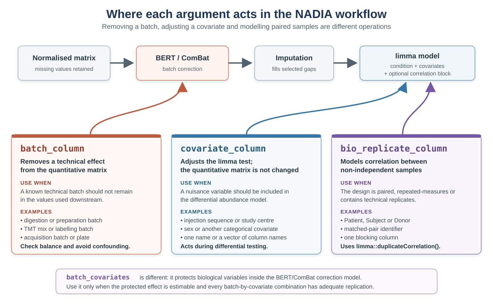
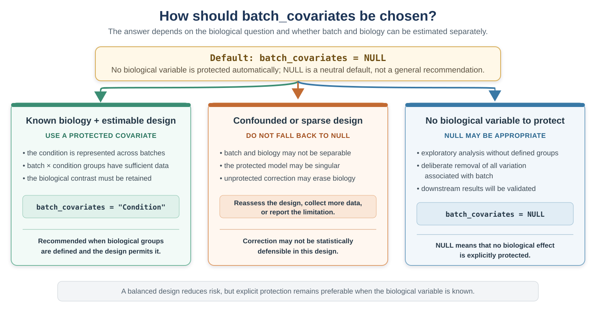

```{r setup, include = FALSE}
knitr::opts_chunk$set(collapse = TRUE, comment = "#>", crop = NULL,
                      dev = "svg")
```

<style>
.bert-warning {
  width: calc(100% - 4.5em);
  box-sizing: border-box;
  margin: 1.15em 0 1.5em;
  padding: 0.9em 1.1em;
  border: 1px solid #e4c78e;
  border-left: 5px solid #c98718;
  border-radius: 5px;
  background: #fffaf0;
  box-shadow: 0 1px 2px rgba(112, 78, 20, 0.08);
}
.bert-warning p {
  margin: 0;
  padding: 0 !important;
  text-align: justify;
}
.bert-warning strong:first-child {
  color: #7a5310;
}
.batch-argument-table {
  width: calc(100% + 3em);
  margin: 1em 0 1.35em -1.5em;
}
.batch-argument-table table {
  width: 100% !important;
  table-layout: fixed;
}
.batch-argument-table col:first-child {
  width: 29% !important;
}
.batch-argument-table col:nth-child(2) {
  width: 71% !important;
}
.batch-argument-table th:first-child,
.batch-argument-table td:first-child {
  width: 29%;
  padding-right: 1.25em !important;
}
.batch-argument-table th:nth-child(2),
.batch-argument-table td:nth-child(2) {
  width: 71%;
  padding-left: 1.25em !important;
}
.batch-argument-table th,
.batch-argument-table td {
  vertical-align: top;
}
.lightbox-figure {
  width: calc(100% - 1em);
  margin: 1.25em 0 1.5em;
  text-align: center;
}
.lightbox-figure img {
  width: 100%;
  height: auto;
  cursor: zoom-in;
}
#diagram-lightbox {
  display: none;
  position: fixed;
  z-index: 9999;
  inset: 0;
  align-items: center;
  justify-content: center;
  padding: 2vh 2vw;
  background: rgba(10, 18, 25, 0.9);
}
#diagram-lightbox.is-open {
  display: flex;
}
#diagram-lightbox p {
  display: flex;
  align-items: center;
  justify-content: center;
  margin: 0;
}
#diagram-lightbox img {
  max-width: 96vw;
  max-height: 94vh;
  padding: 0.4em;
  background: #ffffff;
  box-shadow: 0 6px 30px rgba(0, 0, 0, 0.35);
  cursor: default;
}
#diagram-lightbox button {
  position: absolute;
  top: 12px;
  right: 18px;
  border: 0;
  background: transparent;
  color: #ffffff;
  font-size: 36px;
  line-height: 1;
  cursor: pointer;
}
body.diagram-lightbox-open {
  overflow: hidden;
}
</style>

# Introduction

Samples prepared on different days, labelled in different batches or acquired in
different run sequences may contain systematic technical differences. Batch
correction aims to remove this unwanted variation while retaining the biological
signal. If the experimental design is confounded or the correction is applied
without adequate checks, biological variation may also be removed.

This vignette therefore follows a simple rule: **diagnose before correcting and
verify afterwards**. It also clarifies the difference between removing a batch
effect from the quantitative matrix and adjusting for a covariate in the
differential abundance model. Finally, it shows why a substantial batch effect
may be missed by the default variance decomposition when that effect is captured
by later principal components.

# Installation

```{r install, eval = FALSE}
if (!requireNamespace("BiocManager", quietly = TRUE))
    install.packages("BiocManager")
BiocManager::install("NADIA")
```

```{r library, message = FALSE}
library(NADIA)
data(nadia_dia)
```

Batch correction needs `BERT` and the variance decomposition needs `lme4`; both
are optional dependencies:

```{r deps}
have_bert <- requireNamespace("BERT", quietly = TRUE)
have_lme4 <- requireNamespace("lme4", quietly = TRUE)
c(BERT = have_bert, lme4 = have_lme4)
```

```{r flags, include = FALSE}
run_bc  <- have_bert
run_all <- have_bert && have_lme4
```

# The sample annotation

The example dataset does not contain a recorded batch variable. To demonstrate
the workflow, we create a hypothetical sample annotation with two digestion
days, two injection sequences and four subjects. These variables are arranged so
that each condition is represented at every level of the technical factors.

In a real analysis, these variables should come from the experimental sample
sheet rather than being inferred from the quantitative values. The `Column`
field must match the sample identifiers used by the pipeline:

```{r covariates}
md <- nadia_dia$metadata

covariates <- data.frame(
    Column    = md$Coding,
    Digestion = rep(c("d1", "d2"),             length.out = nrow(md)),
    Injection = rep(c("i1", "i1", "i2", "i2"), length.out = nrow(md)),
    Subject   = rep(paste0("s", 1:4),          length.out = nrow(md)),
    stringsAsFactors = FALSE)

covariates
```

## A simulated batch effect

The annotation defines the groups but does not create a batch effect. We
therefore **introduce a simulated effect** so that its removal can be evaluated
against a known starting point.

The simulated effect is deliberately protein-dependent: in the second digestion
batch, half of the proteins are multiplied by six and the remainder by one
sixth. A uniform shift affecting every protein similarly may be largely removed
by normalisation, whereas protein-specific technical effects can remain and may
require explicit batch correction.

The six-fold change is intentionally large. The biological conditions in this
dataset are already strongly separated, and a smaller simulated batch effect
would be difficult to see in the diagnostic figures. Its magnitude is chosen for
illustration and should not be interpreted as a typical batch effect.

```{r inject}
batched <- nadia_dia
qcols   <- grep("^PG.Quantity_", colnames(batched$protein_quant))
samples <- sub("^PG.Quantity_", "", colnames(batched$protein_quant)[qcols])
d2_cols <- qcols[samples %in% covariates$Column[covariates$Digestion == "d2"]]

set.seed(1)
up     <- sample(c(TRUE, FALSE), nrow(batched$protein_quant), replace = TRUE)
batch_multiplier <- ifelse(up, 6, 1 / 6)
batched$protein_quant[, d2_cols] <-
    batched$protein_quant[, d2_cols] * batch_multiplier

length(d2_cols)   # the six samples digested on day 2
```

All subsequent results are calculated from this modified dataset.

# Step 1: is the design suitable for batch correction?

Before choosing a correction model, cross-tabulate the biological and technical
factors and count the samples in each combination:

```{r design}
table(Digestion = covariates$Digestion, Injection = covariates$Injection)
table(Condition = md$R.Condition,       Digestion = covariates$Digestion)
```

Both tables are complete: every digestion day contains both injection sequences,
and every condition occurs on both digestion days. The design therefore provides
information with which to distinguish the simulated digestion effect from the
biological conditions.

If a condition occurred in only one digestion batch, condition and batch would
be **completely confounded**. Their effects could not be estimated separately:
the correction might fail, or it might remove part of the biological difference
with the batch effect. These tables are therefore an essential first diagnostic,
although they should be followed by the post-correction checks shown below.

::: {.bert-warning}
**Minimum replication required by BERT.** BERT requires at least two samples in
every batch. When `batch_covariates` are supplied, this requirement applies to
each combination of batch and protected-covariate levels. In addition, a protein
must have at least two non-missing quantitative values within each of these
combinations for BERT to estimate its correction. Insufficient replication can
make individual proteins unadjustable and, when it affects many proteins, may
prevent the batch-correction model from being fitted.
:::

# Step 2: how much variance does the batch explain?

Before correcting the batch effect, we first process the modified dataset with
batch correction disabled. This provides the normalised and imputed assay that
will serve as the uncorrected reference. We can then use `pvca_analysis()` to
estimate how much of its variation is associated with the biological condition
and how much is associated with the digestion and injection factors.

```{r process, eval = run_bc}
res <- process_proteomics(batched, covariate_df = covariates, verbose = FALSE)
```

`pvca_analysis()` uses the selected principal components to estimate the share of
variation associated with the specified biological and technical factors. With
the default settings, it reports the following result:

```{r pvca-default, eval = run_all, message = FALSE, warning = FALSE}
pvca_default <- pvca_analysis(
    res$se_proc,
    assay_name         = "Impseqrob_min",
    technical_factors  = c("Digestion", "Injection"),
    biological_factors = "Condition",
    verbose            = FALSE)

pvca_default$variance_components
```

Condition accounts for almost all of the reported variation, while digestion is
absent from the table. This is surprising because the simulated digestion effect
is known to be present.

## Why the default hides it, and what to do

`pca_threshold` determines how many principal components are included: components
are retained until their cumulative explained variance reaches the selected
threshold, which is 60% by default. In this experiment, the biological conditions
are strongly separated and PC1 alone exceeds 60%. The simulated digestion effect
is represented by later components, which are excluded from the default
decomposition.

Raise the threshold and it appears:

```{r pvca-before, eval = run_all, message = FALSE, warning = FALSE}
pvca_before <- pvca_analysis(
    res$se_proc,
    assay_name         = "Impseqrob_min",
    technical_factors  = c("Digestion", "Injection"),
    biological_factors = "Condition",
    pca_threshold      = 0.95,
    variance_threshold = 0,
    verbose            = FALSE)

pvca_before$variance_components
```

After increasing the threshold, digestion accounts for **27.4%** of the weighted
variation and condition for **70.2%**. The batch effect does not need to dominate
the dataset to influence the downstream analysis. These proportions describe
how the retained components are partitioned; they do not define a universal
threshold above which correction is required.

A decomposition that reports no technical contribution is therefore not, by
itself, evidence that the data contain no technical structure. Always check how
many principal components were retained and whether later components contain a
recognisable batch pattern.

```{r pvca-before-plot, eval = run_all, message = FALSE, warning = FALSE, fig.width = 7, fig.height = 4.5, fig.cap = "PVCA before correction, using enough principal components to explain 95% of the variance.", fig.alt = "Variance decomposition before batch correction"}
pvca_before$plot
```

# Step 3: correct, and keep the biology

Batch correction is optional and is disabled by default. To apply it within
`process_proteomics()`, set `batch_correct = TRUE` and use `batch_column` to
identify the technical factor that should be removed. Two related arguments,
`covariate_column` and `bio_replicate_column`, describe variables that should be
modelled during differential abundance analysis rather than removed from the
quantitative matrix. The three arguments therefore have distinct roles and
should be defined according to the experimental design:

::: {.batch-argument-table}
| Argument | Effect |
|---|---|
| `batch_column` | identifies the technical factor to be **removed from the quantitative matrix** |
| `covariate_column` | adds one or more variables to the **limma differential abundance model** |
| `bio_replicate_column` | defines a **blocking factor** for samples that are not independent |
:::

Here, `batch_column = "Digestion"` asks BERT/ComBat to estimate and remove the
digestion-day effect. By contrast, `covariate_column = "Injection"` does not
alter the quantitative matrix: it includes injection sequence as a term in the
subsequent limma model. Finally, `bio_replicate_column = "Subject"` uses
`limma::duplicateCorrelation()` to account for the correlation between samples
from the same subject rather than treating all samples as independent.

The diagram below places the three arguments in the complete workflow and shows
typical variables that can be supplied to each one. Click the figure to enlarge
it.

::: {.batch-arguments-figure .lightbox-figure}
```{r batch-arguments-diagram, echo = FALSE, out.width = "100%", fig.cap = "The three arguments act at different stages: batch_column modifies the quantitative matrix, whereas covariate_column and bio_replicate_column act during differential abundance analysis.", fig.alt = "Workflow diagram comparing batch_column, covariate_column and bio_replicate_column. Batch_column removes a technical effect from the normalised matrix before imputation. Covariate_column adds nuisance variables to the limma model without changing the matrix. Bio_replicate_column models correlation between paired, repeated or technical replicate samples."}

```
:::

<div id="diagram-lightbox" role="dialog" aria-modal="true" aria-label="Enlarged diagram">
<button type="button" aria-label="Close enlarged diagram">&times;</button>

</div>

<script>
(function () {
  function initialiseDiagramLightbox() {
    var figures = document.querySelectorAll('.lightbox-figure img');
    var lightbox = document.getElementById('diagram-lightbox');
    if (!figures.length || !lightbox) return;
    var enlarged = lightbox.querySelector('img');
    var closeButton = lightbox.querySelector('button');
    function closeLightbox() {
      lightbox.classList.remove('is-open');
      document.body.classList.remove('diagram-lightbox-open');
    }
    figures.forEach(function (figure) {
      figure.addEventListener('click', function () {
        enlarged.src = figure.src;
        enlarged.alt = figure.alt || 'Enlarged diagram';
        lightbox.classList.add('is-open');
        document.body.classList.add('diagram-lightbox-open');
        closeButton.focus();
      });
    });
    closeButton.addEventListener('click', closeLightbox);
    lightbox.addEventListener('click', function (event) {
      if (event.target === lightbox) closeLightbox();
    });
    document.addEventListener('keydown', function (event) {
      if (event.key === 'Escape') closeLightbox();
    });
  }
  if (document.readyState === 'loading') {
    document.addEventListener('DOMContentLoaded', initialiseDiagramLightbox);
  } else {
    initialiseDiagramLightbox();
  }
})();
</script>

```{r correct, eval = run_bc, message = FALSE, warning = FALSE, results = "hide"}
res_bc <- process_proteomics(
    batched,
    covariate_df         = covariates,
    batch_correct        = TRUE,
    batch_column         = "Digestion",
    batch_algorithm      = "ComBat",
    batch_ComBat_mode    = 1,
    covariate_column     = "Injection",
    bio_replicate_column = "Subject",
    verbose              = FALSE)
```

```{r correct-assays, eval = run_bc}
SummarizedExperiment::assayNames(res_bc$se_proc)
```

Note where the new `BERT` assay sits: after `cycloess`, before the imputed
matrix. Correction runs on the normalised data, and imputation then runs on its
output.

## Protecting a variable inside ComBat

`batch_column` tells BERT/ComBat **which technical grouping should be removed**.
`batch_covariates` tells it **which biological groupings should be protected
while that correction is estimated**. For example, using
`batch_column = "Batch"` together with `batch_covariates = "Condition"` asks the
model to remove differences between batches without treating condition-related
variation as part of the batch effect.

This still differs from `covariate_column`. A protected `batch_covariates`
variable enters the BERT/ComBat model and influences the corrected matrix.
`covariate_column`, by contrast, is used later in the limma model and never
changes that matrix. For this reason, `batch_correct_proteomics()` warns when
ComBat or limma correction is requested without a protected covariate.

::: {.bert-warning}
**The default does not imply the recommended choice.**
`batch_covariates = NULL` is the default because NADIA cannot determine
automatically which metadata variable represents the biological signal that
should be preserved. In most experiments with a known biological grouping and
sufficient replication, that variable should be supplied explicitly. NADIA
therefore warns when ComBat or limma correction is performed without a
protected covariate.
:::

The appropriate choice depends on both the biological question and the design.
The following guide summarises when a protected covariate should be supplied,
when `NULL` may be reasonable, and when the design should be reconsidered rather
than forcing an unprotected correction. Click the figure to enlarge it.

::: {.batch-covariates-figure .lightbox-figure}
```{r batch-covariates-decision, echo = FALSE, out.width = "100%", fig.cap = "Choosing batch_covariates. A known biological variable should normally be protected when batch and biology can be estimated separately. NULL is not a remedy for confounding or insufficient replication.", fig.alt = "Decision guide for batch_covariates. Use a protected covariate for a known biological variable when the design is estimable. Reassess the design rather than falling back to NULL when batch and biology are confounded or replication is insufficient. NULL may be appropriate when no biological variable needs protection or when all batch-associated variation is deliberately removed."}

```
:::

The following template shows how the four roles can be combined. `Condition` is
already obtained from the `proteomics_data` metadata, whereas the additional
technical and subject variables are supplied through `covariate_df`:

```{r protected-batch-example, eval = FALSE}
# The sample annotation contains Column, Batch, Injection and Subject.
sample_annotation <- read.delim("sample_annotation.tsv")

# Check that Condition is represented at least twice in every batch.
design_check <- merge(
    data.frame(
        Column    = my_data$metadata$Coding,
        Condition = my_data$metadata$R.Condition),
    sample_annotation,
    by = "Column")

batch_condition_counts <- with(
    design_check,
    table(Batch = Batch, Condition = Condition))
batch_condition_counts
stopifnot(all(batch_condition_counts >= 2))

res_bc <- process_proteomics(
    my_data,
    covariate_df         = sample_annotation,
    batch_correct        = TRUE,
    batch_column         = "Batch",       # remove from the matrix
    batch_covariates     = "Condition",   # protect during correction
    covariate_column     = "Injection",   # adjust the limma model
    bio_replicate_column = "Subject")     # paired/repeated samples
```

In this call, only `Batch` is removed from the quantitative matrix. `Condition`
is included in the batch-correction model so that its biological differences are
retained. `Injection` and `Subject` do not participate in BERT/ComBat: they are
used later during differential abundance analysis.

In the simulated example used in this vignette, `Condition` is not protected
because the small batch-by-condition groups do not provide enough usable
observations for BERT to fit the protected model. The unprotected correction is
acceptable here only because the simulated digestion effect is balanced across
conditions and its removal can be evaluated against a known result.

# Step 4: verify

## Did the batch effect go?

Because the batch effect was introduced deliberately, its removal can be measured
directly. For each protein, we calculate the difference between its mean
intensity on the two digestion days. Both the typical absolute difference and
the spread of these differences should decrease after correction:

```{r verify-direct, eval = run_bc}
grp <- covariates$Digestion[
    match(colnames(SummarizedExperiment::assay(res_bc$se_proc, "cycloess")),
          covariates$Column)]

delta <- function(assay_name) {
    m <- SummarizedExperiment::assay(res_bc$se_proc, assay_name)
    rowMeans(m[, grp == "d1", drop = FALSE], na.rm = TRUE) -
    rowMeans(m[, grp == "d2", drop = FALSE], na.rm = TRUE)
}

data.frame(
    assay      = c("cycloess (before)", "BERT (after)"),
    median_abs_difference = c(median(abs(delta("cycloess")), na.rm = TRUE),
                              median(abs(delta("BERT")),     na.rm = TRUE)),
    sd         = c(sd(delta("cycloess"), na.rm = TRUE),
                   sd(delta("BERT"),     na.rm = TRUE)))
```

Both summaries fall markedly, indicating that the simulated between-day effect
has been substantially reduced.

## Did the biology survive?

Removing the technical pattern is only half of the assessment. Repeat the
decomposition on the corrected assay using the same threshold to determine
whether the biological structure remains visible:

```{r pvca-after, eval = run_all, message = FALSE, warning = FALSE}
pvca_after <- pvca_analysis(
    res_bc$se_proc,
    assay_name         = "BERT",
    technical_factors  = c("Digestion", "Injection"),
    biological_factors = "Condition",
    pca_threshold      = 0.95,
    variance_threshold = 0,
    verbose            = FALSE)

pvca_comparison <- merge(
    pvca_before$variance_components,
    pvca_after$variance_components,
    by = "label",
    suffixes = c("_before", "_after"))[, c(1, 2, 4)]

# Use fixed decimal notation so that the proportions can be read directly.
pvca_comparison$weights_before <- formatC(
    pvca_comparison$weights_before, format = "f", digits = 8)
pvca_comparison$weights_after <- formatC(
    pvca_comparison$weights_after, format = "f", digits = 8)

pvca_comparison
```

The estimated digestion contribution falls from 27.4% to a value close to zero,
while the relative share assigned to condition rises from 70.2% to 77.5%. This
is the desired direction: the known technical structure is removed while the
biological conditions remain prominent.

PVCA reports relative shares, so the increase in the condition proportion does
not prove by itself that every biological effect was preserved. It may partly
reflect a smaller total after removal of the batch-associated variance. This is
why the decomposition should be combined with direct checks of known biological
signals and with inspection of the differential abundance results.

## What it changed in the results

```{r de-effect, eval = run_bc}
table(uncorrected = res$DEPs_results$Change)
table(corrected   = res_bc$DEPs_results$Change)
```

In this simulated example, the batch effect increases residual variability and
reduces statistical power. After correction, the number of significant
protein–comparison results rises markedly.

This count cannot establish whether the correction was successful: both improved
power and an over-aggressive correction can increase the number of significant
results. A reduction in the technical contribution together with retention of
the biological structure is reassuring, whereas a simultaneous loss of both is
a warning sign. Whenever known controls or expected changes are available, they
provide a stronger test than the number of significant calls alone.

# Removing two factors, one after the other

`batch_correct_proteomics()` corrects one factor per call. Because each call can
read one assay and write the corrected values to a new assay, corrections can be
applied sequentially. The first call below starts from the normalised
`cycloess` assay; the second uses the first corrected assay as its input:

```{r cascade, eval = run_bc, message = FALSE, warning = FALSE, results = "hide"}
se1 <- batch_correct_proteomics(
    res$se_proc,
    assay_name           = "cycloess",
    batch_column         = "Digestion",
    corrected_assay_name = "BERT",
    verbose              = FALSE)

se2 <- batch_correct_proteomics(
    se1,
    assay_name           = "BERT",       # the already-corrected matrix
    batch_column         = "Injection",
    corrected_assay_name = "BERT_2",
    verbose              = FALSE)
```

```{r cascade-assays, eval = run_bc}
SummarizedExperiment::assayNames(se2)
```

Sequential correction requires care. Each step uses degrees of freedom, and the
second model is fitted to values already modified by the first. The order can
also affect the result when the technical factors are associated. In this
simulated design, digestion and injection are balanced with respect to one
another, as shown in step 1. After the second correction, imputation should be
applied to `BERT_2`, not to the earlier assays.

::: {.bert-warning}
**Risk of over-correction.** Applying BERT sequentially to several technical
factors can overfit the data or remove genuine biological signal because every
step modifies a matrix that has already been corrected. A more conservative
option is to use `batch_column` for the dominant technical effect and include
the remaining factor in `covariate_column`, so that limma adjusts for it without
altering the quantitative matrix again. In this example, that means correcting
`Digestion` and modelling `Injection`. This strategy reduces, but does not
eliminate, the need to check design balance and verify the results.
:::

# Inspecting the correction with PCA

PVCA summarises the contributions numerically, whereas PCA shows how the samples
are arranged. `pca_covariates_plot()` displays the same projection coloured by
each selected covariate, making it easier to identify factors associated with
sample separation:

```{r pca-cov, eval = run_bc, message = FALSE, fig.width = 7, fig.height = 6, fig.cap = "PCA of the simulated example after correction, coloured in turn by each biological or technical variable.", fig.alt = "PCA coloured by condition, digestion, injection and subject"}
pca_grid <- pca_covariates_plot(
    res_bc$se_proc,
    assay_name = "BERT",
    covariates = c("Condition", "Digestion", "Injection", "Subject"),
    scale.     = TRUE,
    verbose    = FALSE)

pca_grid$grid +
    ggplot2::theme(panel.spacing = grid::unit(1.2, "lines"))
```

After a successful correction, samples should retain their biological grouping
while no longer separating systematically by the corrected technical factor. If
strong digestion-related clustering remains, reconsider the annotation, the
model and the selected correction method before proceeding. Sequentially
removing an additional factor is appropriate only when that second factor also
has a justified and independently assessable technical effect.

# Applying the workflow to a real batch effect

The simulated example made it possible to verify removal of an effect whose size
and direction were known. The TMT example provides a complementary test: its two
labelling mixes represent a real technical batch, while the three-proteome
spike-in design provides expected biological changes against which the results
can be evaluated.

## The batch has to be declared, not discovered

`nadia_tmt_report.tsv.gz` contains samples labelled in two TMTpro mixes:
replicates 1–4 of each condition belong to the first mix and replicates 5–8 to
the second. The separate labelling reactions and acquisitions create a plausible
source of technical variation.

The Proteome Discoverer report does not contain a column identifying the TMT mix,
so `preprocess_tmt()` cannot add this variable automatically. It must be supplied
to `process_proteomics()` in a data frame whose `Column` values match the sample
identifiers. In a real analysis, the assignments should come from the sample
sheet. For this example, they can be reconstructed from the replicate numbers:

```{r tmt-data}
tmt <- preprocess_tmt(
    system.file("extdata", "nadia_tmt_report.tsv.gz", package = "NADIA"),
    condition_order = c("A", "B", "D"), verbose = FALSE)

tmt_cov <- data.frame(
    Column = tmt$metadata$Coding,
    Mix    = ifelse(tmt$metadata$R.Replicate <= 4, "mix1", "mix2"),
    stringsAsFactors = FALSE)

table(Condition = tmt$metadata$R.Condition, Mix = tmt_cov$Mix)
```

Every condition is represented by four samples in each mix. This balanced design
allows the mix effect to be estimated separately from condition and is important
for interpreting what changes after correction.

## The decomposition finds it

```{r tmt-process, eval = run_bc, message = FALSE}
tmt_res <- process_proteomics(tmt, covariate_df = tmt_cov, verbose = FALSE)
```

```{r tmt-pvca, eval = run_all, message = FALSE, warning = FALSE}
tmt_pvca_before <- pvca_analysis(
    tmt_res$se_proc,
    assay_name         = "Impseqrob_min",
    technical_factors  = "Mix",
    biological_factors = "Condition",
    pca_threshold      = 0.95,
    variance_threshold = 0,
    verbose            = FALSE)

tmt_pvca_before$variance_components
```

Before correction, TMT mix accounts for 69.1% of the weighted variation and
condition for 30.5%. Unlike the preceding simulation, no numerical shift was
introduced artificially: this structure is present in the example report.

## Correcting it, and checking against biology

```{r tmt-correct, eval = run_bc, message = FALSE, warning = FALSE, results = "hide"}
tmt_bc <- process_proteomics(
    tmt, covariate_df = tmt_cov,
    batch_correct = TRUE, batch_column = "Mix",
    batch_algorithm = "ComBat", batch_ComBat_mode = 1,
    verbose = FALSE)
```

The correction above protects nothing, which invites the question of what
`batch_covariates` would add. Condition can be protected here, and in most
experiments it should be: it is what stops ComBat from removing
condition-associated variation together with the mix effect, and that variation
is at risk whenever condition and batch are even partly correlated. This design
is the case in which it matters least. Every condition is represented by four
samples in each mix, so condition and mix are close to orthogonal and there is
little left for the protection to rescue.

That is an expectation of the design, not a result, so it is worth measuring
rather than asserting:

```{r tmt-correct-protected, eval = run_bc, message = FALSE, warning = FALSE, results = "hide"}
tmt_bc_prot <- process_proteomics(
    tmt, covariate_df = tmt_cov,
    batch_correct = TRUE, batch_column = "Mix",
    batch_covariates = "Condition",
    batch_algorithm = "ComBat", batch_ComBat_mode = 1,
    verbose = FALSE)
```

Both corrected assays are compared against the spike-in expectations below. The
design tables of step 1 remain the first thing to look at: they are what tells
you in advance whether protection is needed, whether it can be estimated, and
how much a correction without it puts at risk.

Repeating PVCA after correction verifies whether the mix-associated component was
removed:

```{r tmt-pvca-after, eval = run_all, message = FALSE, warning = FALSE}
tmt_pvca_after <- pvca_analysis(
    tmt_bc$se_proc,
    assay_name         = "BERT",
    technical_factors  = "Mix",
    biological_factors = "Condition",
    pca_threshold      = 0.95,
    variance_threshold = 0,
    verbose            = FALSE)

merge(tmt_pvca_before$variance_components,
      tmt_pvca_after$variance_components,
      by = "label", suffixes = c("_before", "_after"))[, c(1, 2, 4)]
```

The estimated contribution of mix falls to a value close to zero, while
condition becomes the dominant component. This confirms removal of the visible
mix structure, but the spike-in expectations below are still needed to assess
the consequences for biological inference.

This report is a three-proteome spike-in: *E. coli* increases from condition A to
D, yeast decreases, and the human background remains constant at 80%. Therefore,
for the `D-A` comparison the expected directions are known: quantified *E. coli*
proteins should increase, yeast proteins should decrease, and human proteins
should remain unchanged.

The organism name is stored in the UniProt `OS=` field of the protein description.
The TMT preprocessor does not create a separate organism column, so it is parsed
here for this diagnostic:

```{r tmt-verify, eval = run_bc}
species <- sub(".*OS=(.+?)\\s+[A-Za-z]+=.*", "\\1",
               tmt$protein_id$PG.ProteinDescriptions)
names(species) <- tmt$protein_id$PG.ProteinGroups

directional_performance <- function(res, comparison) {
    d  <- res$DEPs_results
    d  <- d[d$Comparison == comparison, ]
    sp <- species[match(d$Protein.IDs, names(species))]
    c(`E. coli called up` = mean(d$Change[grepl("^Escherichia", sp)] == "Up"),
      `yeast called down` = mean(d$Change[grepl("^Saccharomyces", sp)] == "Down"),
      `human unchanged`   = mean(d$Change[grepl("^Homo", sp)] == "No Change"))
}

round(100 * cbind(
    uncorrected = directional_performance(tmt_res,     "D-A"),
    corrected   = directional_performance(tmt_bc,      "D-A"),
    protected   = directional_performance(tmt_bc_prot, "D-A")), 1)
```

Correction increases recovery in the expected direction from 78.8% to 97.4% for
*E. coli* and from 84.2% to 95.6% for yeast. However, the percentage of human
proteins correctly left unchanged falls from 89.0% to 38.2%. The batch effect has
been removed and sensitivity has increased, but specificity against the known
constant background has deteriorated. This trade-off would be missed if only the
number of recovered spike-in proteins were reported. It is also measured at the
default fold-change threshold of zero; the section *Significance is not effect
size* below shows how much of it depends on that choice.

Protecting the condition changes almost nothing: 97.8% against 97.4% for
*E. coli*, 96.1% against 95.6% for yeast, and 36.6% against 38.2% for the human
background. The three figures move by around a percentage point, in both
directions, and the corrected assay carries the same number of missing values
either way. This is the expected result for a design in which every condition
appears equally in both mixes, and it is the reason the balance was worth
checking in step 1 rather than assumed. It does not generalise: where condition
is unevenly distributed across batches, an unprotected ComBat removes part of the
biological difference along with the batch effect, and the protected model is
then the one to use.

## Visual assessment with PCA

The PCA projections below show the same samples before and after correction,
coloured separately by condition and TMT mix:

```{r tmt-pca-before, eval = run_bc, message = FALSE, fig.width = 8.5, fig.height = 4, fig.cap = "TMT experiment before correction. The same PCA is coloured by biological condition and TMT mix.", fig.alt = "PCA of the TMT experiment before correction, coloured by condition and by TMT mix. The samples separate by mix along the first component."}
tmt_pca_before <- pca_covariates_plot(
    tmt_res$se_proc,
    assay_name = "Impseqrob_min",
    covariates = c("Condition", "Mix"),
    scale. = TRUE,
    verbose = FALSE)$grid

tmt_pca_before +
    ggplot2::theme(panel.spacing.x = grid::unit(2, "lines"))
```

Before correction, PC1 explains 66.4% of the variance and clearly separates the
two mixes. Within each biological condition, the samples form two groups along
PC1 according to their mix, whereas condition is more clearly represented along
PC2. The main source of separation is therefore technical rather than biological.

```{r tmt-pca-after, eval = run_bc, message = FALSE, fig.width = 8.5, fig.height = 4, fig.cap = "TMT experiment after correction. Mix-related separation is no longer visible and condition becomes the main source of structure.", fig.alt = "PCA of the TMT experiment after correction, coloured by condition and by TMT mix. The mix panel has no structure left and the conditions separate along the first component."}
tmt_pca_after <- pca_covariates_plot(
    tmt_bc$se_proc,
    assay_name = "BERT",
    covariates = c("Condition", "Mix"),
    scale. = TRUE,
    verbose = FALSE)$grid

tmt_pca_after +
    ggplot2::theme(panel.spacing.x = grid::unit(2, "lines"))
```

After correction, samples from the two mixes overlap within the condition-related
clusters. PC1 remains the dominant axis but now separates the biological
conditions rather than the TMT mixes. This visual result agrees with the PVCA
comparison, although neither diagnostic alone evaluates false-positive control.

## What it changed in the results

```{r tmt-de-effect, eval = run_bc}
table(uncorrected = tmt_res$DEPs_results$Change)
table(corrected   = tmt_bc$DEPs_results$Change)
```

Across the three comparisons, the number of significant protein–comparison calls
rises from approximately 1,100 to 3,300. The spike-in evaluation shows why this
increase cannot be interpreted as an improvement on its own. Many additional
calls involve human proteins, even though the experimental design specifies a
constant 80% human background.

At the default `logFC_threshold = 0`, a small but consistent shift can become
statistically significant once the residual variance is reduced. Correction
therefore improves detection of the intended *E. coli* and yeast changes, but it
also increases false-positive calls against the known constant background. Both
sensitivity and specificity must be considered when deciding whether the
corrected results are preferable.

## Significance is not effect size

The additional calls are statistically significant, but they are not comparable
in size. Comparing the human and *E. coli* calls of the `D-A` comparison shows
the difference directly:

```{r tmt-effect-size, eval = run_bc}
effect_size <- function(res, organism) {
    d  <- res$DEPs_results
    d  <- d[d$Comparison == "D-A", ]
    sp <- species[match(d$Protein.IDs, names(species))]
    d  <- d[grepl(organism, sp) & d$Change != "No Change", ]
    c(significant      = nrow(d),
      median_abs_logFC = median(abs(d$logFC)),
      p90_abs_logFC    = quantile(abs(d$logFC), 0.9, names = FALSE))
}

round(rbind(
    `human, uncorrected`   = effect_size(tmt_res, "^Homo"),
    `human, corrected`     = effect_size(tmt_bc,  "^Homo"),
    `E. coli, uncorrected` = effect_size(tmt_res, "^Escherichia"),
    `E. coli, corrected`   = effect_size(tmt_bc,  "^Escherichia")), 2)
```

The human calls that appear after correction have a median absolute log2 fold
change of about 0.09, which is a change of roughly 6% in intensity, while the
*E. coli* calls sit near 0.84. A difference of 0.09 on the log2 scale is not
biology, it is precision: removing the mix effect lowers the residual variance,
and at `logFC_threshold = 0` any small but consistent difference then crosses the
significance threshold. The two groups are separated by effect size, which is
exactly what a fold-change threshold is for.

`benchmarking_proteomics()` scores a results table against the declared spike-in
expectations at any threshold, so the same two analyses can be rescored to show
how much of the apparent trade-off survives one. The expectations are those of
`vignette("benchmarking")`, which describes this scoring in full:

```{r tmt-threshold-sweep, eval = run_bc, message = FALSE, warning = FALSE}
species_code <- ifelse(grepl("^Escherichia",   species), "ECOLI",
                ifelse(grepl("^Saccharomyces", species), "YEAST",
                ifelse(grepl("^Homo",          species), "HUMAN", NA)))
species_df <- data.frame(Protein.IDs = names(species), Species = species_code)
species_df <- species_df[!is.na(species_df$Species), ]

expected <- data.frame(
    Comparison     = rep(c("B-A", "D-A", "D-B"), each = 2),
    Species        = c("ECOLI", "YEAST"),
    expected_logFC = c(1, -0.58, 2, -3.3, 1, -2.72))

score <- function(res, thr) {
    m <- benchmarking_proteomics(
        res$DEPs_results, expected, species_df = species_df,
        lfc_thr = thr, output_dir = NULL, verbose = FALSE)$metrics_table
    m[m$Comparison == "D-A", c("TP", "FP", "Sensitivity", "Specificity", "MCC")]
}

sweep <- do.call(rbind, lapply(c(0, 0.2, 0.3, 0.5, 1), function(thr)
    data.frame(logFC_threshold = thr,
               assay           = c("uncorrected", "corrected", "protected"),
               rbind(score(tmt_res, thr), score(tmt_bc, thr),
                     score(tmt_bc_prot, thr)))))
rownames(sweep) <- NULL
sweep
```

At a threshold of zero the uncorrected analysis appears to be the best of the
three, but this is low statistical power presented as specificity: the mix effect
inflates the residual variance and conceals the background differences along with
much of the spike-in signal. From 0.2 upwards the ordering reverses. At 0.3 the
corrected results recover 450 of the expected changes against 385 uncorrected,
with 33 false positives against 10, and reach the highest MCC of the comparison.
On this dataset the batch correction did what it was asked to do; the zero
threshold simply did not measure it.

The protected and unprotected corrections track each other throughout, separated
by a few thousandths of MCC and swapping places from one threshold to the next.
Protection is doing no harm and no measurable good, which is what an orthogonal
design predicts, and it is the reason to protect by default anyway: the cost is
negligible, whereas the cost of omitting it in an unbalanced design is
irreversible loss of biological signal.

The sweep also has an upper limit that is characteristic of isobaric labelling.
TMT quantification is subject to **ratio compression**: precursors co-isolated
within the same isolation window contribute reporter-ion signal to every channel,
which pulls measured ratios towards unity, so observed fold changes are
systematically smaller than the mixing proportions imply. Here the expected `D-A`
change of +2 log2 for *E. coli* is measured as roughly +0.84, and the expected
-3.3 for yeast as roughly -1.62 — between 40% and 50% of the specification, as
the fold changes computed in the next section show. Compression moves the true
spike-in changes towards zero and therefore towards the human background,
narrowing the window that separates them. That is why a threshold of 1 removes
every false positive but also discards more than half of the true ones, and why
the useful range in this experiment is narrow.

Scoring a batch correction at a zero fold-change threshold therefore measures
statistical power as much as it measures the correction. Where the threshold
should be placed depends on the experiment and, for isobaric data, on how much
compression it carries; the point here is that the question has to be asked, not
that any particular value is correct.

## What changed after correction

To distinguish altered effect estimates from altered statistical power, compare
the median log2 fold change for each species before and after correction:

```{r tmt-fold, eval = run_bc}
fold <- function(res) {
    d  <- res$DEPs_results
    d  <- d[d$Comparison == "D-A", ]
    sp <- species[match(d$Protein.IDs, names(species))]
    vapply(list(`E. coli` = "^Escherichia",
                yeast     = "^Saccharomyces",
                human     = "^Homo"),
           function(p) median(d$logFC[grepl(p, sp)]), numeric(1))
}

round(cbind(uncorrected = fold(tmt_res), corrected = fold(tmt_bc)), 2)
```

The median fold changes change very little. In this balanced example, the main
effect of correction is therefore a reduction in residual variability rather
than a substantial change in the estimated condition differences. More results
cross the significance threshold, including both expected spike-in changes and
small shifts in the nominally constant human background.

Their absolute size is worth noting alongside the design. The `D-A` comparison
specifies +2 log2 for *E. coli* and a complete loss of yeast, yet the measured
medians are approximately +0.84 and -1.62. This is the ratio compression
described above, and it is a property of the isobaric measurement rather than of
the correction: it is present before and after, and it sets the scale on which
any fold-change threshold has to be chosen.

> When every condition is equally represented in every batch and the technical
> effect is adequately described by the correction model, batch and condition
> effects can be estimated separately. Correction may then improve precision
> without materially changing the condition fold changes. This is an expectation
> of the model, not a guarantee, and it must be checked in the corrected data.

With complete confounding, the biological and technical effects cannot be
separated. Partial imbalance can also make their estimates less reliable. The
design tables in step 1 reveal these problems before correction, while PVCA, PCA
and known biological controls help determine what the correction changed.

# Session information

```{r session}
sessionInfo()
```
