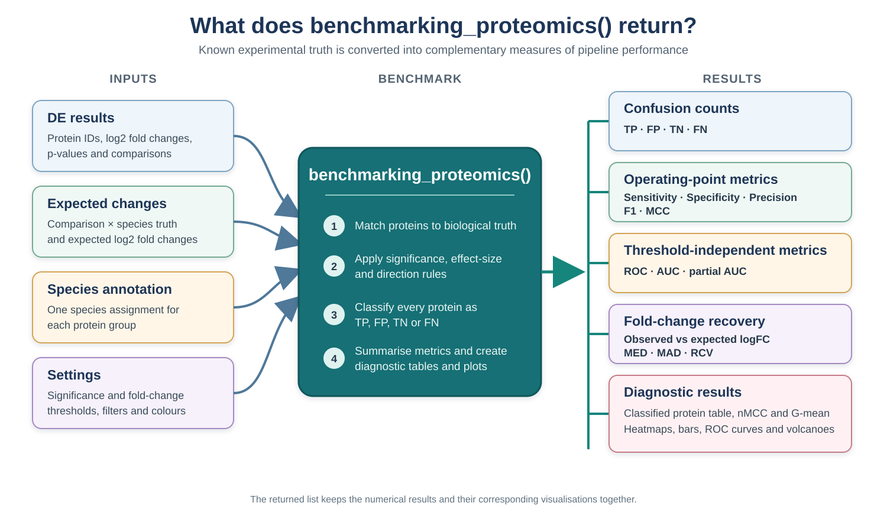
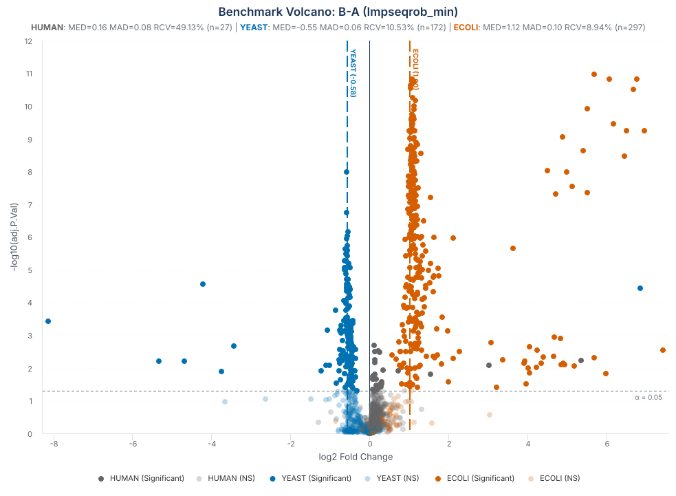

```{r setup, include = FALSE}
knitr::opts_chunk$set(collapse = TRUE, comment = "#>", crop = NULL)
```

<style type="text/css">
.species-preview,
.function-parameters,
.code-details {
  margin: 1em 0 1.4em;
  border: 1px solid #c8d3dc;
  border-radius: 5px;
  background: #f7f9fb;
}
.species-preview summary,
.function-parameters summary,
.code-details summary {
  padding: 0.75em 1em;
  color: #1d3557;
  font-weight: 600;
  cursor: pointer;
}
.species-preview[open] summary,
.function-parameters[open] summary,
.code-details[open] summary {
  border-bottom: 1px solid #c8d3dc;
}
.species-preview pre,
.species-preview table,
.function-parameters pre,
.function-parameters table,
.code-details pre,
.code-details table {
  margin: 1em;
}
.function-parameters .parameter-content {
  padding: 0.2em 1em 0.7em;
}
.function-parameters .parameter-content ul {
  margin-bottom: 0.7em;
}
.benchmark-warning {
  width: calc(100% - 4.5em);
  box-sizing: border-box;
  margin: 1.15em 0 1.5em;
  padding: 0.9em 1.1em;
  border: 1px solid #e4c78e;
  border-left: 5px solid #c98718;
  border-radius: 5px;
  background: #fffaf0;
  box-shadow: 0 1px 2px rgba(112, 78, 20, 0.08);
}
.benchmark-warning p {
  margin: 0;
  padding: 0 !important;
  text-align: justify;
}
.benchmark-warning strong:first-child {
  color: #7a5310;
}

/* Give the experimental-design figure the same responsive scale as NADIA.Rmd. */
@media screen and (min-width: 992px) {
  #fig\:benchmark-three-proteome-design + img,
  img[src$="Three_Proteome_Experimental_Design.svg"],
  #fig\:benchmarking-outputs + img,
  img[src$="Benchmarking_Proteomics_Outputs.svg"] {
    width: 112% !important;
    max-width: none !important;
    margin-left: -6%;
  }
}
@media screen and (min-width: 1400px) {
  #fig\:benchmark-three-proteome-design + img,
  img[src$="Three_Proteome_Experimental_Design.svg"],
  #fig\:benchmarking-outputs + img,
  img[src$="Benchmarking_Proteomics_Outputs.svg"] {
    width: 124% !important;
    margin-left: -12%;
  }
}
@media screen and (min-width: 768px) {
  .signif-direction-plot img,
  .confusion-plot-110 img,
  .metrics-heatmap-110 img,
  .roc-plot-110 img,
  .volcano-plot-110 img,
  .multiple-confusion-plot-110 img,
  .multiple-ranking-plot-110 img {
    width: 110% !important;
    height: auto !important;
    max-width: none !important;
    margin-left: -5%;
  }
}
.confusion-plot-110 {
  margin: 1.8em 0;
}
.metrics-heatmap-110 {
  margin-top: 1.8em;
  margin-bottom: 1.8em;
}
.roc-plot-110 {
  margin: 1.8em 0;
}
.volcano-plot-110 {
  margin: 1.8em 0;
}
.multiple-confusion-plot-110 img,
.multiple-ranking-plot-110 img {
  display: block;
  margin-top: 1.8em !important;
  margin-bottom: 1.8em !important;
}
#fig\:benchmark-three-proteome-design + img.benchmark-three-proteome-clickable,
img[src$="Three_Proteome_Experimental_Design.svg"].benchmark-three-proteome-clickable,
#fig\:benchmarking-outputs + img.benchmarking-outputs-clickable,
img[src$="Benchmarking_Proteomics_Outputs.svg"].benchmarking-outputs-clickable,
#fig\:bench-volcano-svg + img.benchmark-volcano-clickable,
img[src$="benchmark-volcano-b-a-im.svg"].benchmark-volcano-clickable {
  cursor: zoom-in;
}
.figure-zoom-hint {
  margin: -0.15em 0 1.2em;
  text-align: center;
  color: #5f6f7e;
  font-size: 0.9em;
  font-style: italic;
}
#benchmark-three-proteome-lightbox,
#benchmarking-outputs-lightbox,
#benchmark-volcano-lightbox {
  display: none;
  position: fixed;
  inset: 0;
  z-index: 9999;
  padding: 24px;
  align-items: center;
  justify-content: center;
  background: rgba(15, 25, 35, 0.88);
  cursor: zoom-out;
}
#benchmark-three-proteome-lightbox.is-open,
#benchmarking-outputs-lightbox.is-open,
#benchmark-volcano-lightbox.is-open {
  display: flex;
}
#benchmark-three-proteome-lightbox img,
#benchmarking-outputs-lightbox img,
#benchmark-volcano-lightbox img {
  width: auto !important;
  height: auto !important;
  max-width: 96vw !important;
  max-height: 92vh !important;
  margin: 0 !important;
  padding: 0 !important;
  background: white;
  box-shadow: 0 6px 30px rgba(0, 0, 0, 0.35);
  cursor: default;
  /* The enlarged image is a clone: it must not inherit the
     positioning the in-flow figure uses to widen itself. */
  position: static !important;
  left: auto !important;
  transform: none !important;
}
#benchmark-three-proteome-lightbox button,
#benchmarking-outputs-lightbox button,
#benchmark-volcano-lightbox button {
  position: absolute;
  top: 12px;
  right: 18px;
  border: 0;
  background: transparent;
  color: white;
  font-size: 36px;
  line-height: 1;
  cursor: pointer;
}
</style>

# Introduction

In most proteomics experiments, the proteins that truly change between
conditions are unknown. The comparisons in `vignette("choosing-methods")`
therefore rely on indirect criteria. A spike-in experiment provides a known
answer instead: proteins from one or more foreign organisms are mixed into a
constant background at predefined ratios. We know in advance which species
should change, the expected direction and size of each change, and that the
background proteins should remain unchanged.

`benchmarking_proteomics()` compares a differential-expression result with this
known experimental design. Given the DE table, a protein-to-species annotation,
and the expected fold changes, it classifies proteins as TP, FP, TN, or FN;
calculates performance metrics; and produces diagnostic tables and plots. This
vignette explains those classification rules and shows how to interpret the
resulting benchmark.

# Installation

```{r install, eval = FALSE}
if (!requireNamespace("BiocManager", quietly = TRUE))
    install.packages("BiocManager")
BiocManager::install("NADIA")
```

```{r library, message = FALSE}
library(NADIA)
data(nadia_dia)
```

Some metrics need `pROC`, which is optional:

```{r deps}
have_proc <- requireNamespace("pROC", quietly = TRUE)
have_proc
```

If it is not installed, the confusion-matrix metrics and static plots are still
available, but AUC, partial AUC, ROC curves, and the multi-pipeline ranking are
skipped. Install it with `install.packages("pROC")` to run those sections.

# The experiment

The example dataset originates from a three-proteome spike-in experiment. Each
sample contains a constant 80% *Homo sapiens* (HeLa) background, while
*Escherichia coli* and *Saccharomyces cerevisiae* proteins make up the remaining
20% in reciprocal proportions. Across the complete experimental design, the
*E. coli* fraction increases and the yeast fraction decreases from condition A
to condition D. The four condition mixtures were prepared from the same HeLa
stock and then divided into four aliquots, each of which was carried independently
through the complete sample-preparation workflow and LC--ESI--MS/MS analysis.
These are
therefore termed **pseudo-biological replicates**: they are not independent
biological specimens, but they capture more experimental variation than repeated
injections of the same prepared sample.

```{r benchmark-three-proteome-design, echo = FALSE, fig.align = "center", out.width = "100%", fig.cap = "Complete three-proteome spike-in design underlying the benchmark dataset. HeLa remains constant at 80%, while E. coli increases and yeast decreases across conditions. The dataset distributed with NADIA retains conditions A, B, and D and 2,000 protein groups.", fig.alt = "Three-proteome spike-in experimental design with conditions A to D and four replicates per condition. HeLa proteins remain at 80 percent, Escherichia coli proteins increase from 5 to 20 percent, and yeast proteins decrease from 15 percent to zero. NADIA retains conditions A, B, and D for the example benchmark."}
knitr::include_graphics("figures/Three_Proteome_Experimental_Design.svg")
```

<div class="figure-zoom-hint">Click the figure to enlarge it; press Esc or click outside the image to close it.</div>

<script>
(function () {
  var anchor = document.getElementById("fig:benchmark-three-proteome-design");
  var source = anchor ? anchor.nextElementSibling : null;
  // BiocStyle numbers figures and leaves that anchor before the image;
  // pkgdown emits no such anchor, so fall back to the file itself.
  if (!source || source.tagName !== "IMG") {
    source = document.querySelector('img[src$="Three_Proteome_Experimental_Design.svg"]');
  }
  if (!source) return;

  source.classList.add("benchmark-three-proteome-clickable");
  source.setAttribute("tabindex", "0");
  source.setAttribute("title", "Click to enlarge the experimental design");

  var lightbox = document.createElement("div");
  lightbox.id = "benchmark-three-proteome-lightbox";
  lightbox.setAttribute("role", "dialog");
  lightbox.setAttribute("aria-modal", "true");
  lightbox.setAttribute("aria-label", "Enlarged three-proteome experimental design");
  lightbox.setAttribute("aria-hidden", "true");

  var enlarged = source.cloneNode(true);
  enlarged.classList.remove("benchmark-three-proteome-clickable");
  enlarged.removeAttribute("tabindex");
  enlarged.removeAttribute("title");
  enlarged.removeAttribute("width");

  var closeButton = document.createElement("button");
  closeButton.type = "button";
  closeButton.setAttribute("aria-label", "Close enlarged figure");
  closeButton.textContent = "\u00d7";

  lightbox.appendChild(enlarged);
  lightbox.appendChild(closeButton);
  document.body.appendChild(lightbox);

  function openLightbox() {
    lightbox.classList.add("is-open");
    lightbox.setAttribute("aria-hidden", "false");
    closeButton.focus();
  }
  function closeLightbox() {
    lightbox.classList.remove("is-open");
    lightbox.setAttribute("aria-hidden", "true");
    source.focus();
  }

  source.addEventListener("click", openLightbox);
  source.addEventListener("keydown", function (event) {
    if (event.key === "Enter" || event.key === " ") {
      event.preventDefault();
      openLightbox();
    }
  });
  enlarged.addEventListener("click", function (event) {
    event.stopPropagation();
  });
  closeButton.addEventListener("click", closeLightbox);
  lightbox.addEventListener("click", closeLightbox);
  document.addEventListener("keydown", function (event) {
    if (event.key === "Escape" && lightbox.classList.contains("is-open")) {
      closeLightbox();
    }
  });
}());
</script>

The reduced dataset distributed with NADIA retains conditions A, B, and D: 12
samples and 2,000 protein groups. These groups were selected at random with a
fixed seed rather than by abundance or data completeness, preserving a
realistic missing-value structure. Condition D contains nominally 0% yeast,
which produces the strongest biological missingness in the experiment and makes
this condition particularly informative for assessing whether a pipeline
recovers the expected biological changes.

The processed `nadia_dia` object identifies proteins through
`PG.ProteinGroups`, but it deliberately keeps the experimental species
annotation in a separate file. The following expandable example shows how that
file is read, how its organism column is converted into the `species_df` input
required by `benchmarking_proteomics()`, and a few representative rows from
each species.

<details class="species-preview">
<summary>Show the species annotation code and example rows</summary>

```{r species}
spikein <- read.delim(system.file("extdata", "nadia_dia_spikein.tsv.gz",
                                  package = "NADIA"))
species_df <- data.frame(Protein.IDs = spikein$PG.ProteinGroups,
                         Species     = spikein$PG.OrganismId)

species_example <- do.call(rbind, lapply(c("HUMAN", "ECOLI", "YEAST"),
    function(species) head(species_df[species_df$Species == species, ], 2)))
rownames(species_example) <- NULL

species_example
table(species_df$Species)
```

</details>

Each protein in `species_df` must map to exactly one species. NADIA collapses
exact duplicate rows with a message, rejects proteins assigned to conflicting
species, and verifies that joining the annotation does not change the number of
DE rows. These checks prevent duplicated mappings from silently inflating the
confusion matrix and every metric derived from it.

# Declaring the truth

`expected_values` says what each species should do in each comparison, as a
log2 fold change. This is the specification of the experiment, taken from how
much of each organism was mixed in — not something derived from the data.
NADIA accepts either a base R `data.frame` or a `tibble`. The first option below
is executed in this vignette; the commented alternative creates the same
`expected` object with `tibble::tribble()`.

<details class="code-details">
<summary>Show the code used to define the expected fold changes</summary>

```{r expected, results = "hide"}
# Option 1: base R data.frame
expected <- data.frame(
    Comparison     = rep(c("B-A", "D-A", "D-B"), each = 2),
    Species        = rep(c("ECOLI", "YEAST"), times = 3),
    expected_logFC = c(1, -0.58, 2, -3.3, 1, -2.72))

# Option 2: equivalent row-wise tibble
# expected <- tibble::tribble(
#     ~Comparison, ~Species, ~expected_logFC,
#     "B-A",       "ECOLI",             1,
#     "B-A",       "YEAST",         -0.58,
#     "D-A",       "ECOLI",             2,
#     "D-A",       "YEAST",          -3.3,
#     "D-B",       "ECOLI",             1,
#     "D-B",       "YEAST",         -2.72
# )

expected
```

</details>

The resulting table contains one expected change for each spike-in species and
comparison:

```{r expected-table, echo = FALSE}
expected
```

Condition D requires a practical convention. Its nominal yeast proportion is
0%, so the exact yeast fold change relative to a non-zero condition would be
zero on the ratio scale and `-Inf` after log2 transformation. Because the
benchmark requires a finite expected value, NADIA represents this complete
depletion with a finite floor. For `D-A`, the chosen value is approximately
-3.3, corresponding to a tenfold decrease (`2^-3.3` is approximately 0.10).
Using the same floor relative to condition B gives approximately -2.72 for
`D-B`. These values are an operational scoring convention; they do not imply
that yeast was intentionally added to condition D.

Because this table defines the biological truth, NADIA validates it before
scoring. `expected_logFC` must be numeric, finite, and non-zero.

::: {.benchmark-warning}
**Keep species annotation and expected changes separate.** Every protein that
may enter the benchmark, including the human background, must have its species
recorded in `species_df`. By contrast, `expected_values` contains only the
species expected to change in each comparison. Human proteins are therefore
present in `species_df` but absent from `expected_values`, so NADIA treats them
as background: a significant human protein is an FP and a non-significant one
is a TN. The same rule applies to any other species omitted from
`expected_values`; background species should not be added with
`expected_logFC = 0`.
:::

# Scoring a pipeline

The species annotation and the expected changes now provide the experimental
truth against which the pipeline can be scored. First,
`process_proteomics()` runs the complete analysis and produces a
differential-expression table. `benchmarking_proteomics()` then compares every
protein in that table with the declared truth, assigns TP, FP, TN, or FN, and
summarises how well the expected changes were recovered.

`benchmarking_proteomics()` returns a named list containing numerical tables and
their corresponding diagnostic plots. Its principal inputs and controls are
summarised below.

<details class="function-parameters">
<summary>Show the parameters of benchmarking_proteomics()</summary>
<div class="parameter-content">

<p><strong>Data and experimental truth</strong></p>
<ul>
  <li><code>de_res</code>: the differential-expression table, including protein IDs, log2 fold changes, p-values, and comparisons.</li>
  <li><code>expected_values</code>: the expected <code>Comparison</code>, <code>Species</code>, and <code>expected_logFC</code> combinations.</li>
  <li><code>species_df</code>: the protein-to-species mapping. It is needed unless <code>de_res</code> already contains a <code>Species</code> column.</li>
</ul>

<p><strong>Classification settings</strong></p>
<ul>
  <li><code>alpha</code>: significance threshold; the default is 0.05.</li>
  <li><code>lfc_thr</code>: minimum absolute log2 fold change; the default is 0.</li>
  <li><code>p_col</code>: p-value column used for classification; the default is <code>adj.P.Val</code>.</li>
</ul>

<p><strong>Selection and output</strong></p>
<ul>
  <li><code>comparisons</code> and <code>assay</code>: optional filters selecting the results to score.</li>
  <li><code>output_dir</code>: export directory; <code>NULL</code> keeps the results in memory without writing files.</li>
  <li><code>verbose</code> and <code>species_colors</code>: control progress messages and plot colours.</li>
</ul>

</div>
</details>

The diagram groups the outputs by the question they answer. The following
sections inspect these results individually.

```{r benchmarking-outputs, echo = FALSE, fig.align = "center", out.width = "100%", fig.cap = "Inputs, classification steps, and output families produced by benchmarking_proteomics().", fig.alt = "Workflow diagram showing differential-expression results, expected changes, species annotation, and analysis settings entering benchmarking_proteomics. The function returns TP, FP, TN and FN counts; sensitivity, specificity, precision, F1 and MCC; ROC, AUC and partial AUC; fold-change recovery statistics; classified proteins; and diagnostic plots."}

```

<div class="figure-zoom-hint">Click the figure to enlarge it; press Esc or click outside the image to close it.</div>

<script>
(function () {
  var anchor = document.getElementById("fig:benchmarking-outputs");
  var source = anchor ? anchor.nextElementSibling : null;
  // BiocStyle numbers figures and leaves that anchor before the image;
  // pkgdown emits no such anchor, so fall back to the file itself.
  if (!source || source.tagName !== "IMG") {
    source = document.querySelector('img[src$="Benchmarking_Proteomics_Outputs.svg"]');
  }
  if (!source) return;

  source.classList.add("benchmarking-outputs-clickable");
  source.setAttribute("tabindex", "0");
  source.setAttribute("title", "Click to enlarge the benchmarking outputs");

  var lightbox = document.createElement("div");
  lightbox.id = "benchmarking-outputs-lightbox";
  lightbox.setAttribute("role", "dialog");
  lightbox.setAttribute("aria-modal", "true");
  lightbox.setAttribute("aria-label", "Enlarged benchmarking outputs diagram");
  lightbox.setAttribute("aria-hidden", "true");

  var enlarged = source.cloneNode(true);
  enlarged.classList.remove("benchmarking-outputs-clickable");
  enlarged.removeAttribute("tabindex");
  enlarged.removeAttribute("title");
  enlarged.removeAttribute("width");

  var closeButton = document.createElement("button");
  closeButton.type = "button";
  closeButton.setAttribute("aria-label", "Close enlarged figure");
  closeButton.textContent = "\u00d7";

  lightbox.appendChild(enlarged);
  lightbox.appendChild(closeButton);
  document.body.appendChild(lightbox);

  function openLightbox() {
    lightbox.classList.add("is-open");
    lightbox.setAttribute("aria-hidden", "false");
    closeButton.focus();
  }
  function closeLightbox() {
    lightbox.classList.remove("is-open");
    lightbox.setAttribute("aria-hidden", "true");
    source.focus();
  }

  source.addEventListener("click", openLightbox);
  source.addEventListener("keydown", function (event) {
    if (event.key === "Enter" || event.key === " ") {
      event.preventDefault();
      openLightbox();
    }
  });
  enlarged.addEventListener("click", function (event) {
    event.stopPropagation();
  });
  closeButton.addEventListener("click", closeLightbox);
  lightbox.addEventListener("click", closeLightbox);
  document.addEventListener("keydown", function (event) {
    if (event.key === "Escape" && lightbox.classList.contains("is-open")) {
      closeLightbox();
    }
  });
}());
</script>

In this example, `res$DEPs_results` is the differential-expression table,
`expected` is the truth table defined above, and `species_df` supplies the
protein-to-species annotation. Setting `output_dir = NULL` keeps all outputs in
the returned `bench` object.

```{r bench, message = FALSE, warning = FALSE}
res <- process_proteomics(nadia_dia, verbose = FALSE)

bench <- benchmarking_proteomics(res$DEPs_results, expected,
                                 species_df = species_df,
                                 output_dir = NULL, verbose = FALSE)
```

## The metrics_table summary

The first summary to inspect is `metrics_table`. Each row represents one
comparison and the following code selects the principal classification and
ranking indicators.

```{r bench-metrics}
metric_cols <- c("Comparison", "Sensitivity", "Specificity", "Precision",
                 "F1", "MCC", "AUC")
knitr::kable(bench$metrics_table[, metric_cols], digits = 3,
             caption = "Classification and ranking metrics by comparison.")
```

All six indicators are interpreted so that better performance gives a larger
value, except that MCC can also be negative:

- **Sensitivity** is the proportion of expected spike-in changes recovered as
  TP. Low sensitivity means that many expected changes were missed or assigned
  the wrong direction.
- **Specificity** is the proportion of background proteins correctly retained
  as TN. It decreases when unchanged proteins are called significant.
- **Precision** is the proportion of positive predictions that are TP rather
  than FP. It asks how often a reported detection is correct.
- **F1** is the harmonic mean of sensitivity and precision, and is high only
  when both recovery and reliability are high.
- **MCC** combines TP, FP, TN, and FN in one balanced coefficient. It ranges from
  -1 to 1, where 1 is perfect classification, 0 is no better than chance, and
  negative values indicate systematic disagreement.
- **AUC** measures how well the p-values rank spike-in proteins ahead of
  background proteins across all possible thresholds. A value of 0.5 indicates
  random ranking and 1 indicates perfect separation.

# How TP, FP, TN and FN are defined

The reported metrics follow from how each protein is matched to the experimental
truth and to the result returned by the differential-expression analysis.

Two independent things go into every classification.

**`truth` — what the protein *is*.** It is 1 if the protein belongs to a
spike-in species with a declared expectation, 0 if it is background. This comes
from `species_df` and `expected_values`, that is, from how the experiment was
mixed. It is a property of the protein and **no analysis can change it**.

**`predicted` — what the pipeline *said*.** It is 1 only if the protein is
significant (`adj.P.Val <= alpha`, with `alpha = 0.05` by default) **and** its
`logFC` has the sign the experiment specified. Significance alone is not enough.

Crossing them gives the four cells:

| | `truth = 1` (spike-in) | `truth = 0` (background) |
|---|---|---|
| **`predicted = 1`** | **TP** — detected, right direction | **FP** — background wrongly flagged |
| **`predicted = 0`** | **FN** — missed, *or found with the wrong sign* | **TN** — correctly left alone |

The same rules in biological terms are:

| Protein scenario | Analysis result | Class |
|---|---|---|
| Significant human protein | A change that should not exist is called significant | **FP** |
| Non-significant human protein | The background is correctly left unchanged | **TN** |
| Significant spike-in, correct sign | The expected change is recovered | **TP** |
| Non-significant spike-in | A real expected change is missed | **FN** |
| Significant spike-in, wrong sign | The expected direction is not recovered | **FN** |

The `FN` label alone does not distinguish a spike-in protein that was not
significant from one that was significant in the wrong direction. To preserve
this useful diagnostic information, `classified_df` includes two additional
columns without changing the classification metrics. `is_significant` records
whether the protein passed both the adjusted p-value and fold-change thresholds,
irrespective of direction. `direction_error` identifies the subset of FNs that
passed those thresholds but had the opposite sign. The following code retrieves
these cases; there are nine in this analysis:

<details class="code-details">
<summary>Show the code used to identify significant spike-ins with the wrong direction</summary>

```{r classification-calculate, results = "hide"}
wrong_sign <- subset(bench$classified_df, direction_error)
wrong_sign <- merge(wrong_sign, expected,
                    by = c("Comparison", "Species"))

nrow(wrong_sign)
table(wrong_sign$Comparison, wrong_sign$Species)
wrong_sign[, c("Protein.IDs", "Comparison", "Species", "logFC",
               "expected_logFC", "adj.P.Val", "is_significant",
               "direction_error", "classification")]
```

</details>

```{r classification-results, echo = FALSE}
nrow(wrong_sign)
table(wrong_sign$Comparison, wrong_sign$Species)
wrong_sign[, c("Protein.IDs", "Comparison", "Species", "logFC",
               "expected_logFC", "adj.P.Val", "is_significant",
               "direction_error", "classification")]
```

All nine are yeast proteins that rose significantly even though the spike-in
design specified a decrease. They occur across all three comparisons, whose
expected yeast changes are -0.58, -3.3, and -2.72. Every one is an `FN` and
retains `truth = 1`.

NADIA also provides `gg_signif_bars`, which displays significant proteins by
species, comparison, and observed direction. Because the plot uses
`is_significant` rather than `predicted`, these nine FNs remain visible in the
`UP` facet:

<div class="signif-direction-plot">

```{r signif-direction, fig.width = 7.5, fig.height = 4.5, fig.alt = "Significant proteins by species, comparison, and observed direction"}
bench$gg_signif_bars
```

</div>

# The confusion plots: the whole picture at once

`metrics_table` summarises each comparison with one value per performance
indicator. A confusion plot instead displays the four underlying classification
outcomes---TP, FP, TN, and FN---and therefore shows whether errors arise from
missed spike-in proteins or from significant calls in the unchanged background.

The general purpose of these plots is to turn the summary benchmark scores into
a diagnostic view of pipeline performance. They show whether the analysis
recovers the expected biological changes while keeping the background stable,
allow comparisons to be assessed side by side, and identify the species or
error type responsible for weaker performance. This makes it possible to
interpret *why* a metric is high or low rather than treating it as an isolated
number.

## Species-level confusion plot

The species-level plot separates these outcomes by organism within each
comparison. Each stacked bar represents all proteins from one species and shows
the percentage assigned to each applicable class. This is the most informative
view for a spike-in experiment because it reveals whether recovery differs
between *E. coli*, yeast, and the human background.

<div class="confusion-plot-110">

```{r conf-species, fig.width = 7.5, fig.height = 5, fig.alt = "Confusion matrix by species and comparison"}
bench$gg_confusion_by_species
```

</div>

The dependence on effect size is immediately visible. In `B-A`, 87.9% of the
*E. coli* proteins are recovered as TP, whereas only 42.5% of the yeast proteins
are recovered. The expected yeast change in this comparison is a log2 fold
change of -0.58, equivalent to a 1.5-fold difference and therefore relatively
difficult to detect. In `D-A`, where the expected yeast log2 fold change is
-3.3, recovery rises to 90.9%. The benchmark is thus evaluating the pipeline
against explicitly defined effect sizes, and smaller effects are expected to be
more difficult to recover.

The plot is convenient for comparing patterns, whereas the corresponding table
provides the exact percentage for every class. It also reports `N`, the number
of proteins evaluated for each species and comparison.

```{r conf-species-tbl}
species_cols <- c("Comparison", "Species", "N", "TP_pct", "FP_pct",
                  "FN_pct", "TN_pct")
knitr::kable(bench$confusion_by_species[, species_cols], digits = 1,
             caption = "Classification percentages within each species.")
```

The zero-valued columns follow directly from the role of each organism in the
experimental design. Human proteins form the unchanged background, so they can
only be TN when correctly left non-significant or FP when called significant;
their TP and FN percentages must therefore be zero. *E. coli* and yeast are the
expected-changing species, so their proteins can only be TP when the expected
change is recovered or FN when it is missed or detected in the wrong direction;
their FP and TN percentages must be zero. Within each spike-in species, `TP_pct`
is consequently its recovery rate and `FN_pct` is its missed or incorrectly
directed fraction.

## Overall confusion plot

For a more compact summary, the overall plot pools the three species within
each comparison. This makes the total balance of correct and incorrect
classifications easy to compare. However, it hides which spike-in species
contributed the TP and FN proteins, and its percentages use all scored proteins
as the denominator rather than the class-specific denominators used for
sensitivity and specificity.

<div class="confusion-plot-110">

```{r conf-overall, fig.width = 7.5, fig.height = 4.5, fig.alt = "Overall confusion matrix by comparison"}
bench$gg_confusion_overall
```

</div>

Correct classifications dominate the overall composition: TP and TN together
represent 84.9% of the scored proteins in `B-A`, 94.5% in `D-A`, and 92.5% in
`D-B`. The larger FN segment in `B-A` (13.7%) is consistent with the weak yeast
effect in that comparison. FP proteins account for only 1.4%, 3.0%, and 1.8% of
all proteins in `B-A`, `D-A`, and `D-B`, respectively. These are percentages of
the complete benchmark and should be interpreted as the composition of each
bar; class-specific performance is reported separately in `metrics_table`.

The figure emphasises relative proportions. The following table complements it
with the exact TP, FP, TN, and FN counts and the resulting accuracy for each
comparison.

```{r conf-overall-tbl}
overall_cols <- c("Comparison", "N", "TP", "FP", "FN", "TN", "Accuracy")
knitr::kable(bench$confusion_overall[, overall_cols], digits = 3,
             caption = "Classification counts across all scored proteins.")
```

All three comparisons evaluate the same 1,997 proteins. `B-A` contains 469 TP
and 274 FN, giving the lowest accuracy (0.849). Recovery improves markedly in
`D-A`, with 693 TP and only 50 FN, and this comparison achieves the highest
accuracy (0.945) despite having 60 FP. `D-B` is intermediate, with 629 TP, 114
FN, and an accuracy of 0.925. The table is included because the exact counts are
the quantities from which the summary metrics are calculated and cannot be read
precisely from the percentage-based plot alone.

# The metrics heatmap

The metrics heatmap provides a compact comparison of pipeline performance
across all three contrasts. Columns represent comparisons and rows show six
metrics: AUC, sensitivity, specificity, precision, F1, and accuracy. Each cell
contains the numerical value of the metric, while the common red-to-green scale
highlights lower and higher performance, respectively. Because all six metrics
range from 0 to 1 and larger values indicate better performance, the heatmap
makes both consistently strong results and comparison-specific weaknesses easy
to identify.

<div class="metrics-heatmap-110">

```{r bench-heatmap, fig.width = 7.5, fig.height = 4, fig.alt = "Heatmap of the benchmark metrics by comparison"}
bench$gg_heatmap
```

</div>

The heatmap identifies `D-A` as the strongest comparison overall. It has the
highest AUC (0.978), sensitivity (0.933), F1 (0.926), and accuracy (0.945),
showing that the expected changes are both well ranked and successfully
recovered. `D-B` also performs well, but its lower sensitivity (0.847) indicates
that it misses more spike-in proteins than `D-A`; its high specificity (0.972)
and precision (0.947) show that background control and the reliability of its
positive calls remain strong. `B-A` is the most difficult comparison. Although
its specificity (0.979) and precision (0.946) are high, its sensitivity falls to
0.631, which also lowers F1 to 0.757 and AUC to 0.832. Together with the
species-level results in Section 7.1, this pattern shows that the main weakness
in `B-A` is failure to recover the small expected yeast change, rather than an
excess of significant calls among human background proteins.

# The OpDEA metrics

Spike-in benchmarks are often imbalanced: here, 1,254 of 1,997 proteins are
unchanged human background. A method that called nothing significant would
therefore achieve 62.8% accuracy, showing how accuracy alone can conceal poor
recovery of the expected changes.

The OpDEA framework developed by
[Peng et al. (2024)](https://doi.org/10.1038/s41467-024-47899-w) evaluates
proteomics differential-expression workflows using nMCC, G-mean, and pAUC at
FPR limits of 1%, 5%, and 10%. nMCC and G-mean assess classification across
spike-in and background proteins, whereas pAUC measures ranking in the low-FPR
region. Together, they reduce the influence of class imbalance and reveal poor
spike-in recovery that strong background performance might otherwise conceal.

NADIA reports these five values for every comparison in `opdea_metrics`:

```{r opdea, eval = have_proc}
knitr::kable(bench$opdea_metrics, digits = 3,
             caption = "OpDEA metrics by comparison.")
```

- **nMCC** — the Matthews correlation coefficient rescaled to `[0, 1]`. It uses
  TP, FP, TN, and FN in a balanced measure that is robust to class imbalance.
  A value of 1 is perfect, 0.5 indicates no association, and values below 0.5
  indicate disagreement with the expected classes.
- **G_mean** — the geometric mean of sensitivity and specificity,
  `sqrt(Sensitivity * Specificity)`. It is high only when the pipeline both
  recovers spike-in proteins and preserves the background, and becomes zero if
  either component is zero.
- **pAUC** — the partial ROC area at FPR limits of 1%, 5%, and 10%, reported as
  `pAUC_001`, `pAUC_005`, and `pAUC_010`. The McClish-corrected scale ranges from
  0.5 (random) to 1 (perfect) and focuses the evaluation on stringent low-FPR
  regions.

All five indicators identify `D-A` as the strongest comparison. Its nMCC and
G-mean are both approximately 0.94, and it has the highest pAUC across all FPR
limits (0.912--0.961), indicating balanced classification and strong ranking
even in the most stringent low-FPR region.

`D-B` ranks second, with nMCC = 0.920, G-mean = 0.907, and pAUC values of
0.868--0.925. `B-A` performs worst: its lower G-mean (0.786) and pAUC
(0.768--0.821) reflect reduced sensitivity to the small yeast effect. The
consistent pattern across the three metric families indicates that the main
limitation in `B-A` is recovery of the expected spike-in changes, rather than
control of the human background.

# Interpreting ROC curves

A receiver operating characteristic (ROC) curve evaluates how well a continuous
score separates two known classes across every possible threshold. In this
benchmark, spike-in proteins are the positive class, background proteins are the
negative class, and the ranking score is derived from `adj.P.Val`. Each point on
the curve combines the true positive rate (TPR, or sensitivity) with the false
positive rate (FPR, or `1 - Specificity`) obtained at one threshold.

Curves closer to the upper-left corner indicate better separation: they recover
more spike-in proteins while misclassifying fewer background proteins. The area
under the curve (AUC) summarises the complete curve from 0 to 1. An AUC of 1
represents perfect ranking, 0.5 corresponds to random ranking, and values below
0.5 indicate that the classes are ranked in the opposite order.

## The full ROC curve

The first plot shows the complete FPR and TPR ranges from 0 to 1.

<div class="roc-plot-110">

```{r roc, eval = have_proc, fig.width = 6.5, fig.height = 5, fig.alt = "ROC curves for the three comparisons"}
bench$gg_roc
```

</div>

The full AUC is highest for `D-A` (0.978), followed by `D-B` (0.949) and `B-A`
(0.832). This agrees with the previous results: the larger expected changes are
ranked more effectively, whereas the small yeast effect makes `B-A` more
difficult. The legend preserves the input order (`B-A`, `D-A`, `D-B`); it is
**not** sorted by AUC, so performance should be read from the displayed values.

The full AUC averages performance over all possible FPRs, including very large
rates that would rarely be accepted in a proteomics differential-expression
analysis. Most analyses use stringent adjusted p-value thresholds and operate
near the left edge of the ROC curve, rather than accepting large fractions of
significant background proteins. Consequently, full AUC values can obscure
differences in the practically relevant region, and a ranking based on the full
curve can shrink, widen, or even reverse when only low FPRs are considered.

## Zooming into the low-FPR region

To examine this operationally relevant part of the curve, NADIA restricts the
x-axis to `FPR <= 0.10`. The zoom is not a different ROC analysis; it enlarges
the first 10% of the same curves so that differences near stringent operating
points can be seen.

<div class="roc-plot-110">

```{r roc-zoom, eval = have_proc, fig.width = 6.5, fig.height = 5, out.width = "110%", fig.alt = "ROC curves zoomed into the low false-positive region"}
bench$gg_roc_zoom
```

</div>

This figure differs from the full curve in two ways. First, the legend reports
the McClish-corrected pAUC over `FPR <= 0.05`, although the axis extends to 10%
to provide context around that interval. Second, the legend is deliberately
sorted by decreasing `pAUC_005`: `D-A` (0.951), `D-B` (0.912), and `B-A`
(0.807). These values focus on a more relevant operating range and confirm that
`D-A` provides the strongest ranking under a low false-positive-rate constraint.

Both AUC and pAUC use `adj.P.Val` to rank spike-in and background proteins; they
do not consider the expected fold-change direction. A significant spike-in with
the wrong sign can therefore rank highly in a ROC analysis while remaining an
FN in the direction-aware confusion matrix. ROC and confusion metrics should be
interpreted together.

An FPR range is not numerically equivalent to an adjusted p-value threshold.
`adj.P.Val <= 0.05` defines which proteins the analysis calls significant,
whereas the resulting FPR is the proportion of background proteins that are
called positive. The following table links the two empirically by reporting the
observed operating point at the threshold used in this vignette. TPR is the
proportion of spike-in proteins called positive at the same threshold.

<details class="code-details">
<summary>Show the code used to calculate the observed operating points</summary>

```{r operating-point-calculate, results = "hide"}
op <- do.call(rbind, lapply(unique(bench$classified_df$Comparison), function(comp) {
    d <- subset(bench$classified_df, Comparison == comp)
    called_positive <- !is.na(d$adj.P.Val) & d$adj.P.Val <= 0.05
    data.frame(
        Comparison = comp,
        FPR_at_adjP005 = sum(called_positive & d$truth == 0) / sum(d$truth == 0),
        TPR_at_adjP005 = sum(called_positive & d$truth == 1) / sum(d$truth == 1))
}))

knitr::kable(op, digits = 4,
             col.names = c("Comparison", "FPR", "TPR"),
             caption = "Observed ROC operating points at adj.P.Val <= 0.05.")
```

</details>

```{r operating-point-table, echo = FALSE}
knitr::kable(op, digits = 4,
             col.names = c("Comparison", "FPR", "TPR"),
             caption = "Observed ROC operating points at adj.P.Val <= 0.05.")
```

At `adj.P.Val <= 0.05`, the observed FPR is 2.2% for `B-A`, 4.8% for `D-A`,
and 2.8% for `D-B`; the corresponding ROC TPRs are 63.3%, 93.8%, and 85.2%.
These TPRs are slightly higher than the direction-aware sensitivity values in
`metrics_table` because ROC analysis counts a significant spike-in as positive
even when its observed fold-change direction is incorrect. All
three points therefore lie within both the displayed 10% zoom and the 5% region
summarised by `pAUC_005`. This correspondence is specific to these results and
must not be interpreted as a general identity between `adj.P.Val <= 0.05` and
`FPR <= 0.05`.

The table also explains why the zoom is more informative for this analysis: it
resolves the region containing the actual operating points, whereas most of the
full curve lies far beyond them. A difference in full AUC may arise mainly at
high FPRs, while a difference in `pAUC_005` reflects performance under a
stringent false-positive-rate budget. The next subsection shows how restricting
the FPR range can change the comparison between analytical pipelines.

## Comparing search engines across FPR ranges

The search engine determines which proteins and quantitative evidence enter the
downstream differential-expression analysis. To measure its influence, the same
twelve injections were processed with Spectronaut and DIA-NN and evaluated
against the same `expected` spike-in ratios. Keeping the experimental truth and
the downstream benchmark fixed makes differences between their results directly
attributable to the search-engine pipelines. This comparison also provides a
practical example of why both views are needed: the ranking suggested by the
full ROC range can reverse when the low-FPR region is examined.

The DIA-NN organism annotation is extracted from `Protein.Names`, after which
`benchmarking_proteomics()` can evaluate its results in exactly the same way as
the Spectronaut results.

**Full-range ROC comparison.** We begin with the AUC over the complete ROC
range. This provides one global measure of how well each engine ranks spike-in
proteins ahead of background proteins across all possible thresholds.

<details class="code-details">
<summary>Show the code used to benchmark the search engines</summary>

```{r engines-bench, message = FALSE, warning = FALSE, results = "hide"}
diann <- preprocess_diann(
    system.file("extdata", "nadia_diann_report.tsv.gz", package = "NADIA"),
    condition_order = c("A", "B", "D"), verbose = FALSE)

species_dn <- data.frame(
    Protein.IDs = diann$protein_id$PG.ProteinGroups,
    Species = toupper(sub(".*_", "",
                          sub(";.*", "", diann$protein_id$PG.ProteinNames))))

bench_dn <- benchmarking_proteomics(
    process_proteomics(diann, verbose = FALSE)$DEPs_results,
    expected, species_df = species_dn, output_dir = NULL, verbose = FALSE)

engine_auc <- rbind(
    cbind(Engine = "Spectronaut",
          bench$metrics_table[, c("Comparison", "TP", "FP", "TN", "FN", "AUC")]),
    cbind(Engine = "DIA-NN",
          bench_dn$metrics_table[, c("Comparison", "TP", "FP", "TN", "FN", "AUC")]))

engine_auc$N <- rowSums(engine_auc[, c("TP", "FP", "TN", "FN")])
engine_auc <- engine_auc[, c("Engine", "Comparison", "N", "AUC")]

knitr::kable(engine_auc, digits = 3,
             caption = "Full ROC AUC by search engine and comparison.")
```

</details>

```{r engines-auc-table, echo = FALSE}
knitr::kable(engine_auc, digits = 3,
             caption = "Full ROC AUC by search engine and comparison.")
```

DIA-NN has the higher full AUC in every comparison: 0.909 versus 0.832 in
`B-A`, 0.995 versus 0.978 in `D-A`, and 0.967 versus 0.949 in `D-B`. Thus, when
the entire ROC range is considered, DIA-NN provides the stronger overall
ranking. Both engines nevertheless show the same biological pattern, performing
best in `D-A` and worst in the more difficult `B-A` comparison.

The `N` column also shows that Spectronaut and DIA-NN contribute 1,997 and 1,965
proteins, respectively. AUC is based on rates and is therefore more suitable
than raw TP or FP counts for comparing these different-sized protein sets.
However, the benchmark remains conditional on the proteins identified by each
engine; identification coverage is a separate question.

**Low-FPR comparison.** Full AUC includes thresholds with large false-positive
rates that would rarely be accepted in practice. We therefore repeat the
comparison using pAUC at FPR limits of 1%, 5%, and 10%, focusing progressively
on the region in which a proteomics analysis is more likely to operate.

```{r engines-pauc, eval = have_proc}
engine_pauc <- cbind(
    Engine = rep(c("Spectronaut", "DIA-NN"), each = 3),
    rbind(bench$opdea_metrics, bench_dn$opdea_metrics)[
        , c("Comparison", "pAUC_001", "pAUC_005", "pAUC_010")])

knitr::kable(engine_pauc, digits = 3,
             caption = "Partial AUC by search engine and FPR range.")
```

The result now depends on the FPR limit. At 1%, Spectronaut has the higher pAUC
in all three comparisons: 0.768 versus 0.688 in `B-A`, 0.912 versus 0.855 in
`D-A`, and 0.868 versus 0.778 in `D-B`. At 5% and 10%, the order reverses and
DIA-NN has the higher pAUC in every comparison. Its greater recovery becomes
advantageous once the analysis allows a slightly larger false-positive budget.

Choosing a search engine therefore requires an explicit decision about the
acceptable FPR. A 1% limit means tolerating approximately one false positive
for every 100 truly unchanged background proteins; it does not mean one false
discovery per 100 reported proteins. If that strict budget is required,
Spectronaut performs better here. If limits of 5% or 10% are acceptable, DIA-NN
performs better. The relevant operating range, rather than a single global AUC,
should determine which engine is preferred for the study.

# Volcano plots as diagnostic tools

A volcano plot displays the magnitude and statistical evidence of every
protein-level change. The x-axis shows the log2 fold change, with negative and
positive values indicating changes in opposite directions, while the y-axis
shows `-log10(adj.P.Val)`. Proteins with stronger statistical evidence therefore
appear higher in the plot.

`benchmarking_proteomics()` returns one interactive Highcharts volcano plot per
comparison in `hc_volcano_list`. The interactive version allows individual
proteins to be examined by hovering over the points and species to be shown or
hidden from the legend.

::: {.benchmark-warning}
**Why is a static image shown?** To keep the installed vignette within
Bioconductor size guidance, the interactive plot is exported as an SVG.
See `vignette("visualization")` for guidance on working with live interactive
figures.
:::

The following code retrieves the plot for `B-A`:

```{r bench-volcano, eval = FALSE}
bench$hc_volcano_list[["B-A"]]
```

The exported SVG version is shown below.

<div class="volcano-plot-110">

```{r bench-volcano-svg, echo = FALSE, out.width = "110%", fig.alt = "Benchmark volcano plot for B-A, with proteins coloured by species and expected fold changes marked", fig.cap = "Benchmark volcano plot for the B-A comparison."}

```

</div>

<div class="figure-zoom-hint">Click the figure to enlarge it; press Esc or click outside the image to close it.</div>

<script>
(function () {
  var anchor = document.getElementById("fig:bench-volcano-svg");
  var source = anchor ? anchor.nextElementSibling : null;
  // BiocStyle numbers figures and leaves that anchor before the image;
  // pkgdown emits no such anchor, so fall back to the file itself.
  if (!source || source.tagName !== "IMG") {
    source = document.querySelector('img[src$="benchmark-volcano-b-a-im.svg"]');
  }
  if (!source) return;

  source.classList.add("benchmark-volcano-clickable");
  source.setAttribute("tabindex", "0");
  source.setAttribute("title", "Click to enlarge the benchmark volcano plot");

  var lightbox = document.createElement("div");
  lightbox.id = "benchmark-volcano-lightbox";
  lightbox.setAttribute("role", "dialog");
  lightbox.setAttribute("aria-modal", "true");
  lightbox.setAttribute("aria-label", "Enlarged benchmark volcano plot for B-A");
  lightbox.setAttribute("aria-hidden", "true");

  var enlarged = source.cloneNode(true);
  enlarged.classList.remove("benchmark-volcano-clickable");
  enlarged.removeAttribute("tabindex");
  enlarged.removeAttribute("title");
  enlarged.removeAttribute("width");

  var closeButton = document.createElement("button");
  closeButton.type = "button";
  closeButton.setAttribute("aria-label", "Close enlarged figure");
  closeButton.textContent = "\u00d7";

  lightbox.appendChild(enlarged);
  lightbox.appendChild(closeButton);
  document.body.appendChild(lightbox);

  function openLightbox() {
    lightbox.classList.add("is-open");
    lightbox.setAttribute("aria-hidden", "false");
    closeButton.focus();
  }
  function closeLightbox() {
    lightbox.classList.remove("is-open");
    lightbox.setAttribute("aria-hidden", "true");
    source.focus();
  }

  source.addEventListener("click", openLightbox);
  source.addEventListener("keydown", function (event) {
    if (event.key === "Enter" || event.key === " ") {
      event.preventDefault();
      openLightbox();
    }
  });
  enlarged.addEventListener("click", function (event) {
    event.stopPropagation();
  });
  closeButton.addEventListener("click", closeLightbox);
  lightbox.addEventListener("click", closeLightbox);
  document.addEventListener("keydown", function (event) {
    if (event.key === "Escape" && lightbox.classList.contains("is-open")) {
      closeLightbox();
    }
  });
}());
</script>

Colouring proteins by species turns the volcano plot into a diagnostic view of
the spike-in experiment. Human background proteins are shown in grey and
should remain concentrated around `log2FC = 0`; yeast proteins are blue and are
expected near `-0.58`; and *E. coli* proteins are orange and are expected near
`1.00`. The blue and orange vertical dashed lines mark these expected spike-in
log2 fold changes, whereas the solid vertical line at zero represents no
change.

The subtitle summarises the significant proteins for each species (restricted
to the expected direction for spike-ins). `MED` is the median observed log2
fold change, `MAD` is its median absolute deviation, and `RCV` is the robust
coefficient of variation (`MAD / abs(MED) * 100`); `n` is the number of
proteins summarised.
Comparing `MED` with the expected line assesses fold-change recovery, while
lower `MAD` and `RCV` values indicate a tighter distribution.

The horizontal dashed line marks `alpha = 0.05`
(`adj.P.Val <= 0.05`). Significant proteins have stronger colours, whereas
non-significant proteins appear lighter. In `B-A`, most human proteins remain
near zero and the spike-in species cluster around their expected values.
Deviations flag proteins for review. Spike-ins with the correct direction but
unusually large fold changes are often imputed or presence--absence cases,
because one condition has little or no measured signal.

# Comparing multiple pipelines

After scoring one pipeline, the next question is whether another combination
of preprocessing methods recovers the known changes more reliably.
`benchmarking_multiple()` brings the results of separate
`benchmarking_proteomics()` runs into a common comparison. It does not rerun
the differential-expression analyses; it validates their benchmark summaries,
ranks the pipelines, and generates comparative plots.

The function accepts either combined tables already held in memory or a parent
directory containing the files exported by each benchmark. This section begins
with the in-memory workflow; the directory-based workflow is introduced in
Section 12.3.

<details class="function-parameters">
<summary>Show the parameters of benchmarking_multiple()</summary>
<div class="parameter-content">

<p><strong>Benchmark inputs</strong></p>
<ul>
  <li><code>opdea_combined</code>: combined OpDEA table containing <code>Assay</code>, <code>Comparison</code>, <code>nMCC</code>, <code>G_mean</code>, and the three pAUC columns. This is the required input for an in-memory comparison.</li>
  <li><code>confusion_combined</code>: optional combined <code>TP</code>, <code>FP</code>, <code>TN</code>, and <code>FN</code> counts used to generate comparative confusion plots.</li>
  <li><code>classified_combined</code>: optional protein-level classified results used to draw multi-pipeline ROC curves.</li>
  <li><code>bench_metrics_combined</code>: optional classification metrics used for the extended 11-metric ranking.</li>
  <li><code>results_dir</code>: parent directory containing exported benchmark folders. It is used when <code>opdea_combined</code> is not supplied.</li>
</ul>

<p><strong>File discovery and method names</strong></p>
<ul>
  <li><code>pattern</code>: regular expression identifying OpDEA files; the default matches <code>benchmark_opdea_metrics.tsv</code>.</li>
  <li><code>method_names</code>: optional pipeline names for imported files. If omitted, names are taken from their parent folders.</li>
  <li><code>recursive</code>: search within subdirectories; the default is <code>TRUE</code>.</li>
  <li><code>strip_prefix</code>: prefix removed from imported method names; the default removes <code>benchmark_</code>.</li>
</ul>

<p><strong>Ranking and plots</strong></p>
<ul>
  <li><code>metrics</code>: metrics used for the standard ranking; by default these are <code>nMCC</code>, <code>G_mean</code>, <code>pAUC_001</code>, <code>pAUC_005</code>, and <code>pAUC_010</code>.</li>
  <li><code>extended_metrics</code>: metrics used when an extended ranking is requested through <code>bench_metrics_combined</code>.</li>
  <li><code>p_col</code>: p-value column used for multi-pipeline ROC curves; the default is <code>adj.P.Val</code>.</li>
  <li><code>plots</code>: <code>"all"</code> or any selection of <code>ranking_heatmap_mean</code>, <code>ranking_heatmap_median</code>, <code>ranking_bars_mean</code>, <code>ranking_bars_median</code>, <code>metrics_heatmap_mean</code>, <code>metrics_heatmap_median</code>, <code>metrics_comparison</code>, <code>extended_ranking_bars</code>, and <code>extended_ranking_heatmap</code>. Confusion and ROC plots are generated automatically when their input tables are available.</li>
</ul>

<p><strong>Messages and exports</strong></p>
<ul>
  <li><code>verbose</code>: print progress messages; the default is <code>TRUE</code>.</li>
  <li><code>output_dir</code>: optional directory for the combined tables and plots; <code>NULL</code> keeps them in memory.</li>
  <li><code>export_plots</code> and <code>export_tables</code>: control PNG and TSV export; both default to <code>TRUE</code> when <code>output_dir</code> is provided.</li>
  <li><code>plot_width</code>, <code>plot_height</code>, and <code>plot_dpi</code>: dimensions and resolution of exported plots; defaults are 12 inches, 8 inches, and 150 dpi.</li>
</ul>

</div>
</details>

The example tests three pipelines chosen to separate the effects of
normalization and imputation:

| Pipeline | Normalization | Imputation |
|---|---|---|
| `cycloess_combo` | cycloess | Two-stage `combo`: Impseqrob for MAR values and `min` for MNAR values |
| `quantile_combo` | quantile | The same two-stage `combo` imputation |
| `cycloess_min` | cycloess | Minimum-value imputation applied as a single method |

Comparing the first two pipelines isolates the normalization choice, whereas
comparing `cycloess_combo` with `cycloess_min` isolates the imputation strategy.
Each pipeline is processed and scored separately; only the OpDEA and confusion
tables needed below are then combined and passed to `benchmarking_multiple()`.

<details class="code-details">
<summary>Show the code used to run and combine the three pipelines</summary>

```{r multiple, message = FALSE, warning = FALSE, eval = have_proc}
pipelines <- list(
    cycloess_combo = list(norm_method = "cycloess", imp_method = "combo"),
    quantile_combo = list(norm_method = "quantile", imp_method = "combo"),
    cycloess_min   = list(norm_method = "cycloess", imp_method = "min"))

invisible(capture.output(
  scored <- lapply(names(pipelines), function(p) {
      processed <- do.call(
          process_proteomics,
          c(list(nadia_dia, verbose = FALSE), pipelines[[p]]))
      benchmark <- benchmarking_proteomics(
          processed$DEPs_results, expected,
          species_df = species_df,
          output_dir = NULL, verbose = FALSE)
      list(
          opdea = cbind(Assay = p, benchmark$opdea_metrics),
          confusion = cbind(Assay = p, benchmark$metrics_table))
  })))

opdea <- do.call(rbind, lapply(scored, `[[`, "opdea"))
confusion <- do.call(rbind, lapply(scored, `[[`, "confusion"))

multi_bench <- benchmarking_multiple(
    opdea_combined = opdea,
    confusion_combined = confusion,
    plots = "ranking_bars_mean",
    verbose = FALSE)
```

</details>

## Comparing TP, FP, TN and FN

The classification counts should be inspected before reducing performance to a
single rank. They show whether a pipeline loses expected spike-ins as false
negatives or incorrectly calls background proteins as false positives. Because
all nine rows contain the same 1,997 proteins, their counts are directly
comparable.

```{r multiple-counts, eval = have_proc}
count_cols <- c("Assay", "Comparison", "TP", "FP", "TN", "FN")
knitr::kable(
    multi_bench$confusion_combined[, count_cols],
    caption = "Classification counts by pipeline and comparison.")
```

The stacked plot presents the same counts as one bar per pipeline and
comparison, making the balance between correct classifications and errors
easier to compare. Labels are hidden for segments smaller than 4% of a bar to
avoid overlap; the table retains every exact count.

<div class="multiple-confusion-plot-110">

```{r multiple-confusion, eval = have_proc, fig.width = 8.5, fig.height = 5, out.width = "110%", fig.alt = "Confusion matrix counts per pipeline and comparison"}
confusion_plot <- multi_bench$gg_confusion_stacked
bar_total <- ave(
    confusion_plot$data$Count,
    confusion_plot$data$Assay,
    confusion_plot$data$Comparison,
    FUN = sum)
confusion_plot$data$label_text[
    confusion_plot$data$Count < 0.04 * bar_total] <- ""
confusion_plot
```

</div>

`cycloess_combo` provides the best balance: it keeps FP counts low while
recovering more TP than `cycloess_min` in every comparison. This is why it later
ranks first even though it does not minimise every error count individually.
`quantile_combo` recovers slightly more TP in `B-A` and `D-A`, but its FP counts
rise to 917 and 934 in `D-A` and `D-B`, respectively, indicating poor control
of the background. In contrast, `cycloess_min` is the most conservative
pipeline: it produces the fewest or joint-fewest FP, but also the most FN in all
three comparisons. The plot therefore reveals the error pattern behind the
ranking rather than only identifying a winner.

## Ranking pipelines with the OpDEA criteria

The confusion counts describe each type of error but do not provide one overall
ordering. `benchmarking_multiple()` therefore averages each OpDEA metric across
comparisons, ranks the pipelines from the highest metric value to the lowest,
and calculates `rank_final` as the mean of the five metric-specific ranks. A
lower final rank indicates better and more consistent performance.

```{r multiple-rank, eval = have_proc}
multi_bench$mean_ranking
```

The result is unanimous: `cycloess_combo` ranks first for `nMCC`, `G_mean`, and
all three pAUC limits. `cycloess_min` ranks second and `quantile_combo` third.
The ordering reflects the trade-offs observed above: the first pipeline balances
spike-in recovery and background control, the second loses sensitivity, and the
third is strongly penalised for its false positives in `D-A` and `D-B`.

The final ranks can also be displayed as horizontal bars. This view is useful
when many pipelines are compared because the methods are ordered directly and
the best result remains visually identifiable.

<div class="multiple-ranking-plot-110">

```{r multiple-plot, eval = have_proc, fig.width = 7, fig.height = 4.5, out.width = "110%", fig.alt = "Ranking of the pipelines across the OpDEA metrics"}
multi_bench$gg_ranking_bars_mean
```

</div>

The green bar for `cycloess_combo` has the lowest possible final rank of 1,
followed by `cycloess_min` at 2 and `quantile_combo` at 3. The result agrees with
`vignette("choosing-methods")`, where cycloess was also preferred using proxy
criteria such as replicate consistency and condition separation. The two
approaches may not always select the same pipeline. When they differ, the
spike-in result is more informative because it compares each pipeline with
changes known in advance, whereas the proxy criteria evaluate only indirect
signs of good performance.

## Comparing saved results and external pipelines

The in-memory workflow is convenient when every pipeline can be run in one R
session. A directory-based workflow is more suitable for long analyses, work
performed at different times, or pipelines implemented outside NADIA. Each
pipeline is first evaluated with `benchmarking_proteomics()` and exported to
its own subdirectory; `benchmarking_multiple()` then discovers and combines
those benchmark files through `results_dir`.

::: {.benchmark-warning}
**External differential-expression results must be benchmarked first.**
`benchmarking_multiple()` does not score a raw MSstats or other external result
table directly. Adapt that table to the input expected by
`benchmarking_proteomics()`, run the individual benchmark with an
`output_dir`, and only then include its exported folder in the multiple
comparison.
:::

An external differential-expression table requires one row per protein and
comparison with the following fields:

| NADIA field | Required content | MSstats `ComparisonResult` |
|---|---|---|
| `Protein.IDs` | Protein identifier matching `species_df` | `Protein` |
| `logFC` | Numeric log2 fold change with the same contrast direction as `expected` | `log2FC` |
| `Comparison` | Comparison label matching `expected$Comparison` exactly | `Label` |
| `adj.P.Val` | Numeric adjusted p-value used for scoring | `adj.pvalue` |
| `P.Value` | Optional raw p-value | `pvalue` |

Species can instead be included directly as a `Species` column, but using the
same `species_df` for every pipeline prevents annotation differences from
confounding the comparison. The output of
[`MSstats::groupComparison()`](https://bioconductor.org/packages/release/bioc/manuals/MSstats/man/MSstats.pdf)
can be adapted as follows:

<details class="code-details">
<summary>Show the code used to adapt an MSstats result</summary>

```{r adapt-msstats, eval = FALSE}
# msstats_result is the list returned by MSstats::groupComparison()
msstats_source <- msstats_result$ComparisonResult

msstats_de <- data.frame(
    Protein.IDs = msstats_source$Protein,
    logFC = msstats_source$log2FC,
    Comparison = msstats_source$Label,
    P.Value = msstats_source$pvalue,
    adj.P.Val = msstats_source$adj.pvalue,
    stringsAsFactors = FALSE)
```

</details>

Check the comparison labels and fold-change direction before scoring: for
example, `B-A` must represent the same contrast in `msstats_de` and `expected`.
After adaptation, both NADIA and external results can be exported under one
parent directory.

<details class="code-details">
<summary>Show the directory-based benchmarking workflow</summary>

```{r multiple-from-files, eval = FALSE}
results_root <- "benchmark_results"
dir.create(results_root, recursive = TRUE, showWarnings = FALSE)

# Export one individual benchmark for each NADIA pipeline
for (p in names(pipelines)) {
    processed <- do.call(
        process_proteomics,
        c(list(nadia_dia, verbose = FALSE), pipelines[[p]]))
    benchmarking_proteomics(
        processed$DEPs_results, expected,
        species_df = species_df,
        output_dir = file.path(results_root, p),
        verbose = FALSE)
}

# Export the benchmark of the adapted external pipeline
benchmarking_proteomics(
    msstats_de, expected,
    species_df = species_df,
    output_dir = file.path(results_root, "MSstats"),
    verbose = FALSE)

# Import, compare, and optionally export all individual benchmarks
multi_from_files <- benchmarking_multiple(
    results_dir = results_root,
    output_dir = file.path(results_root, "multiple_summary"),
    verbose = FALSE)
```

</details>

At minimum, every method folder must contain
`benchmark_opdea_metrics.tsv`. The additional files written automatically by
`benchmarking_proteomics()` extend the comparison:
`benchmark_confusion_overall.tsv` adds the confusion plots,
`benchmark_classified.tsv` adds multi-pipeline ROC curves, and
`benchmark_metrics.tsv` enables the extended ranking. Folder names become the
pipeline names shown in the tables and figures. All methods should use the same
experimental truth, thresholds, comparison directions, and protein universe;
if the detected protein sets differ, retain and report `N` alongside the
performance metrics.

# What this benchmark can and cannot show

A spike-in benchmark provides direct evidence of how well a pipeline recovers
predefined abundance changes while preserving an unchanged background. It is
therefore a strong method for comparing pipelines under the experimental
conditions represented by the benchmark.

However, the highest-ranked pipeline is not guaranteed to be optimal for every
biological study. Spike-in proteins are added at controlled amounts and are
usually detected across conditions, whereas real proteins may be absent from
one condition, follow a missing-not-at-random (MNAR) pattern, or change by
amounts outside the range tested here. These situations can respond differently
to normalization, imputation, and differential-expression methods. Because
each normalization--imputation combination can produce a different downstream
result, `vignette("choosing-methods")` explains how to compare complete
preprocessing strategies when the true changes are unknown, while
`vignette("missing-values")` examines missingness and its treatment in greater
detail.

The ranking should therefore be interpreted as strong evidence about analytical
performance, together with an assessment of how closely the benchmark reflects
the biological experiment of interest.

# References

Peng H, Wang H, Kong W, Li J, Goh WWB (2024). Optimizing differential expression
analysis for proteomics data via high-performing rules and ensemble inference.
*Nature Communications* **15**, 3922.
[doi:10.1038/s41467-024-47899-w](https://doi.org/10.1038/s41467-024-47899-w).

# Session information

```{r session}
sessionInfo()
```
