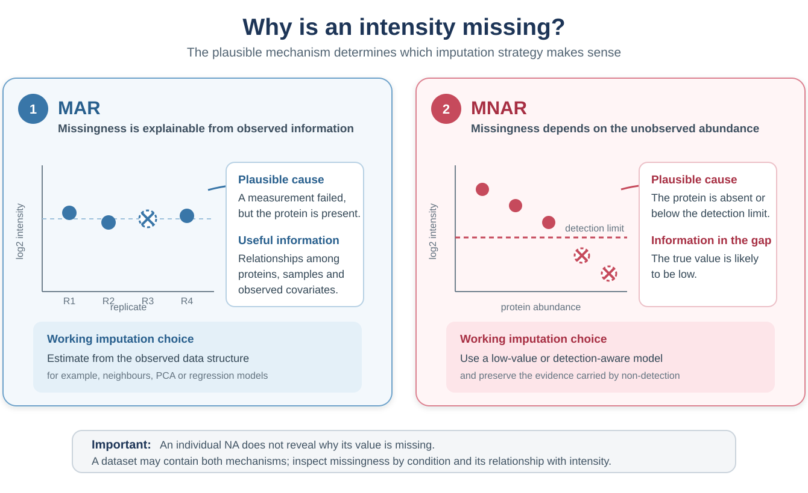

```{r setup, include = FALSE}
knitr::opts_chunk$set(collapse = TRUE, comment = "#>", crop = NULL)
options(width = 100)
```

<style type="text/css">
/* Use the available page width for the four descriptive reference tables. */
.wide-reference-table {
  position: relative;
}
.wide-reference-table table {
  width: 100%;
  max-width: none;
  margin-left: 0 !important;
  margin-right: 0 !important;
  table-layout: fixed;
  font-size: 0.93em;
  line-height: 1.28;
}
.wide-reference-table th,
.wide-reference-table td {
  padding: 0.42em 0.62em !important;
  vertical-align: top !important;
  overflow-wrap: anywhere;
}
.normalisation-methods-table col:nth-child(1) {
  width: 18% !important;
}
.normalisation-methods-table col:nth-child(2) {
  width: 82% !important;
}
.metrics-reference-table col:nth-child(1) {
  width: 14% !important;
}
.metrics-reference-table col:nth-child(2) {
  width: 72% !important;
}
.metrics-reference-table col:nth-child(3) {
  width: 14% !important;
}
.imputation-methods-table col:nth-child(1) {
  width: 22% !important;
}
.imputation-methods-table col:nth-child(2) {
  width: 13% !important;
}
.imputation-methods-table col:nth-child(3) {
  width: 65% !important;
}
@media screen and (min-width: 992px) {
  .wide-reference-table {
    width: 96%;
    max-width: none;
    margin-left: 2%;
  }
  #fig\:mar-mnar-diagram + img {
    width: 112% !important;
    max-width: none !important;
    margin-left: -6%;
  }
}
@media screen and (min-width: 1400px) {
  .wide-reference-table {
    width: 98%;
    margin-left: 1%;
  }
  #fig\:mar-mnar-diagram + img {
    width: 124% !important;
    margin-left: -12%;
  }
}
@media screen and (max-width: 991px) {
  .wide-reference-table {
    overflow-x: auto;
  }
  .wide-reference-table table {
    width: 860px;
    min-width: 860px;
  }
}

/* Enlarge the MAR/MNAR diagram on demand without rasterising the SVG. */
#fig\:mar-mnar-diagram + img.mar-mnar-clickable {
  cursor: zoom-in;
}
.figure-zoom-hint {
  margin: -0.15em 0 1.2em;
  text-align: center;
  color: #5f6f7e;
  font-size: 0.9em;
  font-style: italic;
}
#mar-mnar-lightbox {
  display: none;
  position: fixed;
  inset: 0;
  z-index: 9999;
  padding: 24px;
  align-items: center;
  justify-content: center;
  background: rgba(15, 25, 35, 0.88);
  cursor: zoom-out;
}
#mar-mnar-lightbox.is-open {
  display: flex;
}
#mar-mnar-lightbox img {
  width: auto !important;
  height: auto !important;
  max-width: 96vw !important;
  max-height: 92vh !important;
  margin: 0 !important;
  padding: 0 !important;
  background: white;
  box-shadow: 0 6px 30px rgba(0, 0, 0, 0.35);
  cursor: default;
}
#mar-mnar-lightbox button {
  position: absolute;
  top: 12px;
  right: 18px;
  border: 0;
  background: transparent;
  color: white;
  font-size: 36px;
  line-height: 1;
  cursor: pointer;
}
body.mar-mnar-lightbox-open {
  overflow: hidden;
}
</style>

# Introduction

Normalisation and imputation are not merely technical details. Normalisation
changes the scale on which samples are compared, whereas imputation determines
which values replace the measurements that were not observed. Both choices can
therefore affect the proteins identified as differentially abundant.

There is no method that is best for every dataset. A useful choice should be
based on the characteristics of the experiment, the missing-value pattern and
diagnostics calculated from the data. This vignette follows that reasoning in
four steps:

1. describe the normalisation methods available in NADIA;
2. compare candidate normalisation methods using quantitative metrics and
   diagnostic plots;
3. describe and compare the available imputation strategies; and
4. apply the selected combination and examine how alternative choices affect
   the differential abundance results.

NADIA exposes 13 normalisation labels and 20 imputation strategies. At the
level of selectable methods, this gives **13 × 20 = 260** nominal
normalisation--imputation combinations. Running and interpreting every
combination is possible, but it is rarely an efficient first step. The metrics
in this vignette provide a staged screen: first rank plausible normalisation
methods using replicate agreement and condition separation, then compare
imputation methods on the selected---or a small number of plausible---normalised
assays. The resulting ranks reduce the search space; they do not by themselves
prove that the highest-ranked combination is biologically correct.

The value 260 is a catalogue-level count rather than 260 fully interchangeable
completed matrices: `log2` and `log2Norm` are numerically redundant, and `limpa`
and `none` have special downstream interpretations. The count nevertheless
illustrates why a principled shortlist is preferable to choosing a pipeline by
trial and error.

The examples use `nadia_dia`, a preprocessed DIA dataset included with NADIA.
The comparison is performed without an external ground truth. If an experiment
contains spike-in proteins with known abundances or expected fold changes, the
best normalisation--imputation combination is easier to establish. Such an
experiment supplies an external reference against which the complete pipeline
can be benchmarked, rather than relying only on internal properties of the
processed matrix. Proteins added at known different abundances show whether the
pipeline recovers the expected changes. Proteins kept at the same abundance, by
contrast, show how often the pipeline reports a difference when none is
expected. In that setting, the benchmarking results should take priority over
the internal ranks described here; see `vignette("benchmarking")`.

# Installation and packages

While NADIA is under development, it can be installed from GitHub:

```{r install, eval = FALSE}
if (!requireNamespace("remotes", quietly = TRUE))
    install.packages("remotes")
remotes::install_github("sciordia/NADIA", build_vignettes = TRUE)
```

Only NADIA and `SummarizedExperiment` need to be attached for the code in this
vignette. Method-specific packages are called internally when required.

```{r packages, message = FALSE}
library(NADIA)
library(SummarizedExperiment)

data(nadia_dia)
```

# Normalisation

## What normalisation does

Protein intensities may contain systematic differences caused by sample
preparation, injected amount, instrument response or other non-biological
sources. Normalisation aims to reduce these unwanted differences while
preserving the biological variation that the experiment was designed to
measure.

An effective method should therefore satisfy two goals at the same time:

- replicate samples from the same condition should become more comparable;
- genuine differences between conditions should remain visible.

Making every sample look identical would reduce technical dispersion, but it
could also remove biological signal. For this reason, no single diagnostic is
sufficient on its own.

## Normalisation methods available in NADIA

NADIA provides 13 normalisation options, which are selected with the
`norm_method` argument. Regardless of the option chosen, the resulting
protein-abundance matrix is expressed on the log2 scale.

::: {.wide-reference-table .normalisation-methods-table}

| `norm_method` | Principle |
|---|---|
| `log2` | Applies the log2 transformation and no additional normalisation. It is the natural baseline for comparison. |
| `log2Norm` | Applies the same log2 transformation. It is retained as a named benchmark method for compatibility. |
| `GlobalMedian` | Divides each sample by its total intensity and rescales the totals to their median before log2 transformation. |
| `GlobalMean` | Divides each sample by its total intensity and rescales the totals to their mean before log2 transformation. |
| `eqmedians` | Log2-transforms the data and shifts every sample so that all sample medians are equal. |
| `medianNorm` | Divides raw intensities by the sample median, rescales to the mean of the sample medians and then applies log2. |
| `meanNorm` | Divides raw intensities by the sample mean, rescales to the mean of the sample means and then applies log2. |
| `vsn` | Uses variance-stabilising normalisation from the `vsn` package to reduce the dependence between variance and mean intensity. |
| `quantile` | Maps the empirical distribution of every sample to a common quantile distribution using `limma`. |
| `quantile.robust` | Uses the median, rather than the mean, across sample quantiles to construct a reference distribution that is less sensitive to extreme samples. |
| `Rlr` | Fits a robust linear regression between each sample and the protein-wise median profile, then removes the fitted offset and scale. |
| `MAD` | Aligns both the median and the median absolute deviation of every sample to the corresponding global values. |
| `cycloess` | Applies cyclic loess normalisation with `limma`, correcting intensity-dependent differences between samples. |

:::

`log2` and `log2Norm` produce the same values. Consequently,
`nm_run_normalizations(methods = "all")` retains the `log2` baseline and skips
the redundant `log2Norm` assay, leaving 12 distinct assays for comparison.

## How normalisation methods are evaluated

NADIA combines quantitative measures of within-condition agreement with a
measure of between-condition separation. Four of the measures follow the
intragroup evaluation used by the PRONE package: PCV, PMAD, PEV and intragroup
correlation.

::: {.wide-reference-table .metrics-reference-table}

| Rank | What NADIA calculates | Preferred direction |
|---|---|---:|
| `Rank_PCV` | For each protein and condition, the coefficient of variation is calculated as $100 \times SD / |mean|$. Values are averaged across conditions and summarised by the median across proteins. | Lower |
| `Rank_PMAD` | The median absolute deviation is calculated within each condition for every protein, averaged across conditions and summarised by the median across proteins. | Lower |
| `Rank_PEV` | The within-condition variance is calculated for every protein, averaged across conditions and summarised by the median across proteins. | Lower |
| `Rank_Cor` | Pairwise correlations are calculated between replicate samples within each condition and summarised by their median. | Higher |
| `Rank_Sep` | PCA is performed on complete protein profiles. A one-way ANOVA F-ratio measures separation of the PC1 sample scores by condition relative to variation within conditions. | Higher |

:::

`Rank_Final` is the mean of these five ranks. The lowest value is preferred.
This combined criterion rewards agreement among replicates without allowing
dispersion alone to decide the result. That qualification is important: the
PRONE evaluation showed that reducing intragroup variation does not necessarily
identify the method that performs best in downstream analyses.

The ranking should be read together with the diagnostic plots returned by
`normalization_metrics()`:

- `boxplot` and `density` compare sample intensity distributions;
- `pcv`, `pmad` and `pev` show within-condition dispersion across proteins;
- `correlation` shows agreement between replicate samples;
- `pca` and `mds` show whether replicates cluster and conditions separate;
- `scatter` compares two samples directly, and `qq` assesses one sample against
  a normal distribution;
- `metrics` displays additional multivariate diagnostics; and
- `final_ranking` displays the combined ranking.

These plots answer different questions. A method should not be selected from a
single attractive PCA or a single low dispersion value.

## Comparing normalisation methods with NADIA

The first step builds a baseline `SummarizedExperiment`. The second applies the
candidate methods, storing each result as a separate assay. Four methods are
used here to keep the example concise; omitting `methods` runs all distinct
benchmark assays.

```{r norm-run, message = FALSE}
se_norm <- nm_prepare_se(nadia_dia, verbose = FALSE)
se_norm <- nm_run_normalizations(
    se_norm,
    methods = c("log2Norm", "cycloess", "Rlr", "quantile"),
    verbose = FALSE)

assayNames(se_norm)
```

`normalization_metrics()` calculates the diagnostics and returns both tables
and plots. `output_dir = NULL` prevents files from being written to disk.

```{r norm-metrics, message = FALSE, warning = FALSE}
nm <- normalization_metrics(
    se_norm,
    output_dir = NULL,
    verbose = FALSE)

nm$final_rank
```

The two similarly named elements have different roles but contain the same
ranking. `nm$final_rank` is the numerical table: its five component columns are
`Rank_PCV`, `Rank_PMAD`, `Rank_PEV`, `Rank_Cor` and `Rank_Sep`, and
`Rank_Final` is their mean. `nm$final_ranking` is the bar-chart representation
of `Rank_Final` from that table; it does not calculate an additional ranking.
The separately returned `pc1_rank` and `mds1_rank` tables are optional
diagnostics and are not included in `Rank_Final`.

The first row is the preferred method under the combined criterion. In this
example, `cycloess` has the lowest `Rank_Final`: it ranks first for PCV, PMAD and
correlation while retaining good separation between conditions. `Rlr` is
second, and the unnormalised `log2` baseline ranks last.

The final ranking plot provides the same comparison visually. Shorter bars
indicate a better mean rank.

```{r norm-ranking, fig.width = 7, fig.height = 4.5, fig.alt = "Final ranking of candidate normalisation methods"}
nm$final_ranking
```

The PCA remains useful as a complementary check because it shows the individual
samples rather than reducing the comparison to one score.

```{r norm-pca, fig.width = 8, fig.height = 6, fig.alt = "PCA of samples after each candidate normalisation method"}
nm$pca
```

The selected normalisation method can be extracted directly:

```{r norm-winner}
norm_winner <- nm$final_rank$Method[1]
norm_winner
```

# Imputation

## Why values are missing

Imputation replaces missing entries with estimates so that methods requiring a
complete matrix can be used. The estimate should reflect a plausible reason for
the value being absent. NADIA makes the following practical distinction, also
used in `vignette("missing-values")`:

- **MAR (missing at random)**: the protein is present, but its intensity was not
  successfully measured---for example because of a poor chromatographic moment,
  an interfered precursor or a missed match. Formally, after conditioning on
  information observed elsewhere in the data, the probability of missingness
  no longer depends on the missing intensity itself. Relationships among
  proteins, samples or observed covariates can therefore provide a plausible
  estimate.
- **MNAR (missing not at random)**: the protein is absent or its abundance is
  below the detection limit. The blank is caused by the unobserved abundance
  being low and therefore carries biological or measurement information. A
  neighbouring, typical intensity may erase that evidence, so a low-value or
  detection-aware method is generally more plausible.

These labels describe assumptions, not facts that can be inferred with
certainty from an `NA`. A real dataset can contain more than one mechanism. The
missing-value patterns and intensity relationship should therefore be examined
before choosing a method; see `vignette("missing-values")`.

```{r mar-mnar-diagram, echo = FALSE, fig.align = "center", out.width = "100%", fig.cap = "Working distinction between MAR and MNAR missing values in proteomics. MAR values are reconstructed from observed data structure, whereas MNAR values call for a low-value or detection-aware model.", fig.alt = "Two-panel diagram comparing MAR and MNAR missing values. MAR shows a missing replicate among similar observed intensities and recommends structure-based imputation. MNAR shows low values falling below a detection limit and recommends low-value or detection-aware imputation. A note states that both mechanisms are working assumptions and can coexist."}

```

<div class="figure-zoom-hint">Click the figure to enlarge it; press Esc or click outside the image to close it.</div>

<script>
(function () {
  var anchor = document.getElementById("fig:mar-mnar-diagram");
  var source = anchor ? anchor.nextElementSibling : null;
  if (!source || source.tagName !== "IMG") return;

  source.classList.add("mar-mnar-clickable");
  source.setAttribute("tabindex", "0");
  source.setAttribute("title", "Click to enlarge the MAR and MNAR diagram");

  var lightbox = document.createElement("div");
  lightbox.id = "mar-mnar-lightbox";
  lightbox.setAttribute("role", "dialog");
  lightbox.setAttribute("aria-modal", "true");
  lightbox.setAttribute("aria-label", "Enlarged MAR and MNAR missingness diagram");
  lightbox.setAttribute("aria-hidden", "true");

  var enlarged = source.cloneNode(true);
  enlarged.classList.remove("mar-mnar-clickable");
  enlarged.removeAttribute("tabindex");
  enlarged.removeAttribute("title");
  enlarged.removeAttribute("width");

  var closeButton = document.createElement("button");
  closeButton.type = "button";
  closeButton.setAttribute("aria-label", "Close enlarged figure");
  closeButton.textContent = "\u00d7";

  lightbox.appendChild(enlarged);
  lightbox.appendChild(closeButton);
  document.body.appendChild(lightbox);

  function openLightbox() {
    lightbox.classList.add("is-open");
    lightbox.setAttribute("aria-hidden", "false");
    document.body.classList.add("mar-mnar-lightbox-open");
    closeButton.focus();
  }
  function closeLightbox() {
    lightbox.classList.remove("is-open");
    lightbox.setAttribute("aria-hidden", "true");
    document.body.classList.remove("mar-mnar-lightbox-open");
    source.focus();
  }

  source.addEventListener("click", openLightbox);
  source.addEventListener("keydown", function (event) {
    if (event.key === "Enter" || event.key === " ") {
      event.preventDefault();
      openLightbox();
    }
  });
  enlarged.addEventListener("click", function (event) {
    event.stopPropagation();
  });
  closeButton.addEventListener("click", closeLightbox);
  lightbox.addEventListener("click", closeLightbox);
  document.addEventListener("keydown", function (event) {
    if (event.key === "Escape" && lightbox.classList.contains("is-open")) {
      closeLightbox();
    }
  });
}());
</script>

## Imputation methods available in NADIA

NADIA provides 20 selectable strategies. The grouping below describes their
main intent and does not imply that every missing value can be classified
unambiguously.

::: {.wide-reference-table .imputation-methods-table}

| Group | `imp_method` | Principle |
|---|---|---|
| Structure-based, generally used for MAR | `bpca` | Bayesian principal-component imputation using `pcaMethods`. |
|  | `knn` | Estimates a value from similar proteins using k-nearest neighbours. |
|  | `mice` | Multiple imputation by chained equations; NADIA averages the completed matrices. |
|  | `missForest` | Non-parametric random-forest imputation using relationships among variables. |
|  | `Impseq` | Sequential model-based imputation from `rrcovNA`. |
|  | `Impseqrob` | Robust sequential imputation that reduces sensitivity to outlying profiles. |
|  | `MLE` | Maximum-likelihood imputation under a multivariate normal model. |
|  | `nbavg` | Replaces a gap with the mean of the nearest observed positions in the same protein profile. |
| Low-value, generally used for MNAR | `QRILC` | Quantile-regression imputation for left-censored data. |
|  | `MinDet` | Uses a low, sample-specific quantile; the default is the first percentile. |
|  | `MinProb` | Draws low values around a sample-specific low quantile. |
|  | `PI` | Perseus-style sampling from a narrowed, down-shifted normal distribution. |
|  | `min` | Replaces every gap with the global observed minimum. |
|  | `halfmin` | Uses half the global minimum on the original scale, equivalent to one unit below the minimum on the log2 scale. |
|  | `zero` | Replaces every gap with zero on the log2 scale. |
|  | `with` | Replaces every gap with a user-supplied constant. |
| Hybrid | `combo` | Classifies missing cells from condition-wise presence patterns, then applies separate MAR and MNAR methods. Defaults are `Impseqrob` and `min`. |
|  | `softHybrid` | Blends estimates from MAR and MNAR methods continuously using protein missingness and mean intensity. |
| Detection model | `limpa` | Estimates a detection-probability curve and returns abundance estimates with uncertainty for downstream analysis with `de_method = "limpa"`. |
| No imputation | `none` | Leaves missing values unchanged. |

:::

`limpa` and `none` require special interpretation. `limpa` is intended to carry
its estimated uncertainty into a `limpa` differential abundance model, whereas
`none` deliberately does not produce a complete matrix. They should not be
treated as ordinary constant-fill methods.

## How imputation methods are evaluated

When the true missing values are unknown, NADIA follows the classic
computational evaluation framework used by NAguideR:

1. retain proteins that contain no missing values;
2. hide a known subset of their observed cells;
3. impute the artificial gaps with every candidate method; and
4. compare the estimates with the values that were hidden.

NADIA provides two ways to decide how many values are hidden and where the
artificial gaps are placed:

- With `pattern = "random"`, the user sets the proportion explicitly through
  `na_prop`. For example, `na_prop = 0.20` hides 20% of the values in the
  complete-case matrix. The selected cells do not depend on intensity and are
  treated as MAR for the benchmark. This option is useful for a controlled
  experiment or for comparing performance at several predefined missingness
  levels.
- With `pattern = "from_data"`, `na_prop` is ignored. NADIA estimates the
  proportion of proteins affected by missing values and the distribution of
  gaps across samples from the original assay, then reproduces those features
  when masking the complete-case matrix. The resulting percentage of artificial
  gaps is therefore approximately the percentage observed in the experiment;
  small differences can occur because cell counts must be rounded.

The second option follows the data-derived principle used in the
[NAguideR evaluation](https://doi.org/10.1093/nar/gkaa498), in which missing
values were generated in a complete matrix at a proportion similar to that of
the original dataset. For selecting an imputation method for one particular
experiment, `pattern = "from_data"` is generally the more representative
starting point because it preserves the experiment's overall missingness burden
and its distribution across samples. In `nadia_dia`, for example, the original
assay contains approximately 8.0% missing cells and `pattern = "from_data"`
generates approximately 8.1% artificial gaps, whereas
`pattern = "random", na_prop = 0.20` generates 20%.

Both options hide values that were originally observed, so the true values are
known and imputation error can be calculated. Consequently, neither option
directly reproduces MNAR missingness caused by low abundance or a detection
limit. `pattern = "from_data"` is more representative of the observed NA
frequency and sample distribution, but it is not a direct benchmark of MNAR
imputation.

NADIA calculates four metrics:

::: {.wide-reference-table .metrics-reference-table}

| Metric | Interpretation | Preferred direction |
|---|---|---:|
| `NRMSE` | Normalised root mean squared error over the artificially masked cells. | Lower |
| `SOR` | Sum of per-protein error ranks. A method receives the worst rank for a protein if it fails to impute its artificial gaps. | Lower |
| `PSS` | Procrustes sum of squares comparing the PCA structures of the true and imputed matrices. | Lower |
| `ACC_OI` | Pearson correlation between the true and imputed values pooled over the artificially masked cells. | Higher |

:::

Because the four metrics have different scales, NADIA does not average their raw
values. Instead, it orders the methods from best to worst for each metric and
assigns rank 1 to the best method, rank 2 to the second, and so on. `Rank_Mean`
is the mean of these four ranks, with each metric contributing equally. The
method with the lowest `Rank_Mean` therefore has the best overall performance
for the simulated gaps.

Occasionally, a metric cannot be calculated for a particular method. In that
case, NADIA calculates `Rank_Mean` from the ranks that are available; the method
is not automatically assigned the best or worst rank for the missing metric.
The user should therefore inspect any `NA` before selecting the winner rather
than relying only on `Rank_Mean`.

`ACC_OI` compares the true and imputed values only at the cells that NADIA hid
for the simulation. This prevents the many unchanged cells from making the
correlation appear artificially high. Pearson correlation requires variation in
both sets of values. A constant method such as `min` assigns the same value to
every hidden cell, so its imputed values have no variation and `ACC_OI` cannot
be calculated. In this situation, `ACC_OI = NA` means *not evaluable*; it does
not indicate either good or poor imputation.

## Comparing imputation methods with NADIA

Imputation must be evaluated on a normalised assay. The code below uses the
normalisation selected above and compares representative structure-based,
low-value and hybrid strategies. It uses a controlled 20% random mask for this
illustration. For an experiment-specific evaluation, use
`pattern = "from_data"` and omit `na_prop` from the call.

```{r imp-run, message = FALSE, warning = FALSE}
se_imp <- im_prepare_se(
    nadia_dia,
    norm_method = norm_winner,
    verbose = FALSE)

im <- imputation_metrics(
    se_imp,
    assay_name = norm_winner,
    methods = c("Impseqrob", "knn", "MinDet", "QRILC", "min"),
    combo_methods = list(
        Impseqrob_min = list(
            mar_method = "Impseqrob",
            mnar_method = "min")),
    na_prop = 0.20,
    pattern = "random",
    output_dir = NULL,
    verbose = FALSE)

im$metrics_table[, c(
    "Method", "NRMSE", "SOR", "PSS", "ACC_OI", "Rank_Mean")]
```

`Impseqrob` has the lowest `Rank_Mean` in this example. It produces the smallest
NRMSE, the best SOR and the highest correlation with the hidden values. `knn`
preserves the multivariate structure particularly well, as indicated by its low
PSS, but ranks second overall. The low-value MNAR methods perform poorly because
the simulation hides values at random rather than preferentially hiding low
intensities. That result should not be used to conclude that MNAR imputation is
unnecessary in the original matrix.

The metrics plot shows the values on their original scales:

```{r imp-metrics-plot, fig.width = 8, fig.height = 6, fig.alt = "Imputation quality metrics for the candidate methods"}
im$metrics
```

The heatmap shows one imputation method per row and one evaluation metric per
column. The number printed in each cell is the method's rank for that metric:
rank 1 is the best result. Lower ranks are shown in blue and higher ranks in
red; a grey cell marked `NA` indicates that the metric could not be calculated.
The final column, `Rank_Mean`, is the average of the available metric ranks.
Methods are ordered by this value, so the method in the first row has the lowest
`Rank_Mean` and the best overall result for the simulated gaps.

```{r imp-ranking, fig.width = 7.5, fig.height = 5, fig.alt = "Heatmap of imputation method ranks"}
im$ranking
```

The winner can again be extracted from the first row:

```{r imp-winner}
imp_winner <- im$metrics_table$Method[1]
imp_winner
```

# Applying the selected combination

The selected normalisation and imputation methods can now be passed to the main
workflow. For this example the data-driven combination is `cycloess` followed by
`Impseqrob`.

```{r apply-winners, message = FALSE}
res_selected <- process_proteomics(
    nadia_dia,
    norm_method = norm_winner,
    imp_method = imp_winner,
    verbose = FALSE)

table(res_selected$DEPs_results$Change)
```

The normalised matrix and the imputed matrix are retained as separate assays, so
the processing history can be inspected without overwriting earlier stages.

```{r selected-assays}
assayNames(res_selected$se_proc)
```

# Effect on differential abundance results

A method-selection metric is a guide, not a guarantee that every downstream
result is correct. A useful final check is to repeat the analysis with plausible
alternative pipelines and compare their consequences.

```{r sensitivity, message = FALSE, warning = FALSE}
variants <- list(
    "cycloess + Impseqrob" = list(
        norm_method = "cycloess", imp_method = "Impseqrob"),
    "cycloess + combo" = list(
        norm_method = "cycloess", imp_method = "combo"),
    "cycloess + knn" = list(
        norm_method = "cycloess", imp_method = "knn"),
    "quantile + combo" = list(
        norm_method = "quantile", imp_method = "combo"),
    "log2 + min" = list(
        norm_method = "log2", imp_method = "min"))

# Some imputation methods print progress on stdout; capture.output keeps it out.
invisible(capture.output(
    counts <- do.call(rbind, lapply(names(variants), function(label) {
        fit <- do.call(
            process_proteomics,
            c(list(nadia_dia, verbose = FALSE), variants[[label]]))
        tab <- table(factor(
            fit$DEPs_results$Change,
            levels = c("Up", "Down", "No Change")))
        data.frame(
            Pipeline = label,
            Up = tab[["Up"]],
            Down = tab[["Down"]],
            No_Change = tab[["No Change"]])
    }))))

counts
```

The input matrix, differential abundance method and decision thresholds are the
same in every run, but the numbers called Up and Down change substantially.
These are protein--comparison results: a protein tested in several contrasts can
contribute more than one row. The comparison does not establish which pipeline
is biologically correct. It shows that normalisation and imputation are
consequential modelling choices and must be evaluated, reported and reproduced.

# Practical decision guide

For a dataset without external ground truth, the following sequence provides a
defensible starting point:

1. inspect sample distributions and the missing-value pattern;
2. compare several plausible normalisation methods using both the final rank and
   the diagnostic plots;
3. examine whether missingness appears predominantly scattered or related to
   low abundance and condition-wise dropout;
4. compare imputation methods, remembering that the artificial-masking
   benchmark assesses reconstruction of MAR values rather than true MNAR
   missingness caused by low abundance or a detection limit;
5. apply the selected combination and repeat the differential abundance
   analysis with reasonable alternatives as a sensitivity analysis; and
6. report the method names, relevant parameters, package version and session
   information.

When a spike-in or another known reference is available, it should take priority
over these proxy criteria because it permits evaluation of the expected
biological changes directly.

# References and software

- Arend L, Adamowicz K, Schmidt JR, *et al.* (2025). [Systematic evaluation of
  normalization approaches in tandem mass tag and label-free protein
  quantification data using PRONE](https://doi.org/10.1093/bib/bbaf201).
  *Briefings in Bioinformatics*, 26(3), bbaf201. PRONE is available from
  [Bioconductor](https://bioconductor.org/packages/PRONE) and
  [GitHub](https://github.com/daisybio/PRONE).

- Wang S, Li W, Hu L, Cheng J, Yang H, Liu Y (2020). [NAguideR: performing and
  prioritizing missing value imputations for consistent bottom-up proteomic
  analyses](https://doi.org/10.1093/nar/gkaa498). *Nucleic Acids Research*,
  48(14), e83. Source code is available from the
  [NAguideR GitHub repository](https://github.com/wangshisheng/NAguideR).

- Li M, Cobbold SA, Smyth GK (2025). [Quantification and differential analysis
  of mass spectrometry proteomics data with probabilistic recovery of
  information from missing values](https://doi.org/10.1101/2025.04.28.651125).
  *bioRxiv*, 2025.04.28.651125. This work describes the statistical framework
  implemented in `limpa`; the software is available from
  [Bioconductor](https://bioconductor.org/packages/limpa) and
  [GitHub](https://github.com/SmythLab/limpa).

- Shi Y, Davis S, Charles PD, Taylor S, Dombi E, Berridge G, Ebner D, Fischer R
  (2026). [SoftHybrid: A Hybrid Imputation Algorithm Optimised for Single-Cell
  Proteomics Data](https://doi.org/10.64898/2026.01.13.699212). *bioRxiv*,
  2026.01.13.699212. This work describes the `softHybrid` imputation strategy.

# Session information

```{r session}
sessionInfo()
```
