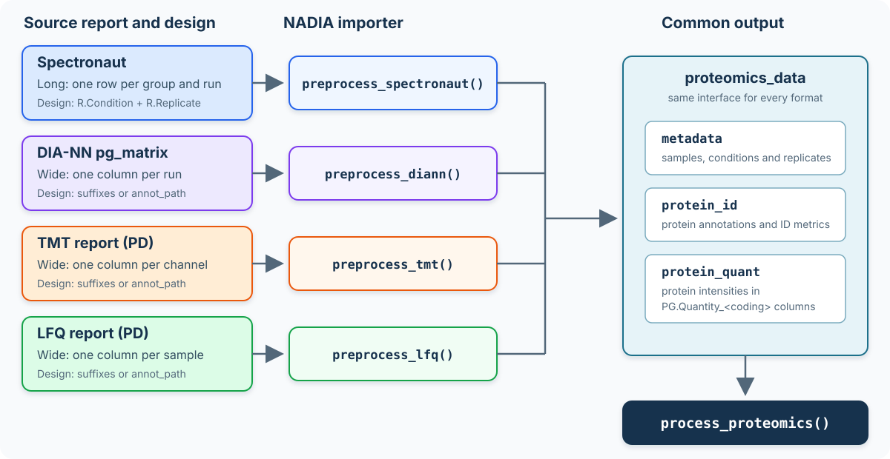
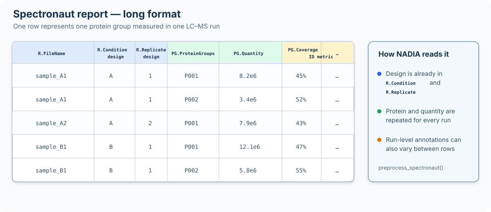
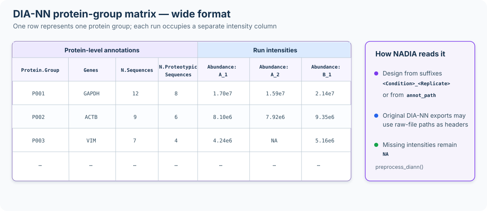
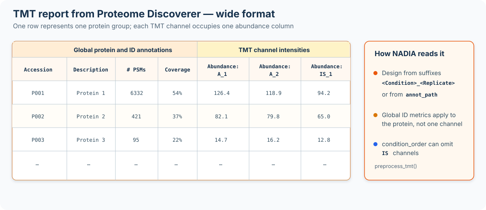
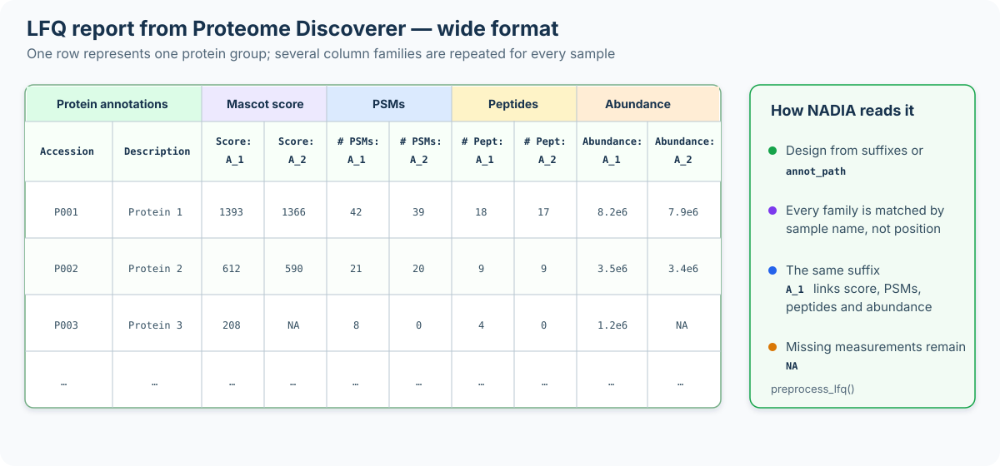

```{r setup, include = FALSE}
knitr::opts_chunk$set(collapse = TRUE, comment = "#>", crop = NULL)
```

<style type="text/css">
#fig\:input-format-overview + img {
  width: 100% !important;
  max-width: none !important;
}
@media screen and (min-width: 992px) {
  #fig\:input-format-overview + img {
    width: 116% !important;
    margin-left: -12%;
  }
}
#fig\:input-format-overview + img.input-format-clickable {
  cursor: zoom-in;
}
.figure-zoom-hint {
  margin: -0.15em 0 1.2em;
  text-align: center;
  color: #5f6f7e;
  font-size: 0.9em;
  font-style: italic;
}
#input-format-lightbox {
  display: none;
  position: fixed;
  inset: 0;
  z-index: 9999;
  padding: 24px;
  align-items: center;
  justify-content: center;
  background: rgba(15, 25, 35, 0.88);
  cursor: zoom-out;
}
#input-format-lightbox.is-open {
  display: flex;
}
#input-format-lightbox img {
  width: auto !important;
  height: auto !important;
  max-width: 96vw !important;
  max-height: 92vh !important;
  margin: 0 !important;
  padding: 0 !important;
  background: white;
  box-shadow: 0 6px 30px rgba(0, 0, 0, 0.35);
  cursor: default;
}
#input-format-lightbox button {
  position: absolute;
  top: 12px;
  right: 18px;
  border: 0;
  background: transparent;
  color: white;
  font-size: 36px;
  line-height: 1;
  cursor: pointer;
}
body.input-format-lightbox-open {
  overflow: hidden;
}
#fig\:spectronaut-input-structure + img,
#fig\:diann-input-structure + img,
#fig\:tmt-input-structure + img,
#fig\:lfq-input-structure + img {
  width: 100% !important;
  max-width: none !important;
}
@media screen and (min-width: 992px) {
  #fig\:spectronaut-input-structure + img,
  #fig\:diann-input-structure + img,
  #fig\:tmt-input-structure + img,
  #fig\:lfq-input-structure + img {
    width: 110% !important;
    margin-left: -5%;
  }
}
img.preprocessor-structure-clickable {
  cursor: zoom-in;
}
#preprocessor-structure-lightbox {
  display: none;
  position: fixed;
  inset: 0;
  z-index: 9999;
  padding: 24px;
  align-items: center;
  justify-content: center;
  background: rgba(15, 25, 35, 0.88);
  cursor: zoom-out;
}
#preprocessor-structure-lightbox.is-open {
  display: flex;
}
#preprocessor-structure-lightbox img {
  width: auto !important;
  height: auto !important;
  max-width: 96vw !important;
  max-height: 92vh !important;
  margin: 0 !important;
  padding: 0 !important;
  background: white;
  box-shadow: 0 6px 30px rgba(0, 0, 0, 0.35);
  cursor: default;
}
#preprocessor-structure-lightbox button {
  position: absolute;
  top: 12px;
  right: 18px;
  border: 0;
  background: transparent;
  color: white;
  font-size: 36px;
  line-height: 1;
  cursor: pointer;
}
body.preprocessor-structure-lightbox-open {
  overflow: hidden;
}
.spectronaut-schema-note {
  margin: 1.15em 0 1.5em;
  width: calc(100% - 1.5em);
  box-sizing: border-box;
  padding: 1em 1.15em 0.9em;
  border: 1px solid #a9c3d6;
  border-left: 5px solid #3577a8;
  border-radius: 5px;
  background: #f4f8fb;
  box-shadow: 0 1px 2px rgba(27, 62, 88, 0.08);
}
.spectronaut-schema-note-title {
  margin-bottom: 0.55em;
  color: #1d5278;
  font-size: 1.08em;
  font-weight: 700;
}
.spectronaut-schema-note p {
  margin: 0 0 0.75em;
  padding-left: 0 !important;
  padding-right: 0 !important;
  text-align: left;
}
.spectronaut-schema-command {
  margin: 0.75em 0;
  padding: 0.65em 0.8em;
  overflow-x: auto;
  border: 1px solid #d0dee8;
  border-radius: 4px;
  background: #ffffff;
  white-space: nowrap;
}
.spectronaut-schema-note p:last-child {
  margin-bottom: 0;
}
.default-call {
  margin: 1em 0 1.25em;
  border: 1px solid #c8d3dc;
  border-radius: 5px;
  background: #f7f9fb;
}
.default-call summary {
  padding: 0.75em 1em;
  color: #1d3557;
  font-weight: 600;
  cursor: pointer;
}
.default-call[open] summary {
  border-bottom: 1px solid #c8d3dc;
}
.default-call pre {
  margin: 1em;
}
.input-format-summary table {
  width: 100%;
  table-layout: fixed;
}
.input-format-summary col:nth-child(1) { width: 20% !important; }
.input-format-summary col:nth-child(2) { width: 18% !important; }
.input-format-summary col:nth-child(3) { width: 62% !important; }
.input-format-summary th,
.input-format-summary td {
  vertical-align: top !important;
}
@media screen and (max-width: 767px) {
  .input-format-summary {
    overflow-x: auto;
  }
  .input-format-summary table {
    min-width: 760px;
  }
}
</style>

# Introduction

NADIA accepts four input formats through `preprocess_spectronaut()`,
`preprocess_diann()`, `preprocess_tmt()` and `preprocess_lfq()`. Although their
source reports have different layouts, all four functions return a
`proteomics_data` object with the same three components. Consequently,
`process_proteomics()` and the downstream modules use the same interface
regardless of how the data were acquired or searched.

This vignette applies each preprocessor to an example report and explains the
main distinction among them: **where NADIA obtains the experimental design**.
Correctly linking every measured column or run to its condition and replicate is
essential, because that mapping determines the groups compared later in the
analysis.

For example, `preprocess_spectronaut()` converts a long-format report—one row
for each reported combination of LC-MS run and protein group—into an object of
class `proteomics_data`.

The `proteomics_data` object separates the information contained in the source
report into three coordinated tables:

- `metadata` contains one row per sample or LC-MS run, including the sample
  identifier, experimental condition, replicate and any available run-level
  information.

- `protein_id` contains identification-level information for each protein group,
  including protein and gene annotations and, when available, run-specific
  evidence such as peptide and precursor counts, sequence coverage and
  identification scores.

- `protein_quant` contains the protein-level quantification data. It includes
  the abundance measured for each protein group in each sample, together with
  the protein annotations and quantitative evidence required by the downstream
  workflow.

```{r input-format-overview, echo = FALSE, fig.align = "center", out.width = "100%", fig.cap = "Four report formats converge on the common `proteomics_data` structure used by the NADIA workflow.", fig.alt = "Workflow diagram showing Spectronaut, DIA-NN, TMT and LFQ reports entering their corresponding preprocessing functions. Spectronaut obtains the design from R.Condition and R.Replicate in the report. DIA-NN, TMT and LFQ obtain it from Abundance column suffixes or an annotation file supplied through annot_path. All four produce a proteomics_data object containing metadata, protein_id and protein_quant, which is passed to process_proteomics."}

```

<div class="figure-zoom-hint">Click the figure to enlarge it; press Esc or click outside the image to close it.</div>

<script>
(function () {
  var anchor = document.getElementById("fig:input-format-overview");
  var source = anchor ? anchor.nextElementSibling : null;
  if (!source || source.tagName !== "IMG") return;

  source.classList.add("input-format-clickable");
  source.setAttribute("tabindex", "0");
  source.setAttribute("title", "Click to enlarge the input-format workflow");

  var lightbox = document.createElement("div");
  lightbox.id = "input-format-lightbox";
  lightbox.setAttribute("role", "dialog");
  lightbox.setAttribute("aria-modal", "true");
  lightbox.setAttribute("aria-label", "Enlarged NADIA input-format workflow");
  lightbox.setAttribute("aria-hidden", "true");

  var enlarged = source.cloneNode(true);
  enlarged.classList.remove("input-format-clickable");
  enlarged.removeAttribute("tabindex");
  enlarged.removeAttribute("title");
  enlarged.removeAttribute("width");

  var closeButton = document.createElement("button");
  closeButton.type = "button";
  closeButton.setAttribute("aria-label", "Close enlarged figure");
  closeButton.textContent = "\u00d7";

  lightbox.appendChild(enlarged);
  lightbox.appendChild(closeButton);
  document.body.appendChild(lightbox);

  function openLightbox() {
    lightbox.classList.add("is-open");
    lightbox.setAttribute("aria-hidden", "false");
    document.body.classList.add("input-format-lightbox-open");
    closeButton.focus();
  }
  function closeLightbox() {
    lightbox.classList.remove("is-open");
    lightbox.setAttribute("aria-hidden", "true");
    document.body.classList.remove("input-format-lightbox-open");
    source.focus();
  }

  source.addEventListener("click", openLightbox);
  source.addEventListener("keydown", function (event) {
    if (event.key === "Enter" || event.key === " ") {
      event.preventDefault();
      openLightbox();
    }
  });
  enlarged.addEventListener("click", function (event) {
    event.stopPropagation();
  });
  closeButton.addEventListener("click", closeLightbox);
  lightbox.addEventListener("click", closeLightbox);
  document.addEventListener("keydown", function (event) {
    if (event.key === "Escape" && lightbox.classList.contains("is-open")) {
      closeLightbox();
    }
  });
}());
</script>

<script>
document.addEventListener("DOMContentLoaded", function () {
  var figureIds = [
    "fig:spectronaut-input-structure",
    "fig:diann-input-structure",
    "fig:tmt-input-structure",
    "fig:lfq-input-structure"
  ];
  var sources = figureIds.map(function (id) {
    var anchor = document.getElementById(id);
    var image = anchor ? anchor.nextElementSibling : null;
    return image && image.tagName === "IMG" ? image : null;
  }).filter(Boolean);
  if (!sources.length) return;

  var lightbox = document.createElement("div");
  lightbox.id = "preprocessor-structure-lightbox";
  lightbox.setAttribute("role", "dialog");
  lightbox.setAttribute("aria-modal", "true");
  lightbox.setAttribute("aria-label", "Enlarged input-file structure diagram");
  lightbox.setAttribute("aria-hidden", "true");

  var enlarged = document.createElement("img");
  var closeButton = document.createElement("button");
  closeButton.type = "button";
  closeButton.setAttribute("aria-label", "Close enlarged figure");
  closeButton.textContent = "\u00d7";
  lightbox.appendChild(enlarged);
  lightbox.appendChild(closeButton);
  document.body.appendChild(lightbox);

  var activeSource = null;
  function openLightbox(source) {
    activeSource = source;
    enlarged.src = source.src;
    enlarged.alt = source.alt;
    lightbox.classList.add("is-open");
    lightbox.setAttribute("aria-hidden", "false");
    document.body.classList.add("preprocessor-structure-lightbox-open");
    closeButton.focus();
  }
  function closeLightbox() {
    lightbox.classList.remove("is-open");
    lightbox.setAttribute("aria-hidden", "true");
    document.body.classList.remove("preprocessor-structure-lightbox-open");
    if (activeSource) activeSource.focus();
  }

  sources.forEach(function (source) {
    source.classList.add("preprocessor-structure-clickable");
    source.setAttribute("tabindex", "0");
    source.setAttribute("title", "Click to enlarge this input-file structure");
    source.addEventListener("click", function () { openLightbox(source); });
    source.addEventListener("keydown", function (event) {
      if (event.key === "Enter" || event.key === " ") {
        event.preventDefault();
        openLightbox(source);
      }
    });
  });
  enlarged.addEventListener("click", function (event) { event.stopPropagation(); });
  closeButton.addEventListener("click", closeLightbox);
  lightbox.addEventListener("click", closeLightbox);
  document.addEventListener("keydown", function (event) {
    if (event.key === "Escape" && lightbox.classList.contains("is-open")) {
      closeLightbox();
    }
  });
});
</script>

In the Spectronaut example used below, `metadata` contains 12 samples, whereas
`protein_id` and `protein_quant` each contain 2,000 protein groups.

The three tables have distinct but complementary roles. `metadata` defines the
experimental design; `protein_quant` provides the abundance matrix used for
normalisation, imputation and differential abundance analysis; and `protein_id`
retains the more detailed identification evidence used for inspection and
reporting.

# Installation

```{r install, eval = FALSE}
if (!requireNamespace("BiocManager", quietly = TRUE))
    install.packages("BiocManager")
BiocManager::install("NADIA")
```

```{r library, message = FALSE}
library(NADIA)
```

# DIA: Spectronaut

::: {.spectronaut-schema-note}

<div class="spectronaut-schema-note-title">Spectronaut export schema included with NADIA</div>

NADIA provides a ready-to-use schema for generating a compatible Spectronaut
report. Locate the installed file from R with:

<div class="spectronaut-schema-command"><code>system.file("extdata", "NADIA_Report.rs", package = "NADIA")</code></div>

`NADIA_Report.rs` is a binary file interpreted by Spectronaut, not a text file
that lists the exported columns. Import it directly into Spectronaut and select
it when generating the report. The resulting table will contain the structure
and columns required by `preprocess_spectronaut()`.

:::

Spectronaut exports a **long** report: one row per protein group *per run*, with
the condition and replicate written in every row. Among the four input formats
supported by NADIA, Spectronaut is the only one for which the experimental
design does not need to be supplied separately. `preprocess_spectronaut()`
extracts it directly from the `R.Condition` and `R.Replicate` columns in the
report.

```{r spectronaut-input-structure, echo = FALSE, fig.align = "center", out.width = "100%", fig.cap = "Structure of the long-format Spectronaut report accepted by `preprocess_spectronaut()`.", fig.alt = "Diagram of a long-format Spectronaut report. Each row contains one LC-MS run and one protein group. R.FileName, R.Condition and R.Replicate identify the sample and experimental design; PG.ProteinGroups identifies the protein; PG.Quantity contains its abundance; and further columns contain run-level annotations."}

```

<div class="figure-zoom-hint">Click the figure to enlarge it; press Esc or click outside the image to close it.</div>

The arguments accepted by `preprocess_spectronaut()` are summarised below. The
input report and the order of the conditions are required; the remaining
arguments control optional export and the aggregation of run-level annotations.

<details class="default-call">
<summary>Show the complete <code>preprocess_spectronaut()</code> call and default arguments</summary>

```{r spectronaut-defaults, eval = FALSE}
dia <- preprocess_spectronaut(
    # Required input and experimental conditions
    file_path = "spectronaut_report.tsv",
    condition_order = c("Control", "Treatment"),

    # Optional export; NULL keeps the result in memory
    export_dir = NULL,

    # Aggregation of annotations reported for multiple runs
    agg_coverage_run = "max",
    agg_coverage_global = "max",
    agg_mw = "max",
    agg_cscore_runwise = "mean",

    # Exported file names and progress messages
    timestamp_suffix = TRUE,
    verbose = TRUE
)
```

</details>

```{r dia}
dia_file <- system.file("extdata", "nadia_dia_report.tsv.gz", package = "NADIA")
dia <- preprocess_spectronaut(dia_file, condition_order = c("A", "B", "D"),
                              verbose = FALSE)
dia
```

Because the design already comes from the report, `condition_order` does not
infer or redefine the condition assigned to each run. Instead, it selects the
conditions to retain—excluding any other conditions present in the report—and
sets their order in the subsequent stages of the analysis, including downstream
comparisons. It should therefore list every condition that is to be analysed.

The following output shows an example of the metadata table extracted and
constructed from the imported Spectronaut report:

```{r dia-md}
dia$metadata
```

Because the report is long and run-level, the same protein group may have
multiple values for annotations such as sequence coverage, molecular weight and
C-score. The `agg_*` arguments determine how those values are reduced when a
single annotation value is required:

```{r dia-agg, eval = FALSE}
dia_median <- preprocess_spectronaut(
    dia_file, condition_order = c("A", "B", "D"),
    agg_coverage_run = "median",   # default "max"
    agg_cscore_runwise = "median", # default "mean"
    verbose = FALSE)
```

These arguments affect only the annotations stored alongside the quantitative
data; they do not modify protein intensities.

# DIA: DIA-NN

A DIA-NN protein-group matrix (`report.pg_matrix.tsv`) is **wide**: it contains
one row per protein group and one intensity column per run. This differs from
the long Spectronaut report and resembles the wide Proteome Discoverer exports
described below, which is why it requires a dedicated importer.

```{r diann-input-structure, echo = FALSE, fig.align = "center", out.width = "100%", fig.cap = "Structure of the wide DIA-NN protein-group matrix accepted by `preprocess_diann()`.", fig.alt = "Diagram of a wide DIA-NN protein-group matrix. Each row represents one protein group. Protein annotations occupy the first columns, followed by one Abundance column for each run. The experimental design is obtained from Condition_Replicate suffixes or from annot_path."}

```

<div class="figure-zoom-hint">Click the figure to enlarge it; press Esc or click outside the image to close it.</div>

The arguments accepted by `preprocess_diann()` are shown below. The report and
the condition order are required. `annot_path` is optional and is used when the
run columns do not follow the `Abundance: <Condition>_<Replicate>` convention.

<details class="default-call">
<summary>Show the complete <code>preprocess_diann()</code> call and default arguments</summary>

```{r diann-defaults, eval = FALSE}
diann <- preprocess_diann(
    # Required input and conditions to retain
    file_path = "report.pg_matrix.tsv",
    condition_order = c("Control", "Treatment"),

    # Optional sample annotation file; NULL uses the column suffixes
    annot_path = NULL,

    # Optional export; NULL keeps the result in memory
    export_dir = NULL,
    timestamp_suffix = TRUE,

    # Progress messages
    verbose = TRUE
)
```

</details>

```{r diann}
diann_file <- system.file("extdata", "nadia_diann_report.tsv.gz",
                          package = "NADIA")
diann <- preprocess_diann(diann_file, condition_order = c("A", "B", "D"),
                          verbose = FALSE)
diann
```

## Declaring the experimental design

DIA-NN names each intensity column after the raw file it came from:

```
D:\DIA-NN\Projects\20241014_XII_CursoProtQ_DIA_500ng_sample_A1.raw
```

The text `sample_A1` may suggest condition A and replicate 1 to a reader, but
that interpretation depends on a laboratory-specific naming convention. A
regular expression that worked for this report could silently misclassify the
next one. NADIA therefore does not infer the design from raw-file names.
Instead, it can be declared in either of two ways:

1. **Rename the run columns** using the
   `Abundance: <Condition>_<Replicate>` convention also used by Proteome
   Discoverer. The example distributed with NADIA follows this convention, so
   the call above needs no additional argument.

2. **Supply an annotation file through `annot_path`** and leave the report
   exactly as DIA-NN exported it. The `Column` field must contain the complete
   run headers, including the raw-file paths:

```{r diann-annot, eval = FALSE}
preprocess_diann(
    "report.pg_matrix.tsv",
    condition_order = c("A", "B", "D"),
    annot_path = "design.tsv")
```

`design.tsv` must be a tab-separated file with one row for each run that should
be imported and two columns named exactly `Column` and `Condition`. `Column`
contains the complete header of the corresponding intensity column in the
DIA-NN matrix, while `Condition` assigns that run to an experimental group. For
example:

```
Column                                                           Condition
D:\DIA-NN\Projects\experiment\sample_A1.raw                       A
D:\DIA-NN\Projects\experiment\sample_A2.raw                       A
D:\DIA-NN\Projects\experiment\sample_B1.raw                       B
```

The values in `Column` must match the report headers exactly, including the
complete raw-file path when DIA-NN uses paths as column names. Runs omitted from
the annotation file are not imported. `condition_order` then selects which of
the annotated conditions are retained and sets their order in the subsequent
analysis. If neither valid `Abundance: <Condition>_<Replicate>` headers nor an
annotation file are supplied, the error message lists the headers that must be
entered in `Column`.

Whichever route is used, NADIA constructs one row of `metadata` per retained
run. The columns have the following meaning:

- `R.FileName` preserves the complete intensity-column header read from the
  report.
- `R.Condition` contains the experimental condition, obtained either from the
  renamed header or from `Condition` in the annotation file.
- `R.Replicate` is read from a `<Condition>_<Replicate>` suffix when that naming
  convention is used. For original DIA-NN headers without such a suffix, runs
  are numbered sequentially within each condition.
- `Coding` is the sample identifier used to name the quantitative columns. It
  is the `<Condition>_<Replicate>` suffix for renamed columns and the value of
  `Column` when `annot_path` is used.
- `R.ProteinGroupsIdentified` reports how many protein groups have a non-missing
  intensity in that run.

The following output shows an example of the metadata table extracted and
constructed from the imported DIA-NN report:

```{r diann-md}
diann$metadata
```

**Note on identification information.** The DIA-NN protein-group matrix contains
little identification evidence. The two available fields are `N.Sequences`,
which gives the total peptide-sequence count, and
`N.Proteotypic.Sequences`, which gives the proteotypic peptide count. To
preserve the common structure of the `proteomics_data` object, NADIA repeats
these protein-level values across runs in `protein_id`, as it does for the
global Proteome Discoverer metrics in TMT data. NADIA also calculates the
number of protein groups with a reported intensity in each run and stores it as
`R.ProteinGroupsIdentified` in the metadata table shown above.

# TMT: Proteome Discoverer

A TMT report from Proteome Discoverer is **wide**: it contains one row per
protein group and one abundance column per sample. As with DIA-NN, the
experimental design must be declared either through column names that follow
the `Abundance: <Condition>_<Replicate>` convention or through an annotation
file supplied with `annot_path`.

```{r tmt-input-structure, echo = FALSE, fig.align = "center", out.width = "100%", fig.cap = "Structure of the wide Proteome Discoverer TMT report accepted by `preprocess_tmt()`.", fig.alt = "Diagram of a wide TMT report from Proteome Discoverer. Each row represents one protein group. Global protein and identification annotations occupy the first columns, followed by one Abundance column for each TMT channel. The design is obtained from Condition_Replicate suffixes or from annot_path."}

```

<div class="figure-zoom-hint">Click the figure to enlarge it; press Esc or click outside the image to close it.</div>

The arguments accepted by `preprocess_tmt()` are listed below. The report and
the conditions to retain are required. `annot_path` provides an alternative
way to declare the design when the abundance suffixes do not follow the naming
convention.

<details class="default-call">
<summary>Show the complete <code>preprocess_tmt()</code> call and default arguments</summary>

```{r tmt-defaults, eval = FALSE}
tmt <- preprocess_tmt(
    # Required input and conditions to retain
    file_path = "tmt_report.tsv",
    condition_order = c("Control", "Treatment"),

    # Optional channel annotation file; NULL uses the column suffixes
    annot_path = NULL,

    # Optional export; NULL keeps the result in memory
    export_dir = NULL,
    timestamp_suffix = TRUE,

    # Progress messages
    verbose = TRUE
)
```

</details>

## Declaring the experimental design

The design can be supplied in either of two ways:

1. **Use informative abundance-column suffixes.** Columns named
   `Abundance: A_1`, `Abundance: A_2` and `Abundance: B_1`, for example, identify
   the condition and replicate directly. No annotation file is required.

2. **Supply an annotation file.** This is useful when the abundance columns
   retain identifiers such as the TMT tags `126`, `127N` or `127C`. The
   annotation file assigns each identifier to its experimental condition
   without modifying the Proteome Discoverer report.

`design.tsv` must be a tab-separated file with the columns `Column` and
`Condition`. For TMT data, `Column` contains the exact text that follows the
`Abundance: ` prefix in the report. For example:

```
Column    Condition
126       A
127N      A
127C      B
128N      B
128C      D
129N      D
```

Thus, an abundance column named `Abundance: 127N` is identified by the value
`127N` in `Column`. Identifiers omitted from the annotation file are not
imported. `condition_order` subsequently selects the conditions to retain and
sets their order in the downstream analysis. The annotation file is passed to
`preprocess_tmt()` as follows:

```{r tmt-annot, eval = FALSE}
preprocess_tmt(
    "tmt_report.tsv",
    condition_order = c("A", "B", "D"),
    annot_path = "design.tsv")
```

This example contains three biological conditions with eight replicates each,
plus four `IS` channels that provide an internal standard across two TMT mixes.
Replicates 1--4 belong to the first mix and replicates 5--8 to the second.
Because `condition_order` also filters the parsed channels, omitting `"IS"`
excludes the standards and prevents NADIA from treating them as a biological
condition in downstream contrasts:

```{r tmt-run}
tmt_file <- system.file("extdata", "nadia_tmt_report.tsv.gz", package = "NADIA")
tmt <- preprocess_tmt(tmt_file, condition_order = c("A", "B", "D"),
                      verbose = FALSE)
tmt
```

The following output shows an example of the metadata table extracted and
constructed from the imported TMT report. The condition counts confirm that the
`IS` channels were excluded by `condition_order`:

```{r tmt-md}
head(tmt$metadata)
table(tmt$metadata$R.Condition)
```

**Note on identification information.** TMT samples are digested and labelled
individually, but they are then combined and analysed as a multiplexed mixture.
Consequently, the identification evidence reported by Proteome Discoverer is
global to the multiplex rather than specific to each original sample. To
preserve the common structure of the `proteomics_data` object, NADIA repeats
global values such as the numbers of PSMs and identified peptides, sequence
coverage and the PEP score across the samples in `protein_id`. These repeated
values must not be interpreted as independent sample-level identifications. In
contrast, the reporter-ion abundances are sample-specific and remain separate
in `protein_quant`.

Any additional columns in `design.tsv` are ignored. Batch, TMT/LFQ experiment
and other covariate information should instead be supplied through
`covariate_df` in `process_proteomics()`, as explained in
`vignette("batch-correction")`.

# Label-free: Proteome Discoverer

A label-free report from Proteome Discoverer is **wide**: it contains one row
per protein group and one abundance column per sample. As with DIA-NN and TMT,
the experimental design can be obtained from column names that follow the
`Abundance: <Condition>_<Replicate>` convention or supplied separately through
`annot_path`.

```{r lfq-input-structure, echo = FALSE, fig.align = "center", out.width = "100%", fig.cap = "Structure of the wide Proteome Discoverer LFQ report accepted by `preprocess_lfq()`.", fig.alt = "Diagram of a wide label-free report from Proteome Discoverer. Each row represents one protein group. Protein annotations are followed by repeated families of Score Mascot, PSM count, peptide count and Abundance columns for every sample. NADIA matches these families by sample name."}

```

<div class="figure-zoom-hint">Click the figure to enlarge it; press Esc or click outside the image to close it.</div>

Unlike DIA-NN and TMT, but like Spectronaut, this report contains
**per-sample identification metrics**. For every sample, Proteome Discoverer
can report a Mascot score, a PSM count and a peptide count in addition to the
abundance. NADIA matches these column families to the corresponding sample by
name rather than by their position in the report. The resulting identification
values therefore retain differences among samples in `protein_id`.

The arguments accepted by `preprocess_lfq()` are shown below. Only the report is
required. Both `annot_path` and `condition_order` are optional; when omitted,
the design and condition order are obtained from the abundance suffixes.

<details class="default-call">
<summary>Show the complete <code>preprocess_lfq()</code> call and default arguments</summary>

```{r lfq-defaults, eval = FALSE}
lfq <- preprocess_lfq(
    # Required input
    file_path = "lfq_report.tsv",

    # Optional design file and condition filtering/order
    annot_path = NULL,
    condition_order = NULL,

    # Optional export; NULL keeps the result in memory
    export_dir = NULL,
    timestamp_suffix = TRUE,

    # Progress messages
    verbose = TRUE
)
```

</details>

## Declaring the experimental design

The design can be supplied in either of two ways:

1. **Use informative abundance-column suffixes.** Columns named
   `Abundance: A_1`, `Abundance: A_2` and `Abundance: B_1`, for example, identify
   the condition and replicate directly. This is the convention used by the
   example report distributed with NADIA.

2. **Supply an annotation file.** This route is used when the text after
   `Abundance: ` identifies a sample but does not encode its experimental
   condition and replicate. The report itself does not need to be renamed.

`design.tsv` must be a tab-separated file with the columns `Column` and
`Condition`. `Column` contains the exact sample identifier that follows the
`Abundance: ` prefix in the report. For example:

```
Column      Condition
Sample01    Control
Sample02    Control
Sample03    Treatment
Sample04    Treatment
```

Thus, the abundance column `Abundance: Sample01` is identified by `Sample01` in
`Column`. Samples omitted from the annotation file are not imported. If
`condition_order` is supplied, it additionally selects the conditions to
retain and sets their order; otherwise, NADIA uses their order of appearance.
The annotation file is passed to `preprocess_lfq()` as follows:

```{r lfq-annot, eval = FALSE}
preprocess_lfq(
    "lfq_report.tsv",
    condition_order = c("Control", "Treatment"),
    annot_path = "design.tsv")
```

The example report distributed with NADIA contains three conditions with four
replicates each. Its abundance-column suffixes already encode the complete
design, so neither `annot_path` nor `condition_order` needs to be supplied:

```{r lfq-run}
lfq_file <- system.file("extdata", "nadia_lfq_report.tsv.gz", package = "NADIA")
lfq <- preprocess_lfq(lfq_file, verbose = FALSE)
lfq
```

The following output shows an example of the metadata table extracted and
constructed from the imported LFQ report:

```{r lfq-md}
lfq$metadata
```

Any additional columns in `design.tsv` are ignored. Batch, TMT/LFQ experiment
and other covariate information should instead be supplied through
`covariate_df` in `process_proteomics()`, as explained in
`vignette("batch-correction")`.

# Where the design comes from

The four importers produce the same object, but they obtain the experimental
design in different ways:

::: {.input-format-summary}

| Format | Layout | Design taken from |
|---|---|---|
| Spectronaut | long, run-level | the `R.Condition` / `R.Replicate` columns |
| DIA-NN | wide | the `Abundance: <cond>_<rep>` suffixes, or `annot_path` |
| TMT (PD) | wide | the `Abundance: <cond>_<rep>` suffixes, or `annot_path` |
| LFQ (PD) | wide | the `Abundance: <cond>_<rep>` suffixes, or `annot_path` |

:::

Only the long Spectronaut report carries its experimental design internally.
The three wide formats use a common declaration strategy: either name the
abundance columns according to the convention or provide a two-column annotation
file. DIA-NN matches `Column` against its complete run headers, whereas the
Proteome Discoverer importers match it against the text after `Abundance: `.

`condition_order` then selects the conditions to retain and sets their order in
the subsequent stages of the analysis. It is required for Spectronaut, DIA-NN
and TMT. For LFQ it is optional; if omitted, NADIA uses the order in which the
conditions are detected.

# Naming the conditions

Regardless of the input format, condition names become **column names in the
design matrix**. The differential abundance model evaluates a contrast such as
`"B-A"` as the expression `B - A`; it is not only a display label.

This determines which condition names are safe. For example, conditions named
`Tr-1` and `Ct-1` would produce `Tr-1-Ct-1`. R would interpret the hyphens as
several subtraction operators rather than as characters within two condition
names, so the intended contrast could not be constructed.

The rule is simple: **each condition must have a syntactically valid R name.**
In practice:

| In the name | Verdict | Why |
|---|---|---|
| letters, digits (not first) | fine | `Ctrl`, `Treat24h` |
| `.` full stop | **fine** | `Ct.1` gives the contrast `Tr.1-Ct.1` |
| `_` underscore | **fine** | `Ct_a` gives `Tr_a-Ct_a` |
| `-` hyphen | **rejected** | collides with the contrast separator |
| space | **rejected** | not a syntactic name |
| leading digit | **rejected** | `1Ct` is not a name; R would rewrite it `X1Ct` |

Names that follow the rows marked **fine** can be used safely and allow the
pipeline to complete without naming-related errors. If there is any doubt,
consult the table above or check the proposed names with `make.names()`:

```{r names-test}
candidates <- c("Ctrl", "Ct.1", "Ct_a", "Ct-1", "Ct 1", "1Ct")
data.frame(name  = candidates,
           valid = make.names(candidates) == candidates,
           what_r_would_do = make.names(candidates))
```

The pipeline validates condition names before fitting the model and stops with
an informative error if any are invalid. Sample identifiers must also remain
consistent. A `Column` value in `design.tsv` that does not match the report
produces an error, whereas samples omitted from the annotation file are
excluded. If `metadata$Coding` is subsequently edited and no longer matches the
corresponding `PG.Quantity_<coding>` column, the unmatched samples are removed
from the analysis and the result contains fewer samples than expected.

In all three **wide formats**, the shared suffix parser reads the replicate from
the trailing digits of `<condition>_<replicate>`. An underscore within the
condition remains valid: `Ct_a_1` is parsed as condition `Ct_a`, replicate 1.
When `annot_path` is used, the labels in its `Condition` field define the
experimental conditions. A condition label can therefore be corrected in
`design.tsv` without renaming any abundance column in the quantitative report;
the values in `Column` must still match the corresponding report identifiers.

# Four sources, one common object

NADIA can start from four different report formats—Spectronaut, DIA-NN, TMT or
LFQ—but all four preprocessing functions converge on the same
`proteomics_data` object. Each importer adds a format-specific class while
retaining this common parent class:

```{r classes}
all4 <- list(Spectronaut = dia, DIA_NN = diann, TMT = tmt, LFQ = lfq)

vapply(all4, function(x) class(x)[1], character(1))
vapply(all4, function(x) inherits(x, "proteomics_data"), logical(1))
```

Every object contains the same three coordinated components: `metadata`,
`protein_id` and `protein_quant`.

```{r elements}
lapply(all4, names)
```

Their structure is common, but their contents reflect the information available
in the original report. The main differences occur in `metadata` and
`protein_id`: Spectronaut provides detailed run-level evidence, DIA-NN contains
limited identification information, TMT reports global identification evidence
for the multiplex and LFQ retains several identification metrics for each
sample. The available metadata fields consequently also differ:

```{r md-cols}
lapply(all4, function(x) colnames(x$metadata))
```

At the quantitative level, all four `protein_quant` tables follow the same
essential contract. In particular, the abundance of every sample is stored in
a `PG.Quantity_<Coding>` column linked to `metadata$Coding`. The numerical
values and any supporting quantitative evidence still depend on the source,
but the common organisation allows `process_proteomics()` to use the same
interface for all four formats:

```{r pipeline}
processed <- lapply(all4, process_proteomics, verbose = FALSE)
lapply(processed, function(x) x$comparisons)
```

The resulting objects proceed through the same workflow, from normalisation and
imputation to differential abundance analysis and visualisation. The available
fields are handled according to the source report, while the shared object
contract keeps the downstream interface unchanged. The presentation and export
of the final results are described in `vignette("results-and-export")`.

# Session information

```{r session}
sessionInfo()
```
