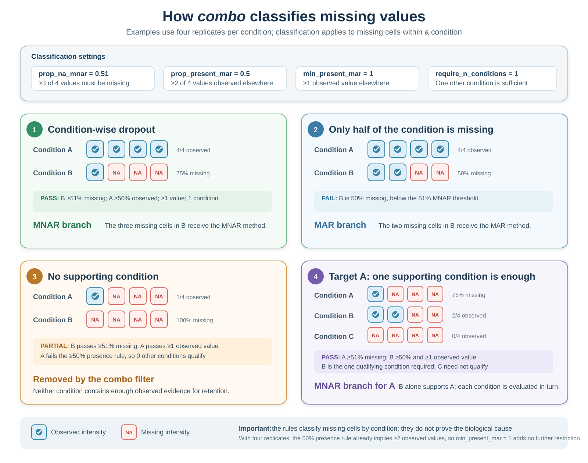

```{r setup, include = FALSE}
knitr::opts_chunk$set(collapse = TRUE, comment = "#>", crop = NULL)
options(width = 100)
```

<style type="text/css">
.wide-reference-table {
  position: relative;
}
.wide-reference-table table {
  width: 100%;
  max-width: none;
  margin-left: 0 !important;
  margin-right: 0 !important;
  table-layout: fixed;
  font-size: 0.93em;
  line-height: 1.28;
}
.wide-reference-table th,
.wide-reference-table td {
  padding: 0.42em 0.62em !important;
  vertical-align: top !important;
  overflow-wrap: anywhere;
}
.imputation-methods-table col:nth-child(1) { width: 22% !important; }
.imputation-methods-table col:nth-child(2) { width: 13% !important; }
.imputation-methods-table col:nth-child(3) { width: 65% !important; }
@media screen and (max-width: 991px) {
  .wide-reference-table { overflow-x: auto; }
  .wide-reference-table table {
    width: 860px;
    min-width: 860px;
  }
}
@media screen and (min-width: 992px) {
  .wide-reference-table {
    width: 96%;
    max-width: none;
    margin-left: 2%;
  }
  #fig\:mar-mnar-diagram + img {
    display: block;
    position: relative;
    left: 50%;
    width: 105% !important;
    max-width: none !important;
    margin-left: 0;
    margin-right: 0;
    transform: translateX(-50%);
  }
  #fig\:combo-classification-diagram + img {
    width: 106% !important;
    max-width: none !important;
    margin-left: -3%;
  }
}
@media screen and (min-width: 1400px) {
  .wide-reference-table {
    width: 98%;
    margin-left: 1%;
  }
}
#fig\:mar-mnar-diagram + img.mar-mnar-clickable,
#fig\:combo-classification-diagram + img.combo-classification-clickable {
  cursor: zoom-in;
}
.figure-zoom-hint {
  margin: -0.15em 0 1.2em;
  text-align: center;
  color: #5f6f7e;
  font-size: 0.9em;
  font-style: italic;
}
#mar-mnar-lightbox,
#combo-classification-lightbox {
  display: none;
  position: fixed;
  inset: 0;
  z-index: 9999;
  padding: 24px;
  align-items: center;
  justify-content: center;
  background: rgba(15, 25, 35, 0.88);
  cursor: zoom-out;
}
#mar-mnar-lightbox.is-open,
#combo-classification-lightbox.is-open { display: flex; }
#mar-mnar-lightbox img,
#combo-classification-lightbox img {
  width: auto !important;
  height: auto !important;
  max-width: 96vw !important;
  max-height: 92vh !important;
  margin: 0 !important;
  background: white;
  box-shadow: 0 6px 30px rgba(0, 0, 0, 0.35);
  cursor: default;
}
#mar-mnar-lightbox button,
#combo-classification-lightbox button {
  position: absolute;
  top: 12px;
  right: 18px;
  border: 0;
  background: transparent;
  color: white;
  font-size: 36px;
  line-height: 1;
  cursor: pointer;
}
body.mar-mnar-lightbox-open,
body.combo-classification-lightbox-open { overflow: hidden; }
</style>

# Introduction

Missing values in a proteomics matrix are not interchangeable. A value may be
absent because a protein was present but not quantified successfully, or because
its abundance was too low to be detected. These mechanisms call for different
assumptions and can coexist within the same experiment.

This vignette explains how to inspect that missingness, summarises the 20
strategies available in NADIA and describes the behaviour of the hybrid and
detection-aware options. It does not repeat the benchmarking metrics used to
rank candidate methods; those are covered in `vignette("choosing-methods")`.

# Installation

```{r install, eval = FALSE}
if (!requireNamespace("BiocManager", quietly = TRUE))
    install.packages("BiocManager")
BiocManager::install("NADIA")
```

```{r library, message = FALSE}
library(NADIA)
data(nadia_dia)
```

# Why values are missing

Imputation replaces missing entries with estimates so that analyses requiring a
complete matrix can be performed. The estimate should reflect a plausible reason
for the value being absent. NADIA uses the following practical distinction:

- **MAR (missing at random):** the protein is present, but its intensity was not
  quantified successfully—for example because of poor chromatography, precursor
  interference or a missed match. Under this assumption, the gap is not itself
  evidence that the unknown intensity was low. Its value can therefore be
  estimated from patterns in the available measurements, such as similar
  protein profiles or related samples.
- **MNAR (missing not at random):** the protein is absent or its abundance is
  below the detection limit. Missingness depends on the unobserved abundance
  being low and therefore carries biological or measurement information.
  Replacing such a gap with a typical neighbouring value may erase that
  evidence, so a low-value or detection-aware method is generally more
  plausible.

```{r mar-mnar-diagram, echo = FALSE, fig.align = "center", out.width = "100%", fig.cap = "Practical distinction between MAR and MNAR missing values in proteomics. MAR values are reconstructed from observed data structure, whereas MNAR values call for a low-value or detection-aware model.", fig.alt = "Two-panel diagram comparing MAR and MNAR missing values. MAR shows a missing replicate among similar observed intensities and recommends structure-based imputation. MNAR shows low values falling below a detection limit and recommends low-value or detection-aware imputation. A note states that an individual missing value does not reveal its cause and that both mechanisms can coexist."}
knitr::include_graphics("figures/MAR_MNAR_Missingness.svg")
```

<div class="figure-zoom-hint">Click the figure to enlarge it; press Esc or click outside the image to close it.</div>

<script>
(function () {
  var anchor = document.getElementById("fig:mar-mnar-diagram");
  var source = anchor ? anchor.nextElementSibling : null;
  if (!source || source.tagName !== "IMG") return;

  source.classList.add("mar-mnar-clickable");
  source.setAttribute("tabindex", "0");
  source.setAttribute("title", "Click to enlarge the MAR and MNAR diagram");

  var lightbox = document.createElement("div");
  lightbox.id = "mar-mnar-lightbox";
  lightbox.setAttribute("role", "dialog");
  lightbox.setAttribute("aria-modal", "true");
  lightbox.setAttribute("aria-label", "Enlarged MAR and MNAR missingness diagram");
  lightbox.setAttribute("aria-hidden", "true");

  var enlarged = source.cloneNode(true);
  enlarged.classList.remove("mar-mnar-clickable");
  enlarged.removeAttribute("tabindex");
  enlarged.removeAttribute("title");
  enlarged.removeAttribute("width");

  var closeButton = document.createElement("button");
  closeButton.type = "button";
  closeButton.setAttribute("aria-label", "Close enlarged figure");
  closeButton.textContent = "\u00d7";

  lightbox.appendChild(enlarged);
  lightbox.appendChild(closeButton);
  document.body.appendChild(lightbox);

  function openLightbox() {
    lightbox.classList.add("is-open");
    lightbox.setAttribute("aria-hidden", "false");
    document.body.classList.add("mar-mnar-lightbox-open");
    closeButton.focus();
  }
  function closeLightbox() {
    lightbox.classList.remove("is-open");
    lightbox.setAttribute("aria-hidden", "true");
    document.body.classList.remove("mar-mnar-lightbox-open");
    source.focus();
  }

  source.addEventListener("click", openLightbox);
  source.addEventListener("keydown", function (event) {
    if (event.key === "Enter" || event.key === " ") {
      event.preventDefault();
      openLightbox();
    }
  });
  enlarged.addEventListener("click", function (event) {
    event.stopPropagation();
  });
  closeButton.addEventListener("click", closeLightbox);
  lightbox.addEventListener("click", closeLightbox);
  document.addEventListener("keydown", function (event) {
    if (event.key === "Escape" && lightbox.classList.contains("is-open")) {
      closeLightbox();
    }
  });
}());
</script>

An individual `NA` does not reveal why the value is missing. MAR and MNAR are
possible explanations that must be evaluated using the experimental design, the
overall distribution of missing values and their relationship with observed
intensity. Both mechanisms may occur in the same dataset.

## How NADIA represents missing intensities

By the time the data enter the analysis, an unreported intensity is represented
as `NA`. How that `NA` is created depends on the input format. In a long
Spectronaut report, a protein that was not quantified in a particular run is
usually absent from the report; when NADIA constructs the wide `protein_quant`
table, the corresponding protein–run cell becomes `NA`. Some wide reports use
zero instead to mark an unreported intensity. Before normalisation,
`normalize_proteomics()` converts these zeros to `NA`, so downstream functions
handle both situations consistently.

# Diagnosing missingness in the example data

The `nadia_dia` example dataset included with NADIA retains the missing-value
pattern of the original experiment. Approximately 8% of its intensities are
missing, and more than a quarter of its proteins contain at least one gap.

```{r pattern}
quant <- as.matrix(nadia_dia$protein_quant[
    grep("^PG.Quantity_", colnames(nadia_dia$protein_quant))])

round(100 * mean(is.na(quant)), 1)
table(missing_per_protein = rowSums(is.na(quant)))
```

The distribution of `NA` values across proteins is informative. There are 70
proteins with one gap, 67 with two and 99 with three, followed by 243 proteins
with exactly four missing values. Four is also the number of replicates per
condition. Most of those 243 proteins are absent from every replicate of one
condition:

```{r condition-dropout}
condition <- rep(c("A", "B", "D"), each = 4)
whole_condition_missing <- apply(
    quant, 1,
    function(x) any(tapply(is.na(x), condition, all)))

c(exactly_four_missing = sum(rowSums(is.na(quant)) == 4),
  whole_condition_missing = sum(rowSums(is.na(quant)) == 4 &
                                whole_condition_missing))
```

Because each condition contains four replicates, a protein with four missing
values may be absent from one complete condition. This pattern suggests that at
least some gaps reflect condition-wise dropout rather than the scattered
missingness usually treated as MAR in this workflow. As a complementary
diagnostic, we next examine the distribution of the intensities that remain
observed:

```{r intensity-vs-missing, fig.width = 6, fig.height = 4, fig.alt = "Mean log2 intensity against number of missing values"}
n_missing  <- rowSums(is.na(quant))
mean_log2  <- rowMeans(log2(quant), na.rm = TRUE)

boxplot(mean_log2 ~ n_missing,
        xlab = "missing values in the protein",
        ylab = "mean log2 intensity of the values present",
        main = "Missingness is concentrated at low abundance")
```

Proteins with more missing values tend to have lower observed intensities. This
pattern supports the presence of an abundance-dependent MNAR component, in
which low-abundance proteins are more likely to fall below the detection limit.
However, this overall trend cannot determine the mechanism responsible for each
individual missing value. Taken together, the condition-wise dropout pattern
and its relationship with intensity suggest that this dataset contains both
scattered gaps and missing values caused by low abundance.

## Data processing shapes the missing-value pattern

NADIA includes DIA-NN and Spectronaut reports generated from the same twelve
LC-MS injections. The instrument data, samples and raw files are therefore the
same, allowing a descriptive comparison of the missing-value patterns produced
by the two processing workflows.

```{r engines, include = FALSE}
diann <- preprocess_diann(
    system.file("extdata", "nadia_diann_report.tsv.gz", package = "NADIA"),
    condition_order = c("A", "B", "D"), verbose = FALSE)

qd <- as.matrix(diann$protein_quant[
    grep("^PG.Quantity_", colnames(diann$protein_quant))])

shared_protein_groups <- length(intersect(
    nadia_dia$protein_quant$PG.ProteinGroups,
    diann$protein_quant$PG.ProteinGroups))
```

Each trimmed file contains 2,000 protein groups selected independently, and
only `r shared_protein_groups` groups are shared. The comparison can therefore
describe overall patterns, but it is not a protein-by-protein benchmark of the
two search engines.

```{r engines-summary}
summarise_missingness <- function(q) {
    n_missing <- rowSums(is.na(q))
    grp <- rep(c("A", "B", "D"), each = 4)
    mean_log2 <- rowMeans(log2(q), na.rm = TRUE)
    median_complete <- median(mean_log2[n_missing == 0])
    median_incomplete <- median(mean_log2[n_missing > 0], na.rm = TRUE)

    c(
        missing_intensities_pct = round(100 * mean(is.na(q)), 1),
        condition_dropout_pct = round(100 * mean(apply(
            q, 1, function(r) any(tapply(is.na(r), grp, all)))), 1),
        median_complete_log2 = round(median_complete, 1),
        median_incomplete_log2 = round(median_incomplete, 1),
        complete_minus_incomplete_log2 = round(
            median_complete - median_incomplete, 1)
    )
}

rbind(
    spectronaut = summarise_missingness(quant),
    diann = summarise_missingness(qd)
)
```

The distribution of missing values per protein provides additional context:

```{r engines-shape}
missing_per_protein <- function(q) {
    table(factor(rowSums(is.na(q)), levels = 0:12))
}
rbind(
    spectronaut = missing_per_protein(quant),
    diann = missing_per_protein(qd)
)
```

The Spectronaut example contains 8.1% missing intensities, compared with 12.5%
in the DIA-NN example. In both matrices, the distribution peaks at four missing
values per protein—the number of replicates in one condition—indicating that
condition-wise dropout is common. This affects 14.4% of proteins in Spectronaut
and 20.4% in DIA-NN; DIA-NN also contains more proteins with eight or more
missing values. Incomplete proteins (`n_missing > 0`) have a lower median
observed intensity than complete proteins (`n_missing = 0`) in both matrices,
with a difference of 1.9 log~2~ units in
Spectronaut and 2.6 log~2~ units in DIA-NN. These within-matrix differences do
not compare the absolute intensity scales of the search engines. Overall, the
DIA-NN example shows more missingness, more condition-wise dropout and a
stronger association between low abundance and missingness. This does not show
that one search engine is better; it shows that imputation decisions should be
based on the missing-value pattern of the matrix that will actually be
analysed.

# Imputation strategies available in NADIA

NADIA offers 20 selectable imputation strategies. The table below groups them
according to their main purpose and the type of missingness they are generally
intended to address. This grouping provides practical guidance; it does not
imply that the mechanism behind every missing value can be determined
unambiguously.

::: {.wide-reference-table .imputation-methods-table}

| Group | imp_method | Principle |
|---|---|---|
| Structure-based, generally used for MAR | `bpca` | Bayesian principal-component imputation using `pcaMethods`. |
|  | `knn` | Estimates a value from similar proteins using k-nearest neighbours. |
|  | `mice` | Multiple imputation by chained equations; NADIA averages the completed matrices. |
|  | `missForest` | Non-parametric random-forest imputation using relationships among variables. |
|  | `Impseq` | Sequential model-based imputation from `rrcovNA`. |
|  | `Impseqrob` | Robust sequential imputation that reduces sensitivity to outlying profiles. |
|  | `MLE` | Maximum-likelihood imputation under a multivariate normal model. |
|  | `nbavg` | Replaces a gap with the mean of the nearest observed positions in the same protein profile. |
| Low-value, generally used for MNAR | `QRILC` | Quantile-regression imputation for left-censored data. |
|  | `MinDet` | Uses a low, sample-specific quantile; the default is the first percentile. |
|  | `MinProb` | Draws low values around a sample-specific low quantile. |
|  | `PI` | Perseus-style sampling from a narrowed, down-shifted normal distribution. |
|  | `min` | Replaces every gap with the global observed minimum. |
|  | `halfmin` | Uses half the global minimum on the original scale, equivalent to one unit below the minimum on the log2 scale; this convention is used by DIA-NN. |
|  | `zero` | Replaces every gap with zero on the log2 scale. |
|  | `with` | Replaces every gap with a user-supplied constant. |
| Hybrid | `combo` | Classifies missing cells from condition-wise presence patterns, then applies separate MAR and MNAR methods. Defaults are `Impseqrob` and `min`. |
|  | `softHybrid` | Blends estimates from MAR and MNAR methods continuously using protein missingness and mean intensity. |
| Detection model | `limpa` | Estimates a detection-probability curve and returns abundance estimates with uncertainty for downstream analysis with `de_method = "limpa"`. |
| No imputation | `none` | Leaves missing values unchanged. |

:::

Structure-based methods estimate scattered gaps from relationships among the
observed proteins and samples. In contrast, low-value methods assume that
missingness is associated with low abundance and impute values from the lower
tail of the intensity distribution. `combo`, `softHybrid` and `limpa` address
this distinction more explicitly, as described below. The `none` option leaves
the missing values unchanged and therefore requires downstream methods that can
analyse an incomplete matrix.

`halfmin` operates on log~2~-transformed data. Halving the global minimum on the
original intensity scale is equivalent to subtracting one from its log~2~ value,
so the imputed value is `log2(minimum) - 1`. Both `min` and `halfmin`
depend on the single lowest observed intensity in the matrix. Distribution-based
methods such as `MinDet`, `QRILC` and `MinProb` instead characterise the
low-intensity tail using more than this single value.

# Why one method may not represent every gap

If the imputation method does not match the likely cause of missingness, it may
distort the biological signal. When a protein is not observed in any replicate
of one condition, a MAR method may borrow information from the other conditions
and impute values that are too similar to them. This can make a genuine
presence–absence difference appear smaller. Conversely, when an isolated value
is missing because of a technical measurement failure, an MNAR method may place
it unnecessarily close to the detection limit and create an artificial
difference between conditions.

Because both patterns can coexist, applying the same method to every `NA` may
not be appropriate. NADIA's hybrid strategies address this problem by applying
different imputation assumptions to different gaps. However, a hybrid method is
not automatically the best choice for every dataset: when one missingness
mechanism predominates, a single method may be sufficient. Candidate methods
can be compared using the procedure described in
`vignette("choosing-methods")`.

# The default hybrid: `combo`

The `combo` option is NADIA's default because a single dataset may contain both
isolated missing measurements and proteins that are not quantified in most or
all replicates of a condition. For each protein, NADIA examines how its observed
and missing values are distributed across the experimental conditions. Isolated
gaps are assigned to the MAR branch, whereas patterns consistent with
condition-wise dropout are assigned to the MNAR branch. By default, these
branches use `Impseqrob` and `min`, respectively.

Four arguments control the classification:

- `prop_na_mnar = 0.51` defines the minimum proportion of missing values within
  a condition for its gaps to be considered MNAR candidates.
- `prop_present_mar = 0.5` requires at least half of the replicates in another
  condition to contain an observed intensity for that protein. In this example,
  this means at least two of the four replicates.
- `min_present_mar = 1` requires at least one observed value in that other
  condition, regardless of its number of replicates. The proportional and
  absolute presence requirements must both be met.
- `require_n_conditions = 1` defines how many other conditions must meet both
  presence requirements. With the default value, one qualifying condition is
  sufficient.

A missing cell is assigned to the MNAR branch only when two criteria are met:
its condition reaches the required proportion of missing values, and the
required number of other conditions provide sufficient observed evidence for
that protein. All other missing cells are assigned to the MAR branch. With four
replicates, `prop_na_mnar = 0.51` requires at least three missing values in a
condition; two missing values represent only 50% and do not meet the threshold.

The following examples use conditions A and B, each with four replicates.
`Observed` denotes a measured intensity. Classification is performed separately
for the missing cells in each condition, so the protein is not assigned one
fixed MAR or MNAR label.

```{r combo-classification-diagram, echo = FALSE, fig.align = "center", out.width = "100%", fig.cap = "Examples of how the four combo arguments classify missing cells. A cell is assigned to the MNAR branch only when the missingness threshold and the evidence in other conditions are both satisfied; otherwise it enters the MAR branch or the protein may be removed by the preliminary combo filter.", fig.alt = "Four coloured examples of combo classification with four replicates per condition. The first is assigned to MNAR because one condition is 75 percent missing and another is fully observed. The second is assigned to MAR because 50 percent missing is below the 51 percent threshold. The third protein is removed because no other condition has at least 50 percent observed values. The fourth uses three conditions and shows that one qualifying supporting condition is sufficient."}

```

<div class="figure-zoom-hint">Click the figure to enlarge it; press Esc or click outside the image to close it.</div>

<script>
(function () {
  var anchor = document.getElementById("fig:combo-classification-diagram");
  var source = anchor ? anchor.nextElementSibling : null;
  if (!source || source.tagName !== "IMG") return;

  source.classList.add("combo-classification-clickable");
  source.setAttribute("tabindex", "0");
  source.setAttribute("title", "Click to enlarge the combo classification examples");

  var lightbox = document.createElement("div");
  lightbox.id = "combo-classification-lightbox";
  lightbox.setAttribute("role", "dialog");
  lightbox.setAttribute("aria-modal", "true");
  lightbox.setAttribute("aria-label", "Enlarged combo classification examples");
  lightbox.setAttribute("aria-hidden", "true");

  var enlarged = source.cloneNode(true);
  enlarged.classList.remove("combo-classification-clickable");
  enlarged.removeAttribute("tabindex");
  enlarged.removeAttribute("title");
  enlarged.removeAttribute("width");

  var closeButton = document.createElement("button");
  closeButton.type = "button";
  closeButton.setAttribute("aria-label", "Close enlarged figure");
  closeButton.textContent = "\u00d7";

  lightbox.appendChild(enlarged);
  lightbox.appendChild(closeButton);
  document.body.appendChild(lightbox);

  function openLightbox() {
    lightbox.classList.add("is-open");
    lightbox.setAttribute("aria-hidden", "false");
    document.body.classList.add("combo-classification-lightbox-open");
    closeButton.focus();
  }
  function closeLightbox() {
    lightbox.classList.remove("is-open");
    lightbox.setAttribute("aria-hidden", "true");
    document.body.classList.remove("combo-classification-lightbox-open");
    source.focus();
  }

  source.addEventListener("click", openLightbox);
  source.addEventListener("keydown", function (event) {
    if (event.key === "Enter" || event.key === " ") {
      event.preventDefault();
      openLightbox();
    }
  });
  enlarged.addEventListener("click", function (event) {
    event.stopPropagation();
  });
  closeButton.addEventListener("click", closeLightbox);
  lightbox.addEventListener("click", closeLightbox);
  document.addEventListener("keydown", function (event) {
    if (event.key === "Escape" && lightbox.classList.contains("is-open")) {
      closeLightbox();
    }
  });
}());
</script>

In these examples, each condition has four replicates. Therefore,
`prop_present_mar = 0.5` means that another condition must contain at least two
observed values before it can support an MNAR classification. Once two values
are observed, the requirement imposed by `min_present_mar = 1` is already
satisfied, so this second parameter does not change the classification here.

Before filling any missing values, `combo` also removes proteins that contain
too little observed information to apply these rules. A protein is retained if
it either contains a pattern classified as an MNAR candidate or has sufficient
observed values in at least `require_n_conditions` conditions.

The following example reports how many proteins pass this filter and how many
of the original missing cells are assigned to each branch:

```{r combo, message = FALSE}
res <- process_proteomics(nadia_dia, verbose = FALSE)
imp <- impute_proteomics(res$se_proc, "cycloess", verbose = FALSE)
x_combo <- SummarizedExperiment::assay(res$se_proc, "cycloess")

c(
    proteins_before = nrow(nadia_dia$protein_quant),
    proteins_after_combo_rules = nrow(res$se_proc),
    MAR_missing_values = sum(imp$mar_mask & is.na(x_combo)),
    MNAR_missing_values = sum(imp$mnar_mask & is.na(x_combo))
)
```

The output shows that both branches are used. These assignments reflect the
selected rules and do not establish the true mechanism of any individual `NA`.
When a distribution-based MNAR method is selected, its low-intensity parameters
are estimated from the original matrix, before MAR imputation, so reconstructed
MAR values do not shift the estimated lower tail.

# `softHybrid`: a continuous combination

`softHybrid` was introduced by [Shi et al. (2026)](https://doi.org/10.64898/2026.01.13.699212)
as a hybrid imputation method for single-cell proteomics. Unlike `combo`, which
assigns each missing cell to either a MAR or an MNAR branch, `softHybrid`
calculates both estimates and combines them continuously.

For each protein, the method uses its proportion of missing values and its mean
observed intensity to calculate a weight. Extensive missingness and low
intensity increase the contribution of the MNAR estimate, whereas a
well-observed, higher-intensity protein receives more influence from the MAR
estimate. The final value for each gap is therefore a weighted average of the
two estimates rather than the result of a binary classification. NADIA uses
`Impseqrob` and `min` as the default MAR and MNAR methods, respectively.

The transition is controlled by two sigmoid functions. Parameter `a` determines
how rapidly the weight changes with the missing-value proportion, `b` controls
the transition along the standardised intensity axis and `lambda` balances the
two signals. In most cases, the defaults provide the natural starting point:

```{r softhybrid}
imp_soft <- impute_proteomics(
    res$se_proc,
    normalized_assay_name = "cycloess",
    imp_method  = "softHybrid",
    mar_method  = "Impseqrob",
    mnar_method = "min",
    verbose     = FALSE)

grep("softHybrid", SummarizedExperiment::assayNames(imp_soft$se), value = TRUE)
imp_soft$imputation_summary
```

The summary reports the initial and final missing-value rates and the
distribution of the MAR weights. Whether this continuous combination improves
the analysis remains dataset-dependent and should be assessed as described in
`vignette("choosing-methods")`.

# `limpa`: detection-aware estimates with uncertainty

The `limpa` framework was described by [Li, Cobbold and Smyth
(2025)](https://doi.org/10.1101/2025.04.28.651125). It differs from conventional
methods that simply replace each missing value with a single completed-matrix
estimate. First, `limpa` estimates a detection-probability curve that relates
protein abundance to the probability of observing a signal. It then uses this
curve to estimate the abundance of missing measurements together with their
standard errors.

Here, *precision* means statistical reliability. `limpa` converts each
abundance estimate and its uncertainty into a **precision weight** for differential
analysis: an estimate based on limited evidence receives less weight than an
observed, reproducible measurement. Missing values can therefore still
contribute information, while uncertain estimates have less influence on the
fitted model.

The estimates and weights are stored together and must remain linked through the
differential abundance step:

```{r limpa, eval = requireNamespace("limpa", quietly = TRUE)}
res_limpa <- process_proteomics(nadia_dia,
                                imp_method = "limpa",
                                de_method  = "limpa",
                                verbose    = FALSE)

class(S4Vectors::metadata(res_limpa$se_proc)$limpa_elist)
table(res_limpa$DEPs_results$Change)
```

`imp_method = "limpa"` should therefore be paired with
`de_method = "limpa"`. Using its abundance estimates with an ordinary `limma`
test would discard the uncertainty model.

# Choosing among the strategies

The missing-value pattern, biological design and intended differential model
should guide the set of plausible strategies. When the true missing abundances
are unknown, no diagnostic can establish a universally correct method. NADIA
therefore provides artificial-masking metrics, ranking summaries and plots for
comparing candidate methods, while sensitivity analysis shows whether the main
biological conclusions depend on that choice.

Those evaluation procedures, their limitations and the interpretation of the
rankings are described in `vignette("choosing-methods")`. Keeping them there
separates two questions: this vignette explains **what the missing values may
mean and how NADIA can handle them**; the companion vignette explains **how to
compare the available choices on a particular dataset**.

# References and software

- Li M, Cobbold SA, Smyth GK (2025). [Quantification and differential analysis
  of mass spectrometry proteomics data with probabilistic recovery of
  information from missing values](https://doi.org/10.1101/2025.04.28.651125).
  *bioRxiv*, 2025.04.28.651125. This work describes the statistical framework
  implemented in `limpa`; the software is available from
  [Bioconductor](https://bioconductor.org/packages/limpa) and
  [GitHub](https://github.com/SmythLab/limpa).

- Shi Y, Davis S, Charles PD, Taylor S, Dombi E, Berridge G, Ebner D, Fischer R
  (2026). [SoftHybrid: A Hybrid Imputation Algorithm Optimised for Single-Cell
  Proteomics Data](https://doi.org/10.64898/2026.01.13.699212). *bioRxiv*,
  2026.01.13.699212. This work describes the `softHybrid` imputation strategy.

# Session information

```{r session}
sessionInfo()
```
