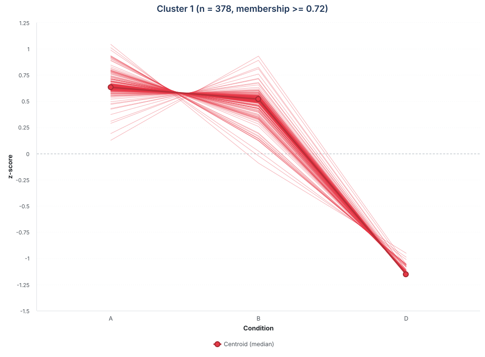
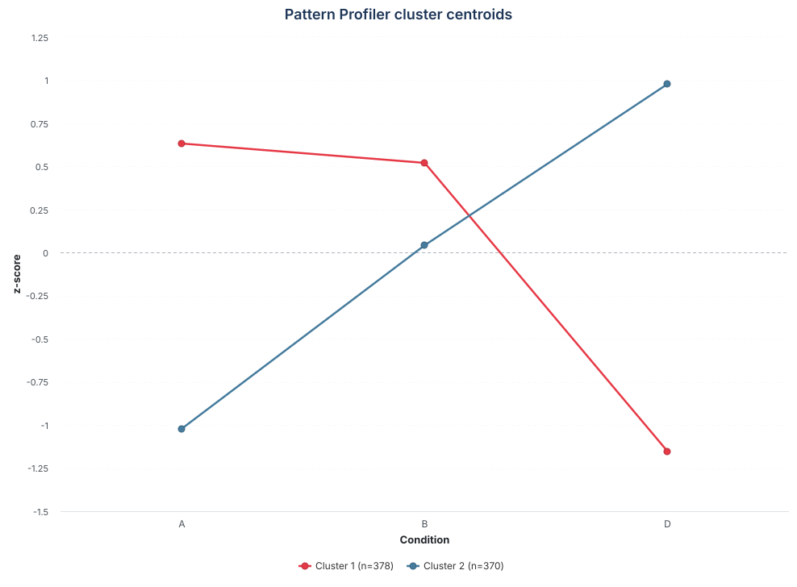

```{r setup, include=FALSE}
knitr::opts_chunk$set(
  collapse = TRUE,
  comment = "#>",
  crop = NULL,
  message = FALSE,
  warning = FALSE
)

have_pattern_profiler <- all(vapply(
  c("Mfuzz", "Biobase", "e1071"),
  requireNamespace,
  logical(1),
  quietly = TRUE
))
```

```{css, echo=FALSE}
.function-parameters {
  margin: 1.4em 0 1.8em;
  border: 1px solid #c8d4df;
  border-radius: 5px;
  background: #f8fafc;
}

.function-parameters summary {
  padding: 0.8em 1em;
  cursor: pointer;
  font-weight: 600;
  color: #234f73;
}

.function-parameters .parameter-content {
  padding: 0 1.2em 0.8em;
}

.function-parameters dt {
  margin-top: 0.7em;
}

.function-parameters dd {
  margin-left: 1.4em;
}

.pattern-note {
  margin: 1.4em 0;
  padding: 0.95em 1.15em;
  border-left: 5px solid #e6a700;
  background: #fff8e5;
}

.figure-space {
  margin-top: 1.8em;
  margin-bottom: 1.8em;
}

.profile-lightbox-target,
.centroid-lightbox-target {
  margin-top: 1.8em;
}

.profile-lightbox-target img.profile-lightbox-clickable,
.centroid-lightbox-target img.centroid-lightbox-clickable {
  cursor: zoom-in;
}

@media screen and (min-width: 768px) {
  .profile-lightbox-target img,
  .centroid-lightbox-target img {
    display: block;
    width: 110% !important;
    height: auto !important;
    max-width: none !important;
    margin-left: -5%;
  }
}

.figure-zoom-hint {
  margin: -0.15em 0 1.2em;
  text-align: center;
  color: #5f6f7e;
  font-size: 0.9em;
  font-style: italic;
}

#profile-lightbox,
#centroid-lightbox {
  display: none;
  position: fixed;
  inset: 0;
  z-index: 9999;
  padding: 24px;
  align-items: center;
  justify-content: center;
  background: rgba(15, 25, 35, 0.88);
  cursor: zoom-out;
}

#profile-lightbox.is-open,
#centroid-lightbox.is-open {
  display: flex;
}

#profile-lightbox img,
#centroid-lightbox img {
  width: auto !important;
  height: auto !important;
  max-width: 96vw !important;
  max-height: 92vh !important;
  margin: 0 !important;
  padding: 0 !important;
  background: white;
  box-shadow: 0 6px 30px rgba(0, 0, 0, 0.35);
  cursor: default;
}

#profile-lightbox button,
#centroid-lightbox button {
  position: absolute;
  top: 12px;
  right: 18px;
  border: 0;
  background: transparent;
  color: white;
  font-size: 36px;
  line-height: 1;
  cursor: pointer;
}

body.pattern-lightbox-open {
  overflow: hidden;
}
```

# Introduction

Differential-expression analysis identifies proteins that change between pairs
of conditions. When an experiment contains three or more ordered conditions,
Pattern Profiler addresses a complementary question: **which proteins follow
the same expression pattern across the complete experiment?** Proteins that
increase, decrease, peak, or recover together may participate in related
biological processes even when their absolute abundances differ.

`pattern_profiler_analysis()` uses fuzzy c-means clustering, implemented with
the `Mfuzz` package (Kumar and Futschik, 2007). Unlike hard clustering, fuzzy
clustering does not force every protein into a single group. Instead, it assigns
a membership value between 0 and 1 to every protein--cluster pair. High
membership indicates a clear match to a pattern, whereas intermediate
membership identifies proteins with more ambiguous profiles.

This vignette shows how to select proteins, choose the number of clusters,
interpret memberships and expression profiles, and save the results for later
use.

# Setup and example data

Pattern Profiler is included in NADIA, while `Mfuzz` and its clustering
dependencies are optional. The following commands install the required packages
if they are not already available.

```{r installation, eval=FALSE}
if (!requireNamespace("BiocManager", quietly = TRUE))
  install.packages("BiocManager")

BiocManager::install(c("NADIA", "Mfuzz", "Biobase"))
install.packages("e1071")
```

We use `nadia_dia`, the example DIA proteomics dataset distributed with NADIA.
The data are first processed to obtain both the intensity assays and the
differential-expression results required by Pattern Profiler.

```{r load-data}
library(NADIA)
data(nadia_dia)

res <- process_proteomics(nadia_dia, verbose = FALSE)
```

The processed experiment contains three ordered conditions (`A`, `B`, and `D`),
each represented by four samples. Replicates are retained during protein
quantification and are aggregated only when the condition-level profiles are
constructed.

```{r example-design}
design_table <- as.data.frame(SummarizedExperiment::colData(res$se_proc))
design_table <- as.data.frame(table(Condition = design_table$Condition))
names(design_table)[2] <- "Samples"

knitr::kable(
  design_table,
  caption = "Number of samples available for each condition."
)
```

Pattern Profiler is most informative when the conditions have a meaningful
order, such as time points, doses, or disease stages. With only two conditions,
each profile contains a single transition and therefore provides little more
information than the direction of the corresponding fold change.

# Running Pattern Profiler

The function first selects proteins using the differential-expression table.
For each selected protein, it then aggregates replicates within conditions,
standardises the resulting profile, selects or accepts a number of clusters,
and performs fuzzy c-means clustering. The example below evaluates two to five
clusters and uses the Xie--Beni index to choose among them.

<details class="function-parameters">
<summary>Arguments of <code>pattern_profiler_analysis()</code></summary>
<div class="parameter-content">
<dl>
<dt><code>se_proc</code></dt>
<dd>A processed <code>SummarizedExperiment</code> containing the protein-intensity assays and sample metadata.</dd>

<dt><code>DEPs_results</code></dt>
<dd>The differential-expression table returned by <code>process_proteomics()</code>.</dd>

<dt><code>assay_name</code></dt>
<dd>The assay used to build the profiles and to select the matching rows from <code>DEPs_results</code>.</dd>

<dt><code>filter_mode</code>, <code>alpha</code>, and <code>comparison</code></dt>
<dd>Control which proteins enter the analysis. The modes are explained in the next section; <code>comparison</code> is required only for <code>filter_mode = "specific"</code>.</dd>

<dt><code>condition_order</code></dt>
<dd>The order in which conditions appear in the profiles. If omitted, alphabetical order is used.</dd>

<dt><code>aggregate</code></dt>
<dd>How replicates are summarised within each condition: <code>"median"</code> (default) or <code>"mean"</code>.</dd>

<dt><code>auto_select_c</code>, <code>c_range</code>, and <code>c</code></dt>
<dd>Automatically evaluate candidate cluster numbers in <code>c_range</code>, or set a fixed <code>c</code> when <code>auto_select_c = FALSE</code>.</dd>

<dt><code>selection_method</code></dt>
<dd>The rule used for automatic selection: <code>"xb"</code>, <code>"consensus"</code>, or <code>"elbow"</code>.</dd>

<dt><code>min_membership</code></dt>
<dd>The minimum fuzzy membership required for a protein--cluster pair to be included in <code>long_output</code> (default: <code>0.25</code>).</dd>

<dt><code>seed</code> and <code>seeds</code></dt>
<dd><code>seed</code> makes the final clustering reproducible. <code>seeds</code> supplies repeated starts when candidate cluster numbers are evaluated.</dd>

<dt><code>output_file</code></dt>
<dd>An optional path for writing <code>long_output</code> as a Parquet file. Nothing is written when it is <code>NULL</code>.</dd>

<dt><code>verbose</code></dt>
<dd>Controls progress messages.</dd>
</dl>
</div>
</details>

```{r run-pattern-profiler, eval=have_pattern_profiler, results='hide'}
pp <- pattern_profiler_analysis(
  se_proc          = res$se_proc,
  DEPs_results     = res$DEPs_results,
  assay_name       = "Impseqrob_min",
  filter_mode      = "any",
  alpha            = 0.05,
  condition_order  = c("A", "B", "D"),
  aggregate        = "median",
  c_range          = 2:5,
  auto_select_c    = TRUE,
  selection_method = "xb",
  min_membership   = 0.25,
  seed             = 42,
  seeds            = c(42, 123, 456),
  verbose          = FALSE
)
```

The returned object contains the chosen cluster number, the estimated fuzzifier
(`m`), selection diagnostics, the fitted `Mfuzz` object, and a long-format table
for inspection and visualisation. The overview below confirms that all selected
proteins passed the preprocessing checks. The output contains more rows than
proteins because a protein can meet the membership threshold in more than one
cluster.

```{r run-overview, eval=have_pattern_profiler}
run_overview <- data.frame(
  Measure = c(
    "Proteins selected",
    "Proteins clustered",
    "Rows in long_output",
    "Selected clusters",
    "Fuzzifier (m)"
  ),
  Value = c(
    format(pp$n_features_input, scientific = FALSE),
    format(pp$n_features_final, scientific = FALSE),
    format(pp$n_rows_output, scientific = FALSE),
    format(pp$optimal_c, scientific = FALSE),
    format(round(pp$m, 3), nsmall = 3)
  )
)

knitr::kable(
  run_overview,
  caption = "Overview of the Pattern Profiler run."
)
```

# Selecting proteins for clustering

Clustering every quantified protein can obscure biologically responsive
patterns with a large number of stable profiles. `filter_mode` therefore lets
the user define the protein set before clustering.

| filter_mode | Proteins included |
|:---|:---|
| `"any"` | Proteins significant in at least one comparison at the selected `alpha`. |
| `"specific"` | Proteins significant in the comparison supplied through `comparison`. |
| `"all"` | All quantified proteins; no significance filter is applied. |

<div class="pattern-note">
<strong>Important:</strong> <code>filter_mode = "all"</code> does not mean
"significant in every comparison". It disables significance filtering and
includes every protein available in the selected assay.
</div>

For this dataset, the three modes produce substantially different input sizes.
The counts below are obtained before missing-value and variance checks are
applied by Pattern Profiler.

```{r filter-counts}
dep_assay <- as.data.frame(res$DEPs_results)
dep_assay <- dep_assay[dep_assay$Assay == "Impseqrob_min", ]

filter_counts <- data.frame(
  Setting = c(
    'filter_mode = "any"',
    'filter_mode = "specific", comparison = "B-A"',
    'filter_mode = "all"'
  ),
  Proteins = c(
    length(unique(dep_assay$Protein.IDs[dep_assay$adj.P.Val <= 0.05])),
    length(unique(dep_assay$Protein.IDs[
      dep_assay$Comparison == "B-A" & dep_assay$adj.P.Val <= 0.05
    ])),
    nrow(res$se_proc)
  )
)

knitr::kable(
  filter_counts,
  caption = "Number of proteins selected by three filtering strategies."
)
```

The `"any"` mode retains 794 proteins that respond in at least one comparison,
whereas a `"specific"` analysis of `B-A` would retain 497. The `"all"` mode
would include all 1,997 quantified proteins and is useful when coordinated
variation among non-significant proteins is also of interest, but it may make
the dominant clusters less specific to the biological response.

# Choosing the number of clusters

The number of clusters determines the resolution of the analysis. Too few
clusters can merge distinct profiles, whereas too many can divide one pattern
into small, weakly supported groups. When `auto_select_c = TRUE`, NADIA fits each
candidate value in `c_range` with multiple seeds and reports four complementary
diagnostics.

| Metric | What it evaluates | Preferred value |
|:---|:---|:---|
| XB | Within-cluster compactness relative to separation between centroids. | Lower |
| FPC | How clearly proteins are assigned rather than shared among clusters. | Higher |
| AMM | Average maximum membership across proteins. | Higher |
| Dmin | Minimum distance between any two cluster centroids. | Higher |

The default `selection_method = "xb"` minimises the Xie--Beni (XB) index.
`"consensus"` combines the ranks of all four diagnostics and can be useful when
they disagree. `"elbow"` selects the largest change in centroid separation and
should be treated as an exploratory alternative rather than as a universal
optimum.

```{r selection-metrics, eval=have_pattern_profiler}
selection_table <- pp$selection_metrics
selection_table[c("XB", "XB_sd", "FPC", "AMM", "Dmin")] <- lapply(
  selection_table[c("XB", "XB_sd", "FPC", "AMM", "Dmin")],
  round,
  digits = 4
)

knitr::kable(
  selection_table,
  row.names = FALSE,
  caption = "Cluster-selection diagnostics for c = 2 to 5."
)
```

All four diagnostics favour two clusters in this example: `c = 2` has the
lowest XB value and the highest FPC, AMM, and Dmin values. The selected solution
therefore provides two well-separated expression patterns without adding
poorly supported subdivisions. These metrics are guides rather than biological
proof; candidate solutions should still be checked visually and interpreted in
the context of the experiment.

<div class="pattern-note">
Fuzzy c-means starts from a random partition. Keep <code>seed</code> fixed for a
reproducible final fit, and use several values in <code>seeds</code> when selecting
the number of clusters. Cluster numbers are arbitrary labels and may be swapped
between runs even when the underlying patterns are equivalent.
</div>

Before clustering, NADIA removes profiles that cannot be standardised reliably,
including constant profiles and features with excessive missingness. Remaining
isolated missing values are filled by k-nearest-neighbour imputation. Failed
candidate fits are stored as missing diagnostic values rather than as zeros, so
they cannot be mistaken for exceptionally good solutions.

# Understanding the soft-clustering output

The main result is `long_output`. It contains the protein identifier, cluster,
membership, and one standardised value for each condition. Because expression
is converted to a row-wise z-score, these values describe the **shape within
each protein**; they must not be interpreted as absolute protein abundance.

```{r long-output, eval=have_pattern_profiler}
knitr::kable(
  head(pp$long_output, 6),
  digits = 3,
  caption = "First rows of the long-format Pattern Profiler output."
)
```

Each row represents one protein--cluster association that satisfies
`min_membership`. `summarize_pattern_profiler()` provides an overview of these
associations and reports how many proteins occur in more than one cluster.

```{r membership-summary, eval=have_pattern_profiler}
pp_summary <- summarize_pattern_profiler(pp$long_output)

membership_overview <- data.frame(
  Measure = c(
    "Unique proteins",
    "Protein--cluster associations",
    "Proteins associated with multiple clusters"
  ),
  Value = c(
    pp_summary$n_unique_features,
    pp_summary$n_total_entries,
    pp_summary$n_multi_cluster_features
  )
)

knitr::kable(
  membership_overview,
  caption = "Summary of the soft-clustering assignments."
)
```

At the analysis threshold of 0.25, 73 proteins are associated with both
clusters. These overlapping assignments are not duplicates or errors: they
identify profiles that share characteristics with both centroids. The cluster
summary shows the size and strength of each set of assignments.

```{r cluster-summary, eval=have_pattern_profiler}
cluster_table <- as.data.frame(pp_summary$cluster_summary)
cluster_table[c("mean_membership", "min_membership", "max_membership")] <-
  lapply(
    cluster_table[c("mean_membership", "min_membership", "max_membership")],
    round,
    digits = 3
  )

knitr::kable(
  cluster_table,
  caption = "Membership summary for each cluster."
)
```

Both clusters have high average memberships, indicating that the two-pattern
solution is well defined overall. A stricter display threshold can be used when
only the clearest representatives are needed.

```{r membership-thresholds, eval=have_pattern_profiler}
thresholds <- c(0.25, 0.50, 0.70, 0.90)
threshold_table <- data.frame(
  Minimum_membership = thresholds,
  Associations_retained = vapply(
    thresholds,
    function(x) sum(pp$long_output$Membership >= x),
    numeric(1)
  )
)

knitr::kable(
  threshold_table,
  caption = "Effect of applying stricter membership thresholds."
)
```

Raising the threshold from 0.25 to 0.50 removes low-confidence secondary
associations while retaining one best-supported assignment for every protein in
this two-cluster solution. At 0.90, only 554 highly characteristic associations
remain. The appropriate threshold depends on whether the aim is broad discovery
or a conservative list for downstream interpretation.

The threshold supplied to `pattern_profiler_analysis()` determines which rows
are retained in `long_output`. Plotting functions can apply an additional,
stricter threshold, but they cannot recover associations that were removed
during the analysis.

# Visualising the expression patterns

Visualisation connects the numerical memberships to their biological meaning.
NADIA provides interactive Highcharts plots for inspecting all protein profiles
within individual clusters and for comparing cluster centroids.

## Protein profiles within each cluster

`cluster_profile_highchart_list()` creates one interactive figure per cluster.
Individual protein lines reveal within-cluster heterogeneity, while the centroid
summarises the dominant pattern. Here, a membership threshold of 0.70 is used as
a conservative starting point for displaying reliable cluster profiles.

```{r individual-profile-code, eval=FALSE}
profile_plots <- cluster_profile_highchart_list(
  pp$long_output,
  conditions = pp$conditions,
  min_membership = 0.70,
  centroid_summary = "median"
)

profile_plots[[1]]
```

The first cluster is shown below. Its interactive Highcharts object was exported
as SVG so that the figure remains compact and can be enlarged without losing
quality.

<div class="profile-lightbox-target">

```{r cluster-profile-svg, echo=FALSE, out.width='100%', fig.alt='Standardised expression profiles for the 378 proteins assigned to Pattern Profiler cluster 1 with membership of at least 0.70.'}

```

</div>

<div class="figure-zoom-hint">Click the figure to enlarge it; press Esc or click outside the image to close it.</div>

The thin red lines represent the 378 individual protein profiles retained at
this threshold, and the thick dark-red line is their median centroid. Most
proteins remain relatively stable between `A` and `B` and then decrease in `D`.
Their concentration around the centroid indicates a coherent cluster pattern.

The live object is best generated in the R session, because hundreds of
interactive series would make the installed vignette unnecessarily large. See
`vignette("visualization")` for additional guidance on interactive figures.

## Comparing cluster centroids

The centroid plot provides a compact overview of the patterns. Here the median
profile is used because it is less sensitive than the mean to proteins at the
edges of a cluster. The same membership threshold of 0.70 is applied so that
this summary and the cluster-level figure above represent the same protein
assignments.

```{r centroid-highchart-code, eval=FALSE}
centroid_plot <- cluster_centroids_highchart(
  pp$long_output,
  conditions = pp$conditions,
  min_membership = 0.70,
  centroid_summary = "median",
  title = "Pattern Profiler cluster centroids"
)

centroid_plot
```

The exported SVG retains the appearance of the interactive Highcharts object
without embedding its JavaScript libraries in the vignette.

<div class="centroid-lightbox-target">

```{r centroid-plot-svg, echo=FALSE, out.width='100%', fig.alt='Median standardised profiles for Pattern Profiler clusters 1 and 2 after applying a membership threshold of 0.70.'}

```

</div>

<div class="figure-zoom-hint">Click the figure to enlarge it; press Esc or click outside the image to close it.</div>

The centroids summarise 378 proteins in cluster 1 and 370 in cluster 2. Cluster
1 remains high in `A` and `B` before decreasing in `D`, whereas cluster 2 rises
from `A` to `D`. These opposing trajectories are expressed as within-protein
z-scores and therefore describe relative patterns rather than absolute
abundances.

<script>
(function () {
  function configureLightbox(targetSelector, lightboxId, clickableClass,
                             dialogLabel, sourceTitle) {
    var source = document.querySelector(targetSelector);
    if (!source) return;

    source.classList.add(clickableClass);
    source.setAttribute("tabindex", "0");
    source.setAttribute("title", sourceTitle);

    var lightbox = document.createElement("div");
    lightbox.id = lightboxId;
    lightbox.setAttribute("role", "dialog");
    lightbox.setAttribute("aria-modal", "true");
    lightbox.setAttribute("aria-label", dialogLabel);
    lightbox.setAttribute("aria-hidden", "true");

    var enlarged = source.cloneNode(true);
    enlarged.classList.remove(clickableClass);
    enlarged.removeAttribute("tabindex");
    enlarged.removeAttribute("title");
    enlarged.removeAttribute("width");

    var closeButton = document.createElement("button");
    closeButton.type = "button";
    closeButton.setAttribute("aria-label", "Close enlarged figure");
    closeButton.textContent = "\u00d7";

    lightbox.appendChild(enlarged);
    lightbox.appendChild(closeButton);
    document.body.appendChild(lightbox);

    function openLightbox() {
      lightbox.classList.add("is-open");
      lightbox.setAttribute("aria-hidden", "false");
      document.body.classList.add("pattern-lightbox-open");
      closeButton.focus();
    }

    function closeLightbox() {
      lightbox.classList.remove("is-open");
      lightbox.setAttribute("aria-hidden", "true");
      document.body.classList.remove("pattern-lightbox-open");
      source.focus();
    }

    source.addEventListener("click", openLightbox);
    source.addEventListener("keydown", function (event) {
      if (event.key === "Enter" || event.key === " ") {
        event.preventDefault();
        openLightbox();
      }
    });
    enlarged.addEventListener("click", function (event) {
      event.stopPropagation();
    });
    closeButton.addEventListener("click", closeLightbox);
    lightbox.addEventListener("click", closeLightbox);
    document.addEventListener("keydown", function (event) {
      if (event.key === "Escape" && lightbox.classList.contains("is-open")) {
        closeLightbox();
      }
    });
  }

  configureLightbox(
    ".profile-lightbox-target img",
    "profile-lightbox",
    "profile-lightbox-clickable",
    "Enlarged Pattern Profiler cluster 1 profile plot",
    "Click to enlarge the cluster 1 profile plot"
  );

  configureLightbox(
    ".centroid-lightbox-target img",
    "centroid-lightbox",
    "centroid-lightbox-clickable",
    "Enlarged Pattern Profiler cluster-centroid plot",
    "Click to enlarge the cluster-centroid plot"
  );
}());
</script>

<div class="figure-space"></div>

# Saving and reusing the results

Pattern Profiler results can be saved either as a standalone Parquet table or
inside a NADIA project. Both approaches avoid repeating the clustering when the
profiles need to be inspected or plotted again.

## Saving the long-format table as Parquet

Set `output_file` when running the analysis to write `long_output` directly.
Use the `.parquet` extension because the function writes a Parquet file.

```{r parquet-roundtrip, eval=have_pattern_profiler && requireNamespace("arrow", quietly=TRUE)}
parquet_file <- file.path(tempdir(), "pattern_profiler.parquet")

invisible(capture.output(pattern_profiler_analysis(
  se_proc          = res$se_proc,
  DEPs_results     = res$DEPs_results,
  assay_name       = "Impseqrob_min",
  filter_mode      = "any",
  condition_order  = c("A", "B", "D"),
  auto_select_c    = FALSE,
  c                = pp$optimal_c,
  min_membership   = 0.25,
  seed             = 42,
  output_file      = parquet_file,
  verbose          = FALSE
)))

reloaded <- read_pattern_profiler_data(
  parquet_file,
  min_membership = 0.70
)

data.frame(
  Rows_saved = nrow(pp$long_output),
  Rows_reloaded_at_0.70 = nrow(reloaded)
)

unlink(parquet_file)
```

`read_pattern_profiler_data()` validates the required columns and can apply a
stricter membership threshold while loading the file. In this example, the
saved table contains all associations at 0.25, whereas the reloaded object keeps
only those at or above 0.70. This stricter filter retains 748 of the 867 saved
protein--cluster associations.

## Storing Pattern Profiler in a NADIA project

A `.nadia` project can store the preprocessing, differential-expression
analysis, and Pattern Profiler result together. This is convenient when the
complete analysis must be transferred or reopened as one reproducible object.

```{r nadia-roundtrip, eval=have_pattern_profiler && requireNamespace("duckdb", quietly=TRUE)}
project_file <- file.path(tempdir(), "pattern_profiler_example.nadia")

write_nadia(
  project_file,
  preprocessing = nadia_dia,
  result = res,
  verbose = FALSE
)

nadia_add_pattern_profiler(
  project_file,
  pattern_profiler = pp,
  verbose = FALSE
)

stored_project <- read_nadia(project_file)
stored_profiles <- nadia_pattern_profiler(stored_project)

data.frame(
  Rows_original = nrow(pp$long_output),
  Rows_recovered = nrow(stored_profiles)
)

unlink(c(project_file, paste0(project_file, ".wal")))
```

The matching row counts confirm that the complete long-format clustering table
was recovered. Alternatively, `pattern_profiler = pp` can be supplied directly
to `write_nadia()` when the project and clustering are saved at the same time.

# Practical recommendations

Pattern Profiler is most useful as an exploratory layer after a well-controlled
differential-expression analysis. The following practices make the results
easier to reproduce and interpret:

- provide an explicit `condition_order` that reflects the experimental design;
- begin with `filter_mode = "any"`, then broaden or restrict the protein set to
  answer a specific biological question;
- inspect all cluster-selection diagnostics rather than treating one index as
  definitive;
- keep random seeds fixed and check that the main profiles remain stable across
  plausible cluster numbers;
- use membership to distinguish representative proteins from ambiguous ones;
- interpret standardised trajectories as relative shapes, not abundance
  differences; and
- perform pathway or functional enrichment only after verifying that the
  corresponding cluster is coherent and biologically interpretable.

With three or more ordered conditions, this workflow complements pairwise
differential expression by revealing groups of proteins that share a response
across the experiment. It does not establish regulation or causality by itself,
but it provides focused protein sets for subsequent biological validation.

# References

Kumar L, Futschik ME (2007). “Mfuzz: a software package for soft clustering of
microarray data.” *Bioinformation*, **2**(1), 5--7.

# Session information

The package versions used to build this vignette are recorded below to support
reproducibility.

```{r session-information}
sessionInfo()
```
