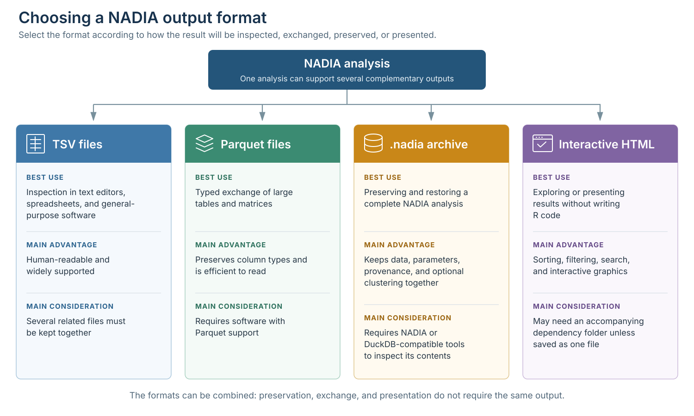
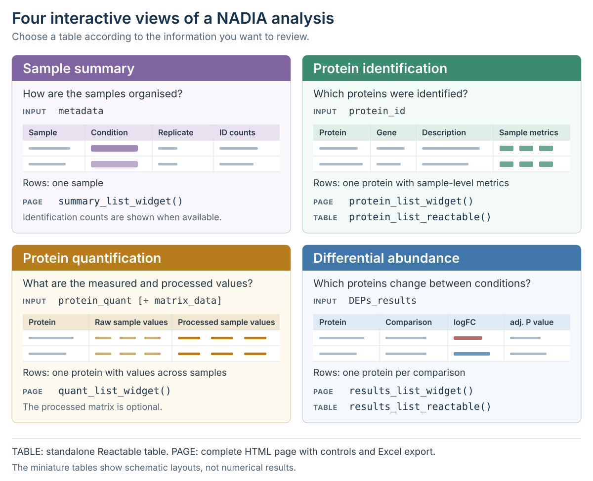

```{r setup, include = FALSE}
knitr::opts_chunk$set(
  collapse = TRUE,
  comment = "#>",
  crop = NULL,
  message = FALSE,
  warning = FALSE
)
options(width = 100)

have_pattern_profiler <- all(vapply(
  c("Mfuzz", "Biobase", "e1071"),
  requireNamespace,
  logical(1),
  quietly = TRUE
))
```

<style type="text/css">
.function-parameters,
.code-details {
  margin: 1em 0 1.4em;
  border: 1px solid #c8d3dc;
  border-radius: 5px;
  background: #f7f9fb;
}
.function-parameters summary,
.code-details summary {
  padding: 0.75em 1em;
  color: #1d3557;
  font-weight: 600;
  cursor: pointer;
}
.function-parameters[open] summary,
.code-details[open] summary {
  border-bottom: 1px solid #c8d3dc;
}
.function-parameters .parameter-content {
  padding: 0.2em 1em 0.7em;
}
.code-details pre,
.code-details table {
  margin: 1em;
}
.format-comparison-table {
  width: 100%;
  margin: 1em 0 1.5em 0;
}
.format-comparison-table table {
  width: 100% !important;
  max-width: none !important;
  margin-left: 0 !important;
  margin-right: 0 !important;
  table-layout: fixed;
}
.format-comparison-table th:nth-child(1),
.format-comparison-table td:nth-child(1) {
  width: 28% !important;
}
.format-comparison-table th:nth-child(2),
.format-comparison-table td:nth-child(2) {
  width: 32% !important;
}
.format-comparison-table th:nth-child(3),
.format-comparison-table td:nth-child(3) {
  width: 40% !important;
}
@media screen and (min-width: 768px) {
  .format-comparison-table th,
  .format-comparison-table td {
    white-space: nowrap;
  }
}
@media screen and (max-width: 767px) {
  .format-comparison-table {
    width: 100%;
    margin-left: 0;
  }
  .format-comparison-table table {
    table-layout: auto;
  }
}
.export-manifest-table {
  width: 80%;
  margin: 1em 0 1.5em 0;
}
.export-manifest-table table {
  width: 100% !important;
  max-width: none !important;
  margin-left: 0 !important;
  margin-right: 0 !important;
  table-layout: fixed;
}
.export-manifest-table th:nth-child(1),
.export-manifest-table td:nth-child(1) {
  width: 48% !important;
}
.export-manifest-table th:nth-child(2),
.export-manifest-table td:nth-child(2) {
  width: 38% !important;
}
.export-manifest-table th:nth-child(3),
.export-manifest-table td:nth-child(3) {
  width: 14% !important;
}
@media screen and (max-width: 767px) {
  .export-manifest-table {
    width: 100%;
  }
  .export-manifest-table table {
    table-layout: auto;
  }
}
.archive-output-table table,
.reproducibility-table table {
  margin-left: 65px !important;
  margin-right: auto !important;
}
@media screen and (max-width: 991px) {
  .archive-output-table table,
  .reproducibility-table table {
    margin-left: 0 !important;
  }
}
.cluster-results-table table {
  width: 580px !important;
  max-width: none !important;
  table-layout: auto;
}
.cluster-results-table th,
.cluster-results-table td {
  white-space: nowrap;
}
.cluster-results-table th:nth-child(5),
.cluster-results-table td:nth-child(5) {
  min-width: 6.5em;
}
.interactive-tables-figure img {
  display: block;
  width: 100%;
  max-width: 100%;
  padding: 0;
  margin-left: 0;
  margin-right: 0;
}
.export-warning {
  box-sizing: border-box;
  margin: 1.15em 0 1.5em;
  padding: 0.9em 1.1em;
  border: 1px solid #e4c78e;
  border-left: 5px solid #c98718;
  border-radius: 5px;
  background: #fffaf0;
  box-shadow: 0 1px 2px rgba(112, 78, 20, 0.08);
}
.export-warning p {
  margin: 0;
  padding: 0 !important;
}
.export-warning p + p {
  margin-top: 0.65em;
}
.export-warning strong:first-child {
  color: #7a5310;
}
.output-format-figure {
  margin: 1.6em 0;
}
.output-format-figure img,
.interactive-tables-figure img {
  cursor: zoom-in;
}
@media screen and (min-width: 768px) {
  .output-format-figure img {
    display: block;
    width: 110% !important;
    height: auto !important;
    max-width: none !important;
    margin-left: -5%;
  }
  .interactive-tables-figure img {
    width: 90% !important;
    height: auto !important;
    max-width: none !important;
    margin-left: 5%;
    margin-right: 5%;
  }
}
.output-format-zoom-hint {
  margin: -0.15em 0 1.2em;
  text-align: center;
  color: #5f6f7e;
  font-size: 0.9em;
  font-style: italic;
}
#output-format-lightbox,
#interactive-tables-lightbox {
  display: none;
  position: fixed;
  inset: 0;
  z-index: 9999;
  padding: 24px;
  align-items: center;
  justify-content: center;
  background: rgba(15, 25, 35, 0.88);
  cursor: zoom-out;
}
#output-format-lightbox.is-open,
#interactive-tables-lightbox.is-open {
  display: flex;
}
#output-format-lightbox img,
#interactive-tables-lightbox img {
  width: auto !important;
  height: auto !important;
  max-width: 96vw !important;
  max-height: 92vh !important;
  margin: 0 !important;
  padding: 0 !important;
  background: white;
  box-shadow: 0 6px 30px rgba(0, 0, 0, 0.35);
  cursor: default;
  /* The enlarged image is a clone: it must not inherit the
     positioning the in-flow figure uses to widen itself. */
  position: static !important;
  left: auto !important;
  transform: none !important;
}
#output-format-lightbox button,
#interactive-tables-lightbox button {
  position: absolute;
  top: 12px;
  right: 18px;
  border: 0;
  background: transparent;
  color: white;
  font-size: 36px;
  line-height: 1;
  cursor: pointer;
}
body.output-format-lightbox-open {
  overflow: hidden;
}
</style>

# Introduction

A proteomics analysis should finish with outputs that other people can inspect
and that the analyst can reproduce later. NADIA supports several complementary
routes: selected tables can be exported as TSV or Parquet files, a complete run
can be archived in one `.nadia` file, and interactive tables or figures can be
shared as HTML.

This vignette explains when to use each route, how to create the corresponding
files, and how to verify what has been saved. The examples use the bundled DIA
dataset so that every output can be reproduced without external files.

# Prepare an example analysis

This section creates one NADIA result that will be reused throughout the
vignette. Keeping a single analysis object also makes it easier to compare the
different export formats.

## Install and load NADIA

Install NADIA through Bioconductor if it is not already available, and then load
the package and example data.

```{r installation, eval = FALSE}
if (!requireNamespace("BiocManager", quietly = TRUE)) {
  install.packages("BiocManager")
}
BiocManager::install("NADIA")
```

```{r load-package}
library(NADIA)
data(nadia_dia)
```

## Run the processing workflow

`process_proteomics()` returns all analysis components in memory. Because
`export_dir` is not supplied here, this call does not create any files.

```{r run-analysis}
res <- process_proteomics(
  nadia_dia,
  verbose = FALSE
)
```

The returned object contains the processed experiment, differential-abundance
results, plotting tables, comparison names, and the parameters used in the run.
The following code summarises the size and purpose of the main components used
throughout this vignette.

<details class="code-details">
<summary>Show the code used to summarise the returned components</summary>

```{r result-components, results = "hide"}
component_summary <- data.frame(
  Component = c(
    "se_proc",
    "DEPs_results",
    "BoxPlot_Input",
    "PCA_Input",
    "comparisons",
    "parameters"
  ),
  Rows = c(
    nrow(res$se_proc),
    nrow(res$DEPs_results),
    nrow(res$BoxPlot_Input),
    nrow(res$PCA_Input),
    length(res$comparisons),
    length(res$parameters)
  ),
  Columns = c(
    ncol(res$se_proc),
    ncol(res$DEPs_results),
    ncol(res$BoxPlot_Input),
    ncol(res$PCA_Input),
    "\u2014",
    "\u2014"
  ),
  Purpose = c(
    "Processed assays and sample metadata",
    "Differential-abundance statistics",
    "Long-format intensities for boxplots",
    "Long-format intensities and significance flags for PCA",
    "Available pairwise comparisons",
    "Analysis settings and recorded function call"
  ),
  check.names = FALSE
)

knitr::kable(
  component_summary,
  caption = "Main components returned by process_proteomics().",
  align = c("l", "r", "r", "l")
)
```

</details>

```{r result-components-table, echo = FALSE}
knitr::kable(
  component_summary,
  caption = "Main components returned by process_proteomics().",
  align = c("l", "r", "r", "l")
)
```

The values are calculated directly with `nrow()` and `ncol()`, but the row count
reflects the structure of each object rather than the number of unique proteins.
`DEPs_results` contains 1,997 proteins across three comparisons (5,991 rows),
`BoxPlot_Input` contains the same proteins across 12 samples and two assays
(47,928 rows), and `PCA_Input` contains one row per protein and sample (23,964
rows). In the three data frames, `Columns` counts the available variables; in
`se_proc`, its 1,997 rows and 12 columns correspond directly to proteins and
samples, respectively. The final two components are not tabular: `comparisons`
contains three contrast names and `parameters` contains 38 recorded analysis
entries, so `Columns` is not applicable to them.

# Choose an output for the task

The most appropriate output depends on who will use it and whether they need
selected results or the complete analysis. The following diagram compares the
four main options used in this vignette.

::: {.output-format-figure}

```{r output-format-diagram, echo = FALSE, out.width = "100%", fig.align = "center", fig.cap = "Four complementary formats for exporting, preserving, or presenting NADIA results.", fig.alt = "A NADIA analysis branches into TSV files, Parquet files, a .nadia archive, and interactive HTML. Each output is described by its best use, main advantage, and main consideration."}

```

:::

<div class="output-format-zoom-hint">Click the figure to enlarge it; press Esc or click outside the image to close it.</div>

<script>
(function () {
  var source = document.querySelector(".output-format-figure img");
  if (!source || document.getElementById("output-format-lightbox")) return;

  source.setAttribute("tabindex", "0");
  source.setAttribute("title", "Click to enlarge the output-format diagram");

  var lightbox = document.createElement("div");
  lightbox.id = "output-format-lightbox";
  lightbox.setAttribute("role", "dialog");
  lightbox.setAttribute("aria-modal", "true");
  lightbox.setAttribute("aria-label", "Enlarged NADIA output-format diagram");
  lightbox.setAttribute("aria-hidden", "true");

  var enlarged = source.cloneNode(true);
  enlarged.removeAttribute("tabindex");
  enlarged.removeAttribute("title");
  enlarged.removeAttribute("width");

  var closeButton = document.createElement("button");
  closeButton.type = "button";
  closeButton.setAttribute("aria-label", "Close enlarged figure");
  closeButton.textContent = "\u00d7";

  lightbox.appendChild(enlarged);
  lightbox.appendChild(closeButton);
  document.body.appendChild(lightbox);

  function openLightbox() {
    lightbox.classList.add("is-open");
    lightbox.setAttribute("aria-hidden", "false");
    document.body.classList.add("output-format-lightbox-open");
    closeButton.focus();
  }

  function closeLightbox() {
    lightbox.classList.remove("is-open");
    lightbox.setAttribute("aria-hidden", "true");
    document.body.classList.remove("output-format-lightbox-open");
    source.focus();
  }

  source.addEventListener("click", openLightbox);
  source.addEventListener("keydown", function (event) {
    if (event.key === "Enter" || event.key === " ") {
      event.preventDefault();
      openLightbox();
    }
  });
  closeButton.addEventListener("click", closeLightbox);
  lightbox.addEventListener("click", function (event) {
    if (event.target === lightbox) closeLightbox();
  });
  document.addEventListener("keydown", function (event) {
    if (event.key === "Escape" && lightbox.classList.contains("is-open")) {
      closeLightbox();
    }
  });
}());
</script>

The four formats address different priorities. TSV files favour immediate,
human-readable inspection, whereas Parquet preserves column types for efficient
programmatic exchange. A `.nadia` archive is the most complete option for
restoring the analysis and its provenance, while interactive HTML is designed
for exploration and presentation without R code. These outputs are
complementary: a practical workflow can retain the `.nadia` archive as the
master record, export TSV or Parquet tables for downstream use, and share HTML
with collaborators for interactive review.

# Export tabular results

Having introduced the file formats supported by NADIA, we now examine them in
turn, beginning with TSV and Parquet. Both can store the same result tables; the
choice affects only how they are stored and read. This section first compares
the two formats and then shows how to export either one, or both, directly from
`process_proteomics()`.

## Choose between TSV and Parquet

TSV and Parquet store the same tabular information in different ways. TSV is
tab-separated plain text that can be opened directly in a text editor or
spreadsheet, making it convenient for manual inspection and exchange. However,
column types must be inferred when it is read, and large files can require
considerable disk space.

Parquet is a compressed, binary columnar format widely used in data analytics.
Storing values by column allows software to read only the data it needs, making
access faster and files smaller. Because Parquet is not human-readable, it
requires compatible software: in R, `arrow::read_parquet()` can load it into
memory, while DuckDB can query it directly.

The following table compares the main characteristics of the TSV and Parquet
formats.

<details class="code-details">
<summary>Show the code used to compare TSV and Parquet</summary>

```{r format-comparison-code, results = "hide"}
format_guide <- data.frame(
  Property = c(
    "File structure",
    "Readable as plain text",
    "Direct manual inspection",
    "Column types",
    "Storage requirement",
    "Repeated programmatic access",
    "Typical use"
  ),
  TSV = c(
    "Tab-delimited text",
    "Yes",
    "Text editor or spreadsheet",
    "Inferred when imported",
    "Larger for substantial tables",
    "Requires parsing the text",
    "Review, exchange, and small analyses"
  ),
  Parquet = c(
    "Compressed columnar binary",
    "No",
    "Requires Parquet-aware software",
    "Stored in the file schema",
    "Usually smaller",
    "Fast, including selected-column reads",
    "Data analytics and automated workflows"
  ),
  check.names = FALSE
)

knitr::kable(
  format_guide,
  caption = "Practical differences between TSV and Parquet exports.",
  align = c("l", "l", "l")
)
```

</details>

<div class="format-comparison-table">

```{r format-comparison-table, echo = FALSE}
knitr::kable(
  format_guide,
  caption = "Practical differences between TSV and Parquet exports.",
  align = c("l", "l", "l")
)
```

</div>

In summary, TSV is best for simple inspection and exchange, whereas Parquet is
better suited to large datasets and repeated computational analysis because it
is smaller, faster to read, and preserves column types. Use both when manual
readability and efficient processing are equally important.

## Create a set of TSV and/or Parquet files

`process_proteomics()` can write processed matrices and plotting inputs while
it runs. Export is activated only when `export_dir` is supplied; with its
default value of `NULL`, all results remain in memory and no directory or file
is created. The value of `export_format` then selects TSV, Parquet, or a matched
copy in both formats.

<details class="function-parameters">
<summary>Main export arguments of <code>process_proteomics()</code></summary>
<div class="parameter-content">

- `export_dir` gives the destination directory. Its default value, `NULL`,
  disables every file export.
- `export_format` accepts `"tsv"`, `"parquet"`, or `"both"`. The last option
  writes the same selected tables in both representations. Parquet export
  through `process_proteomics()` requires the `arrow` package.
- `export_normalized` and `export_imputed` control the processed intensity
  matrices.
- `export_volcano`, `export_boxplot`, and `export_pca` control the tables used by
  the corresponding visualisation functions.

</div>
</details>

The following alternatives differ only in `export_dir` and `export_format`.
Run the one that matches the intended downstream use; repeating the full
analysis three times is not necessary.

```{r export-formats, eval = FALSE}
# Export one TSV file for every enabled output.
process_proteomics(
  nadia_dia,
  export_dir = "results/tsv",
  export_format = "tsv",
  verbose = FALSE
)

# Export the same outputs only as compressed Parquet files.
process_proteomics(
  nadia_dia,
  export_dir = "results/parquet",
  export_format = "parquet",
  verbose = FALSE
)

# Export matched TSV and Parquet copies of every enabled output.
process_proteomics(
  nadia_dia,
  export_dir = "results/tsv_and_parquet",
  export_format = "both",
  verbose = FALSE
)
```

With the default export switches, NADIA writes five datasets: the normalised
intensity matrix (`export_normalized`), the final imputed matrix
(`export_imputed`), the differential-abundance results used by the volcano
plots (`export_volcano`), the long-format intensities used by the boxplots
(`export_boxplot`), and the imputed intensities with significance annotations
used by PCA and heatmaps (`export_pca`). The matrix files contain one protein
per row and one sample per intensity column, whereas the plotting inputs use
long or results-oriented layouts suited to their downstream functions. File
names include the normalisation and imputation methods so that outputs from
different runs can be distinguished.

The next call writes all five default outputs as TSV files to a temporary
directory and displays the types of files generated. In a real analysis,
replace `export_dir` with a permanent project directory.

<details class="code-details">
<summary>Show the code used to create the export manifest</summary>

```{r export-tsv-code, results = "hide"}
export_dir <- file.path(tempdir(), "nadia_vignette_tables")
unlink(export_dir, recursive = TRUE)

invisible(process_proteomics(
  nadia_dia,
  export_dir = export_dir,
  export_format = "tsv",
  verbose = FALSE
))

exported_files <- list.files(export_dir, full.names = TRUE)

file_contents <- ifelse(
  grepl("matrix_log2.*Imp", basename(exported_files)),
  "Imputed intensity matrix",
  ifelse(
    grepl("matrix_log2", basename(exported_files)),
    "Normalised intensity matrix",
    ifelse(
      grepl("VolcanoPlot", basename(exported_files)),
      "Differential-abundance results",
      ifelse(
        grepl("BoxPlot", basename(exported_files)),
        "Long-format boxplot input",
        "Long-format PCA input"
      )
    )
  )
)

export_manifest <- data.frame(
  File = basename(exported_files),
  Contents = file_contents,
  Size = sprintf("%.1f KB", file.info(exported_files)$size / 1024),
  check.names = FALSE
)

knitr::kable(
  export_manifest,
  caption = "Files created by the default TSV export.",
  align = c("l", "l", "r")
)
```

</details>

<div class="export-manifest-table">

```{r export-tsv-table, echo = FALSE}
knitr::kable(
  export_manifest,
  caption = "Files created by the default TSV export.",
  align = c("l", "l", "r")
)
```

</div>

The filenames record the normalisation and imputation methods, reducing the
risk of mixing tables from different runs. The plotting inputs are intentionally
long: each row represents an observation required by its corresponding plot,
whereas the two matrix files keep one protein per row.

Exports can also be assembled *à la carte* with the five switches shown above.
Each `export_*` argument is `TRUE` by default; set it to `FALSE` to omit that
dataset. The value of `export_format` is applied to every dataset that remains
enabled. The following example requests matching TSV and Parquet copies of only
the final imputed matrix and the differential-abundance results; the normalised
matrix and the boxplot and PCA inputs are omitted.

```{r selective-export, eval = FALSE}
process_proteomics(
  nadia_dia,
  export_dir = "results/selected_tables",
  export_format = "both",
  export_normalized = FALSE,
  export_imputed = TRUE,
  export_volcano = TRUE,
  export_boxplot = FALSE,
  export_pca = FALSE,
  verbose = FALSE
)
```

# Archive a complete analysis

Separate tables are useful for exchange, but they do not by themselves retain
the complete relationship between preprocessing, processing, parameters, and
provenance. `write_nadia()` stores these elements in a single DuckDB database
using the `.nadia` extension.

## Write and read a .nadia file

The required input is the preprocessing object. The processing result and a
Pattern Profiler result can be included when available.

<details class="function-parameters">
<summary>Main arguments of <code>write_nadia()</code></summary>
<div class="parameter-content">

- `file` is the path of the archive to create.
- `preprocessing` is the `proteomics_data` object returned by a NADIA
  preprocessing function.
- `result` is the optional output from `process_proteomics()`.
- `pattern_profiler` optionally adds the output from
  `pattern_profiler_analysis()`.
- `overwrite = TRUE` explicitly replaces an existing archive.

</div>
</details>

The following example creates a `.nadia` archive from the bundled dataset and
summarises selected file characteristics and metadata in the table below.

<details class="code-details">
<summary>Show the code used to create and summarise the .nadia archive</summary>

```{r write-nadia-code, eval = requireNamespace("duckdb", quietly = TRUE), results = "hide"}
nadia_file <- file.path(tempdir(), "nadia_vignette_analysis.nadia")
unlink(c(nadia_file, paste0(nadia_file, ".wal")))

write_nadia(
  nadia_file,
  preprocessing = nadia_dia,
  result        = res,
  verbose       = FALSE
)

db <- read_nadia(nadia_file)

archive_summary <- data.frame(
  Property = c(
    "Archive size",
    "Samples",
    "Proteins",
    "Normalised assay",
    "Imputed assay",
    "Pattern Profiler stored"
  ),
  Value = c(
    sprintf("%.1f MB", file.size(nadia_file) / 1024^2),
    db$meta[["n_samples"]],
    db$meta[["n_proteins"]],
    db$meta[["norm_assay"]],
    db$meta[["imputed_assay"]],
    db$meta[["has_pattern_profiler"]]
  ),
  check.names = FALSE
)

knitr::kable(
  archive_summary,
  caption = "Summary of the example .nadia archive.",
  align = c("l", "l")
)
```

</details>

```{r write-nadia-table, echo = FALSE, eval = requireNamespace("duckdb", quietly = TRUE)}
knitr::kable(
  archive_summary,
  caption = "Summary of the example .nadia archive.",
  align = c("l", "l")
)
```

This initial archive contains the complete preprocessing and processing run;
`Pattern Profiler stored` is therefore `FALSE`. Section 5.5 adds the optional
clustering result to the same archive. If clustering has already been completed,
it can instead be supplied directly to `write_nadia()` through
`pattern_profiler`.

## Restore and verify the result

NADIA provides three functions for restoring a `.nadia` archive and converting
its contents back into the tables and objects generated during the original
analysis:

- `read_nadia()` opens the archive and exposes its metadata, canonical tables,
  and stored views through a `nadia_db` object.
- `nadia_result()` reconstructs the `proteomics_result` returned by
  `process_proteomics()`, ready for NADIA plotting and reporting functions.
- `nadia_preprocessing()` restores the original `proteomics_data` object so that
  the processing workflow can be run again.

The following code verifies that the tables and objects restored from the
`.nadia` archive are identical to those generated during the original analysis.

<details class="code-details">
<summary>Show the code used to verify the restored results</summary>

```{r verify-roundtrip-code, eval = requireNamespace("duckdb", quietly = TRUE), results = "hide"}
restored <- nadia_result(db)

roundtrip_check <- data.frame(
  Component = c(
    "Differential-abundance results",
    "PCA input",
    "Final imputed assay"
  ),
  Identical = c(
    identical(restored$DEPs_results, res$DEPs_results),
    identical(restored$PCA_Input, res$PCA_Input),
    identical(
      SummarizedExperiment::assay(restored$se_proc, "Impseqrob_min"),
      SummarizedExperiment::assay(res$se_proc, "Impseqrob_min")
    )
  ),
  check.names = FALSE
)

knitr::kable(
  roundtrip_check,
  caption = "Round-trip verification after restoring the archive.",
  align = c("l", "c")
)
```

</details>

```{r verify-roundtrip-table, echo = FALSE, eval = requireNamespace("duckdb", quietly = TRUE)}
knitr::kable(
  roundtrip_check,
  caption = "Round-trip verification after restoring the archive.",
  align = c("l", "c")
)
```

All three checks return `TRUE`, confirming that the tables, their column types,
and the final assay are reproduced exactly in this example.

## Inspect stored tables and provenance

The `.nadia` file avoids unnecessary duplication. Values that can be
reconstructed exactly, such as the log2 assay and `PCA_Input`, are exposed
through SQL views rather than stored as additional copies. For imputation
methods that leave observed values unchanged, only the replaced cells and their
MAR or MNAR branch need to be stored.

The following table lists the SQL views from which NADIA can reconstruct the
original content of the analysis.

<details class="code-details">
<summary>Show the code used to inspect the SQL views</summary>

```{r nadia-views-code, eval = requireNamespace("duckdb", quietly = TRUE), results = "hide"}
archive_views <- subset(nadia_tables(nadia_file), type == "view")

view_description <- c(
  v_boxplot_input = "Boxplot input",
  v_deps_results = "Differential-abundance results",
  v_matrix_imputed = "Final imputed matrix",
  v_matrix_norm = "Normalised matrix",
  v_metadata = "Sample metadata",
  v_pca_input = "PCA input",
  v_protein_id = "Protein identification table",
  v_protein_quant = "Protein quantification table"
)

archive_views$Contents <- unname(view_description[archive_views$name])

knitr::kable(
  archive_views[, c("name", "rows", "Contents")],
  col.names = c("View", "Rows", "Reconstructed contents"),
  caption = "Canonical views available in the example archive.",
  align = c("l", "r", "l"),
  row.names = FALSE
)
```

</details>

```{r nadia-views-table, echo = FALSE, eval = requireNamespace("duckdb", quietly = TRUE)}
knitr::kable(
  archive_views[, c("name", "rows", "Contents")],
  col.names = c("View", "Rows", "Reconstructed contents"),
  caption = "Canonical views available in the example archive.",
  align = c("l", "r", "l"),
  row.names = FALSE
)
```

The views provide the same analysis tables that users normally access in R.
The archive also records package versions, function calls, source-file
information, and analysis parameters.

<details class="code-details">
<summary>Show the code used to inspect the stored parameters</summary>

```{r nadia-provenance-code, eval = requireNamespace("duckdb", quietly = TRUE), results = "hide"}
provenance_parameters <- subset(
  db$parameters,
  name %in% c(
    "norm_method", "imp_method", "mar_method", "mnar_method",
    "de_method", "alpha", "logFC_threshold"
  )
)

knitr::kable(
  provenance_parameters[, c("step", "name", "value")],
  col.names = c("Stage", "Parameter", "Recorded value"),
  caption = "Selected parameters stored in the .nadia archive.",
  align = c("l", "l", "l"),
  row.names = FALSE
)
```

</details>

```{r nadia-provenance-table, echo = FALSE, eval = requireNamespace("duckdb", quietly = TRUE)}
knitr::kable(
  provenance_parameters[, c("step", "name", "value")],
  col.names = c("Stage", "Parameter", "Recorded value"),
  caption = "Selected parameters stored in the .nadia archive.",
  align = c("l", "l", "l"),
  row.names = FALSE
)
```

These values identify the main analysis choices rather than merely describing
the exported table.

## Query or extract the archive

Because a `.nadia` file is itself a DuckDB database, `nadia_connect()` can open
a DBI connection for targeted SQL queries. DuckDB executes these queries
directly, without reconstructing the complete analysis in R. The following
example counts proteins in the three differential-abundance categories for
each comparison.

<details class="code-details">
<summary>Show the code used to query protein counts with SQL</summary>

```{r nadia-sql-code, eval = requireNamespace("duckdb", quietly = TRUE), results = "hide"}
con <- nadia_connect(nadia_file)

sql_summary <- DBI::dbGetQuery(
  con,
  paste(
    'SELECT "Comparison", "Change", COUNT(*) AS "Proteins"',
    'FROM v_deps_results',
    'GROUP BY "Comparison", "Change"',
    'ORDER BY "Comparison", "Change"'
  )
)

DBI::dbDisconnect(con, shutdown = TRUE)

knitr::kable(
  sql_summary,
  caption = "Protein counts queried directly from the .nadia archive.",
  align = c("l", "l", "r")
)
```

</details>

<div class="archive-output-table">

```{r nadia-sql-table, echo = FALSE, eval = requireNamespace("duckdb", quietly = TRUE)}
knitr::kable(
  sql_summary,
  caption = "Protein counts queried directly from the .nadia archive.",
  align = c("l", "l", "r")
)
```

</div>

These SQL queries reproduce the counts of statistically significant proteins
in each comparison using the stored `Change` classifications, which reflect
the adjusted-p-value and fold-change criteria defined in the original analysis.

To work with software that cannot read `.nadia` files, NADIA provides
`nadia_export_parquet()` to export each canonical view directly as a Parquet
file. This export is performed by DuckDB directly and therefore does not
require `arrow`. The following table lists all Parquet tables extracted from
the example `.nadia` file.

<details class="code-details">
<summary>Show the code used to export the canonical views to Parquet</summary>

```{r nadia-to-parquet-code, eval = requireNamespace("duckdb", quietly = TRUE), results = "hide"}
parquet_dir <- file.path(tempdir(), "nadia_vignette_parquet")
unlink(parquet_dir, recursive = TRUE)
invisible(nadia_export_parquet(db, parquet_dir, verbose = FALSE))

parquet_manifest <- data.frame(
  File = list.files(parquet_dir),
  check.names = FALSE
)

knitr::kable(
  parquet_manifest,
  caption = "Parquet tables extracted from the .nadia archive.",
  align = "l"
)
```

</details>

<div class="archive-output-table">

```{r nadia-to-parquet-table, echo = FALSE, eval = requireNamespace("duckdb", quietly = TRUE)}
knitr::kable(
  parquet_manifest,
  caption = "Parquet tables extracted from the .nadia archive.",
  align = "l"
)
```

</div>

<div class="export-warning">
<p><strong>Working location.</strong> Do not keep an open <code>.nadia</code>
database inside a folder that is being synchronised by iCloud Drive, Dropbox,
or OneDrive. Write and use the archive in a local directory, close it, and then
copy the completed file to the synchronised location.</p>
</div>

## Combine differential abundance with clustering

An existing `.nadia` file can optionally be extended with the results of a
Pattern Profiler analysis. The following code generates the clustering result
`pp` from the processed data and adds it to the file with
`nadia_add_pattern_profiler()`.

<details class="code-details">
<summary>Show the code used to run and store Pattern Profiler</summary>

```{r run-pattern-profiler, eval = have_pattern_profiler && requireNamespace("duckdb", quietly = TRUE), results = "hide"}
# Generate expression-pattern clusters.
pp <- pattern_profiler_analysis(
  res$se_proc,
  res$DEPs_results,
  assay_name = "Impseqrob_min",
  seed       = 123,
  verbose    = FALSE
)

# Add the clustering results to the existing .nadia file.
nadia_add_pattern_profiler(
  nadia_file,
  pattern_profiler = pp,
  verbose = FALSE
)
```

</details>

For downstream functional or enrichment analyses, NADIA can retrieve
differential-abundance statistics together with expression-pattern assignments
from the `.nadia` file.
`deps_with_clusters()` combines these results in memory, whereas
`nadia_deps_with_clusters()` reads the equivalent table from a `.nadia`
archive. Both return the columns of `DEPs_results` followed by `Cluster`,
`Membership`, and `ClusterRank`; rank 1 identifies the dominant cluster of a
protein.

<details class="function-parameters">
<summary>Main arguments of <code>deps_with_clusters()</code></summary>
<div class="parameter-content">

- `DEPs_results` supplies the differential-abundance statistics, and
  `pattern_profiler` supplies the clustering result (`pp`).
- `assignment` selects the shape of the result. `"primary"`, the default,
  keeps the cluster of highest membership and returns one row per protein and
  comparison. `"all"` keeps every soft-cluster association retained in
  `long_output`; a clustered protein without a retained association still
  receives its dominant assignment.
- `min_membership` applies an additional threshold to the returned assignments.
  It can make the selection stricter, but it cannot recover secondary
  memberships omitted when `long_output` was created.
- `comparison` restricts the result to selected comparisons.
- `significant_only` keeps only rows classified as `Up` or `Down`,
  using the classification made during the analysis.

</div>
</details>

The following table shows six clustered proteins, combining their
differential-abundance statistics with their dominant cluster and membership.

<details class="code-details">
<summary>Show the code used to combine differential-abundance results with dominant clusters</summary>

```{r functional-input, eval = have_pattern_profiler && requireNamespace("duckdb", quietly = TRUE), results = "hide"}
functional_input <- deps_with_clusters(
  res$DEPs_results,
  pp,
  assignment = "primary"
)

knitr::kable(
  head(functional_input[
    !is.na(functional_input$Cluster),
    c("Protein.IDs", "Comparison", "logFC", "adj.P.Val", "Change",
      "Cluster", "Membership")
  ], 6),
  caption = "Differential-abundance results with the dominant cluster of each protein.",
  align = c("l", "l", "r", "r", "l", "r", "r"),
  row.names = FALSE,
  digits = 4
)
```

</details>

<div class="archive-output-table cluster-results-table">

```{r functional-input-table, echo = FALSE, eval = have_pattern_profiler && requireNamespace("duckdb", quietly = TRUE)}
knitr::kable(
  head(functional_input[
    !is.na(functional_input$Cluster),
    c("Protein.IDs", "Comparison", "logFC", "adj.P.Val", "Change",
      "Cluster", "Membership")
  ], 6),
  caption = "Differential-abundance results with the dominant cluster of each protein.",
  align = c("l", "l", "r", "r", "l", "r", "r"),
  row.names = FALSE,
  digits = 4
)
```

</div>

Each row retains the original statistical results; `Cluster` identifies the
dominant expression pattern, and `Membership` measures how strongly the protein
belongs to it. Because soft clustering can associate a protein with several
patterns, the next table compares the row counts for `assignment = "primary"`
and `assignment = "all"`.

<details class="code-details">
<summary>Show the code used to compare cluster assignment modes</summary>

```{r assignment-modes, eval = have_pattern_profiler && requireNamespace("duckdb", quietly = TRUE), results = "hide"}
soft <- deps_with_clusters(res$DEPs_results, pp, assignment = "all")

assignment_summary <- data.frame(
  Table = c(
    "Differential-abundance results",
    "assignment = \"primary\"",
    "assignment = \"all\""
  ),
  Rows = c(nrow(res$DEPs_results), nrow(functional_input), nrow(soft)),
  Proteins_without_cluster = c(
    NA_integer_,
    length(unique(functional_input$Protein.IDs[is.na(functional_input$Cluster)])),
    length(unique(soft$Protein.IDs[is.na(soft$Cluster)]))
  ),
  check.names = FALSE
)

knitr::kable(
  assignment_summary,
  col.names = c("Table", "Rows", "Proteins without a cluster"),
  caption = "Effect of the assignment mode on the number of rows.",
  align = c("l", "r", "r")
)
```

</details>

<div class="archive-output-table">

```{r assignment-modes-table, echo = FALSE, eval = have_pattern_profiler && requireNamespace("duckdb", quietly = TRUE)}
knitr::kable(
  assignment_summary,
  col.names = c("Table", "Rows", "Proteins without a cluster"),
  caption = "Effect of the assignment mode on the number of rows.",
  align = c("l", "r", "r")
)
```

</div>

`"primary"` keeps one row per protein and comparison, whereas `"all"` adds
rows for the retained secondary cluster assignments. With these default
filters, both modes keep proteins without a cluster (`NA`), preserving the
full set of tested proteins as a potential background for enrichment analysis.

The `.nadia` file also exposes the combined results through the SQL view
`v_deps_pattern_profiler`, which is included in subsequent Parquet exports.
The following query counts proteins by dominant cluster and differential-abundance
category for comparison `B-A`; `ClusterRank = 1` ensures that each protein is
counted only in its dominant cluster.

<details class="code-details">
<summary>Show the code used to query differential-abundance categories by cluster</summary>

```{r functional-input-sql, eval = have_pattern_profiler && requireNamespace("duckdb", quietly = TRUE), results = "hide"}
con <- nadia_connect(nadia_file)

cluster_counts <- DBI::dbGetQuery(
  con,
  paste(
    'SELECT "Cluster", "Change", COUNT(*) AS "Proteins"',
    'FROM v_deps_pattern_profiler',
    'WHERE "ClusterRank" = 1 AND "Cluster" IS NOT NULL',
    'AND "Comparison" = \'B-A\'',
    'GROUP BY "Cluster", "Change"',
    'ORDER BY "Cluster", "Change"'
  )
)

DBI::dbDisconnect(con, shutdown = TRUE)

knitr::kable(
  cluster_counts,
  caption = "Differential-abundance categories per cluster in comparison B-A.",
  align = c("r", "l", "r")
)
```

</details>

The following table summarises the number of proteins in each
differential-abundance category within each dominant cluster.

<div class="archive-output-table">

```{r functional-input-sql-table, echo = FALSE, eval = have_pattern_profiler && requireNamespace("duckdb", quietly = TRUE)}
knitr::kable(
  cluster_counts,
  caption = "Differential-abundance categories per cluster in comparison B-A.",
  align = c("r", "l", "r")
)
```

</div>

These counts show how differential-abundance categories are distributed across
expression patterns. Storing both results in one `.nadia` file makes them
available together through R or SQL for downstream analyses.

# Explore results with interactive tables

NADIA provides Reactable-based interactive tables for reviewing analysis
results, with sorting, search, filters, and Excel export. Four distinct tables
cover sample metadata, annotations for identified proteins, quantification
values, and differential-abundance results. Use a `*_reactable()` function when
only the table is required, or a `*_widget()` function when a complete page with
additional controls and Excel export is needed.

The diagram below links each interactive view to its input, row structure, and
available functions.

<div class="interactive-tables-figure">

```{r interactive-tables-diagram, echo = FALSE, out.width = "100%", fig.align = "left", fig.cap = "Four complementary interactive tables for reviewing a NADIA analysis.", fig.alt = "From top left to bottom right: sample summary, protein identification, protein quantification, and differential abundance. Each panel shows a schematic table layout, input objects, row units, and the available NADIA functions."}

```

</div>

<div class="output-format-zoom-hint">Click the figure to enlarge it; press Esc or click outside the image to close it.</div>

<script>
(function () {
  var source = document.querySelector(".interactive-tables-figure img");
  if (!source || document.getElementById("interactive-tables-lightbox")) return;

  source.setAttribute("tabindex", "0");
  source.setAttribute("role", "button");
  source.setAttribute("aria-label", "Enlarge the interactive-tables diagram");
  source.setAttribute("title", "Click to enlarge the interactive-tables diagram");

  var lightbox = document.createElement("div");
  lightbox.id = "interactive-tables-lightbox";
  lightbox.setAttribute("role", "dialog");
  lightbox.setAttribute("aria-modal", "true");
  lightbox.setAttribute("aria-label", "Enlarged NADIA interactive-tables diagram");
  lightbox.setAttribute("aria-hidden", "true");

  var enlarged = source.cloneNode(true);
  ["tabindex", "role", "aria-label", "title", "width"].forEach(function (name) {
    enlarged.removeAttribute(name);
  });

  var closeButton = document.createElement("button");
  closeButton.type = "button";
  closeButton.setAttribute("aria-label", "Close enlarged figure");
  closeButton.textContent = "\u00d7";

  lightbox.appendChild(enlarged);
  lightbox.appendChild(closeButton);
  document.body.appendChild(lightbox);

  function openLightbox() {
    lightbox.classList.add("is-open");
    lightbox.setAttribute("aria-hidden", "false");
    document.body.classList.add("output-format-lightbox-open");
    closeButton.focus();
  }

  function closeLightbox() {
    lightbox.classList.remove("is-open");
    lightbox.setAttribute("aria-hidden", "true");
    document.body.classList.remove("output-format-lightbox-open");
    source.focus();
  }

  source.addEventListener("click", openLightbox);
  source.addEventListener("keydown", function (event) {
    if (event.key === "Enter" || event.key === " ") {
      event.preventDefault();
      openLightbox();
    }
  });
  closeButton.addEventListener("click", closeLightbox);
  lightbox.addEventListener("click", function (event) {
    if (event.target === lightbox) closeLightbox();
  });
  document.addEventListener("keydown", function (event) {
    if (!lightbox.classList.contains("is-open")) return;
    if (event.key === "Escape") closeLightbox();
    if (event.key === "Tab") {
      event.preventDefault();
      closeButton.focus();
    }
  });
}());
</script>

The following code creates and displays the four interactive pages in the same
order as the diagram, using the example dataset and processing results.

<details class="code-details">
<summary>Show the code used to create the four interactive tables</summary>

```{r interactive-widget-examples, eval = FALSE}
# 1. Sample metadata.
sample_page <- summary_list_widget(nadia_dia$metadata)
sample_page

# 2. Annotations for identified proteins.
protein_page <- protein_list_widget(
  nadia_dia$protein_id,
  metadata = nadia_dia$metadata
)
protein_page

# 3. Quantification values: add the final processed matrix.
imputed_matrix <- SummarizedExperiment::assay(
  res$se_proc,
  "Impseqrob_min"
)
matrix_data <- data.frame(
  ProteinGroups = rownames(imputed_matrix),
  imputed_matrix,
  check.names = FALSE
)

quantification_page <- quant_list_widget(
  nadia_dia$protein_quant,
  matrix_data = matrix_data,
  metadata = nadia_dia$metadata
)
quantification_page

# 4. Differential-abundance results for comparison B-A.
results_page <- results_list_widget(
  res$DEPs_results,
  protein_quant = nadia_dia$protein_quant,
  comparisons = "B-A",
  alpha = 0.05,
  page_size = 15
)
results_page
```

</details>

- `summary_list_widget()` adapts to the available sample metadata, omitting
  fields absent from the input format.
- `protein_list_widget()` displays protein annotations and sample-level
  identification metrics.
- `quant_list_widget()` joins the processed matrix to the quantification table
  through `ProteinGroups`, which must be present in the matrix.
- `results_list_widget()` provides sorting, search, filters, and Excel export;
  supplying `protein_quant` adds protein descriptions and quantified-peptide
  counts to the statistical results.

<div class="export-warning">
<p><strong>Offline Excel export.</strong> Each complete <code>*_widget()</code>
page includes an <strong>Export to Excel</strong> button. The workbook is
generated in the browser with formatted headers, suitable column widths, and
numeric cells stored as numbers.</p>
<p>This export requires two JavaScript libraries: <strong>ExcelJS</strong>,
which creates the formatted <code>.xlsx</code> workbook, and
<strong>PapaParse</strong>, which parses tabular text during browser-side
export.</p>
<p>Both libraries and their licence files are shipped with NADIA rather than
downloaded from a content-delivery network. The Excel button therefore remains
available when the saved page is opened offline, provided its local dependency
folder accompanies the HTML file.</p>
</div>

# Save interactive HTML

An interactive result can be saved either as a complete page plus a dependency
folder or, for an individual `htmlwidget`, as one self-contained HTML file. The
choice affects portability and which page controls are retained.

## Save a complete widget page

Objects returned by `results_list_widget()`, `protein_list_widget()`,
`quant_list_widget()`, and `summary_list_widget()` are complete HTML pages.
`htmltools::save_html()` saves the page and copies its JavaScript and CSS
dependencies into a neighbouring `lib` directory.

The following example creates and saves an interactive results page for
comparison `B-A`. Replace `widget_dir` with a permanent project directory to
keep the exported page.

<details class="code-details">
<summary>Show the code used to save the interactive results page</summary>

```{r save-widget-page-code, results = "hide"}
widget_dir <- file.path(tempdir(), "nadia_vignette_widget")
dir.create(widget_dir, recursive = TRUE, showWarnings = FALSE)

results_page <- results_list_widget(
  res$DEPs_results,
  protein_quant = nadia_dia$protein_quant,
  comparisons = "B-A"
)

htmltools::save_html(
  results_page,
  file.path(widget_dir, "results_B-A.html")
)
```

</details>

The saved page retains the full NADIA toolbar, including filters and Excel
export. Keep the HTML file and its `lib` directory together when moving or
sharing the page so that it remains functional offline.

## Save an individual widget as one file

`results_list_reactable()` and the Highcharts plotting functions return actual
`htmlwidget` objects. They can be embedded into a single HTML file with
`htmlwidgets::saveWidget(..., selfcontained = TRUE)`.

The following example creates a results table for comparison `B-A` and saves
it as a single HTML file, using the output directory from the previous example.

<details class="code-details">
<summary>Show the code used to save the self-contained HTML file</summary>

```{r save-self-contained-widget-code, results = "hide"}
result_table <- results_list_reactable(
  res$DEPs_results,
  protein_quant = nadia_dia$protein_quant,
  comparisons = "B-A"
)

htmlwidgets::saveWidget(
  result_table,
  file.path(widget_dir, "results_B-A_standalone.html"),
  selfcontained = TRUE
)
```

</details>

The same approach can be used for a Highcharts figure by selecting one chart
from the named list before saving it.

<details class="code-details">
<summary>Show the code used to save a self-contained Highcharts figure</summary>

```{r save-highchart, eval = FALSE}
volcanoes <- volcano_highchart_list(
  res$DEPs_results,
  comparisons = "B-A",
  alpha = 0.05,
  lfc_thr = 1
)

htmlwidgets::saveWidget(
  volcanoes[["B-A"]],
  "volcano_B-A.html",
  selfcontained = TRUE
)
```

</details>

The resulting HTML file contains the widget and its dependencies, so it can be
shared on its own and opened offline, at the cost of a larger file. Reactable
tables retain sorting and search, but not the additional NADIA toolbar supplied
by `results_list_widget()`.

# Preserve reproducibility

Exported values are interpretable only when the analysis settings and source
data can be identified. NADIA returns the processing parameters in memory and
stores them automatically in a `.nadia` archive.

The following table summarises the normalisation, imputation, and
differential-abundance settings used to obtain the example results.

<details class="code-details">
<summary>Show the code used to summarise the processing parameters</summary>

```{r processing-parameters-code, results = "hide"}
selected_parameters <- data.frame(
  Parameter = c(
    "norm_method", "imp_method", "mar_method", "mnar_method",
    "de_method", "alpha", "logFC_threshold"
  ),
  Value = vapply(
    res$parameters[c(
      "norm_method", "imp_method", "mar_method", "mnar_method",
      "de_method", "alpha", "logFC_threshold"
    )],
    as.character,
    character(1)
  ),
  row.names = NULL,
  check.names = FALSE
)

knitr::kable(
  selected_parameters,
  caption = "Main processing parameters for the example analysis.",
  align = c("l", "l")
)
```

</details>

<div class="reproducibility-table">

```{r processing-parameters-table, echo = FALSE}
knitr::kable(
  selected_parameters,
  caption = "Main processing parameters for the example analysis.",
  align = c("l", "l")
)
```

</div>

These values explain how the final assay and differential-abundance categories
were produced. They should accompany any exported table that may be interpreted
outside the original R session.

The following checklist identifies the files and metadata to retain and
explains how each item supports reproducibility or sharing.

<details class="code-details">
<summary>Show the code used to create the reproducibility checklist</summary>

```{r reproducibility-checklist-code, results = "hide"}
reproducibility_items <- data.frame(
  Keep = c(
    "Original proteomics report and sample metadata",
    "Analysis script or R Markdown document",
    "A .nadia archive or the exported result tables",
    "Processing parameters and software versions",
    "Any HTML dependency directory used for sharing"
  ),
  Reason = c(
    "Preserves the source measurements and experimental design",
    "Records the sequence of preprocessing and analysis steps",
    "Preserves the numerical outputs that were interpreted",
    "Identifies the exact methods, thresholds, and computational environment",
    "Keeps multi-file interactive pages functional offline"
  ),
  check.names = FALSE
)

knitr::kable(
  reproducibility_items,
  caption = "Recommended material to retain with a NADIA analysis.",
  align = c("l", "l")
)
```

</details>

<div class="reproducibility-table">

```{r reproducibility-checklist-table, echo = FALSE}
knitr::kable(
  reproducibility_items,
  caption = "Recommended material to retain with a NADIA analysis.",
  align = c("l", "l")
)
```

</div>

Together, these items preserve both the evidence and the decisions that produced
the reported result. A `.nadia` archive reduces the number of files that must be
coordinated, but it should complement rather than replace the original report
and the analysis script.

```{r cleanup, include = FALSE}
cleanup_paths <- c(
  if (exists("export_dir")) export_dir,
  if (exists("nadia_file")) c(nadia_file, paste0(nadia_file, ".wal")),
  if (exists("parquet_dir")) parquet_dir,
  if (exists("widget_dir")) widget_dir
)

unlink(cleanup_paths, recursive = TRUE)
```

# References

Lin G (2026). *reactable: Interactive Data Tables for R*. R package version
0.4.5.9000, [https://glin.github.io/reactable/](https://glin.github.io/reactable/).

# Session information

The package versions used to build this vignette are recorded below to support
reproducibility.

```{r session-information}
sessionInfo()
```
