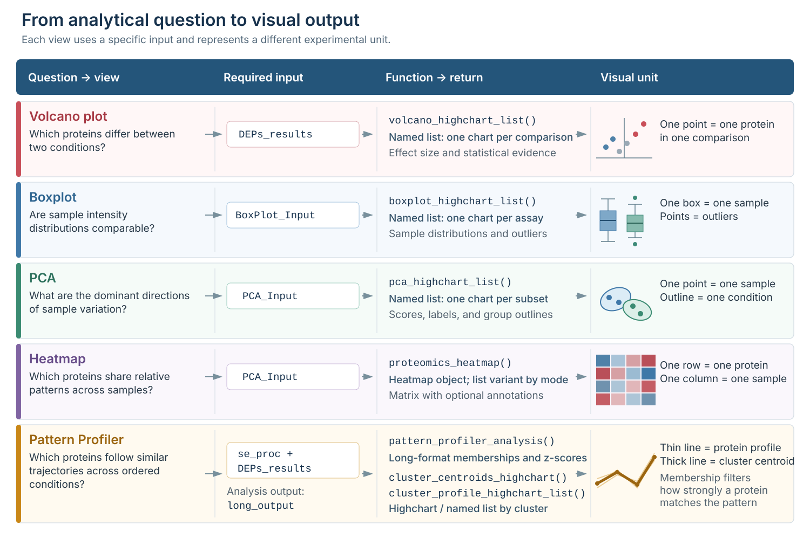

```{r setup, include=FALSE}
knitr::opts_chunk$set(
  collapse = TRUE,
  comment = "#>",
  crop = NULL,
  message = FALSE,
  warning = FALSE
)

options(width = 100)

have_heatmap <- all(vapply(
  c("ComplexHeatmap", "tidyHeatmap", "circlize"),
  requireNamespace,
  logical(1),
  quietly = TRUE
))

have_pattern_profiler <- all(vapply(
  c("Mfuzz", "Biobase", "e1071"),
  requireNamespace,
  logical(1),
  quietly = TRUE
))

# highcharter 0.9.5 declares every Highcharts module for every widget. Some of
# those modules contain literal HTML closing tags, which can be exposed as text
# when Pandoc embeds the dependencies in a self-contained BiocStyle vignette.
# The examples below need only the core and highcharts-more modules. Exporting
# remains available in ordinary NADIA use and is documented later in the text.
prepare_vignette_highchart <- function(widget) {
  widget <- highcharter::hc_exporting(widget, enabled = FALSE)

  highcharts_dir <- system.file(
    "htmlwidgets/lib/highcharts",
    package = "highcharter"
  )

  slim_dependency <- htmltools::htmlDependency(
    name = "highcharts",
    version = "9.3.1.9000",
    src = c(file = highcharts_dir),
    script = c("highcharts.js", "highcharts-more.js", "custom/reset.js"),
    all_files = FALSE
  )

  widget$dependencies <- c(widget$dependencies, list(slim_dependency))
  widget
}
```

<style type="text/css">
.code-details,
.function-parameters {
  margin: 1em 0 1.4em;
  border: 1px solid #c8d3dc;
  border-radius: 5px;
  background: #f7f9fb;
}
.code-details summary,
.function-parameters summary {
  padding: 0.75em 1em;
  color: #1d3557;
  font-weight: 600;
  cursor: pointer;
}
.code-details[open] summary,
.function-parameters[open] summary {
  border-bottom: 1px solid #c8d3dc;
}
.code-details pre,
.code-details table,
.function-parameters pre,
.function-parameters table {
  margin: 1em;
}
.function-parameters .parameter-content {
  padding: 0.2em 1em 0.7em;
}
.function-parameters .parameter-content ul {
  margin-bottom: 0.7em;
}
.visualisation-warning {
  width: calc(100% - 4.5em);
  box-sizing: border-box;
  margin: 1.15em 0 1.5em;
  padding: 0.9em 1.1em;
  border: 1px solid #e4c78e;
  border-left: 5px solid #c98718;
  border-radius: 5px;
  background: #fffaf0;
  box-shadow: 0 1px 2px rgba(112, 78, 20, 0.08);
}
.visualisation-warning p {
  margin: 0 0 0.75em;
  padding: 0 !important;
  text-align: justify;
}
.visualisation-warning p:last-child {
  margin-bottom: 0;
}
.visualisation-warning strong:first-child {
  color: #7a5310;
}
.visualization-workflow-figure {
  margin: 1.5em 0 2em;
}
.visualization-workflow-figure img {
  display: block;
  height: auto !important;
}
.visualization-workflow-figure img.visualization-workflow-clickable {
  cursor: zoom-in;
}
.visualization-workflow-zoom-hint {
  margin: -0.15em 0 1.2em;
  text-align: center;
  color: #5f6f7e;
  font-size: 0.9em;
  font-style: italic;
}
#visualization-workflow-lightbox {
  display: none;
  position: fixed;
  inset: 0;
  z-index: 9999;
  padding: 24px;
  align-items: center;
  justify-content: center;
  background: rgba(15, 25, 35, 0.88);
  cursor: zoom-out;
}
#visualization-workflow-lightbox.is-open {
  display: flex;
}
#visualization-workflow-lightbox img {
  width: auto !important;
  height: auto !important;
  max-width: 96vw !important;
  max-height: 92vh !important;
  margin: 0 !important;
  padding: 0 !important;
  background: white;
  box-shadow: 0 6px 30px rgba(0, 0, 0, 0.35);
  cursor: default;
}
#visualization-workflow-lightbox button {
  position: absolute;
  top: 12px;
  right: 18px;
  border: 0;
  background: transparent;
  color: white;
  font-size: 36px;
  line-height: 1;
  cursor: pointer;
}
body.visualization-workflow-lightbox-open {
  overflow: hidden;
}
.interactive-chart-compact {
  width: 90%;
  margin: 1em auto 1.6em;
}
.interactive-chart-compact .html-widget {
  width: 100% !important;
}
.pattern-profiler-chart {
  margin-top: 1.6em;
  margin-bottom: 1.6em;
}
.pattern-profiler-chart .html-widget {
  height: 440px !important;
  margin-top: 0 !important;
  margin-bottom: 0 !important;
}
.volcano-chart {
  margin-top: 1.6em;
}
.volcano-chart .html-widget {
  margin-top: 1.6em;
}
.pca-chart {
  margin-top: 1.6em;
}
.pca-chart .html-widget {
  margin-top: 1.6em;
}
.boxplot-chart .html-widget {
  height: 560px !important;
  margin-top: 1.6em;
}
.boxplot-chart {
  margin-bottom: 1.6em;
}
.wide-data-table {
  width: calc(100% - 4.5em);
  box-sizing: border-box;
  margin: 1em 0 1.5em;
}
.wide-data-table table {
  width: 100% !important;
  max-width: none;
  margin-left: 0 !important;
  margin-right: 0 !important;
  table-layout: fixed;
}
table.wide-data-table {
  max-width: none;
  margin-left: 0 !important;
  margin-right: 0 !important;
  table-layout: fixed;
}
.wide-data-table th,
.wide-data-table td {
  padding: 0.5em 0.7em !important;
  vertical-align: top !important;
}
.pca-outline-table {
  width: calc(100% - 8em);
}
table.pca-outline-table {
  width: calc(100% - 8em) !important;
}
.pca-outline-intro {
  margin-top: 1.6em;
}
.heatmap-annotation-figure {
  margin-top: 1.6em;
  margin-bottom: 1.6em;
}
.pca-outline-table th,
.pca-outline-table td {
  box-sizing: border-box;
}
.heatmap-subset-table th:nth-child(1),
.heatmap-subset-table td:nth-child(1) {
  width: 34%;
}
.heatmap-subset-table th:nth-child(2),
.heatmap-subset-table td:nth-child(2),
.heatmap-subset-table th:nth-child(3),
.heatmap-subset-table td:nth-child(3) {
  width: 12%;
}
.heatmap-subset-table th:nth-child(4),
.heatmap-subset-table td:nth-child(4) {
  width: 42%;
}
.palette-reference-table {
  margin: 1em 0 1.5em;
}
.palette-reference-table table {
  margin-left: 0 !important;
  margin-right: auto !important;
}
@media screen and (min-width: 768px) {
  .visualization-workflow-figure img {
    width: 110% !important;
    max-width: none !important;
    margin-left: -8%;
  }
}
@media screen and (max-width: 767px) {
  .wide-data-table {
    overflow-x: auto;
  }
  .wide-data-table table {
    min-width: 680px;
  }
  .visualization-workflow-figure img {
    width: 100% !important;
    max-width: 100% !important;
    margin-left: 0;
  }
  .visualisation-warning,
  .wide-data-table,
  .interactive-chart-compact {
    width: 100%;
  }
}
</style>

# Introduction

A useful proteomics figure should answer a specific question. A volcano plot
summarises differential abundance, a boxplot compares sample distributions, a
principal component analysis (PCA) reveals the main sources of variation, and a
heatmap displays coordinated protein profiles across individual samples.
Pattern Profiler adds a different view by grouping proteins with similar
relative trajectories across ordered conditions. These views are complementary;
none is a substitute for the others or for the underlying statistical model.

This vignette presents a complete visualisation workflow for NADIA results. It
shows how to choose and prepare each plot, how to interpret the example output,
which customisation options most often matter, and how to export the result.
The interactive functions use **highcharter**, whereas the publication-oriented
heatmap uses **tidyHeatmap** and **ComplexHeatmap**.

# Setup and example data

This section creates one reproducible analysis that will be reused throughout
the vignette. Keeping the data and thresholds constant makes it possible to
compare what each visualisation adds to the interpretation.

## Installation

NADIA can be installed with `BiocManager`. The heatmap and Pattern Profiler
packages are optional dependencies and are installed separately when those
visualisations are required.

```{r installation, eval=FALSE}
if (!requireNamespace("BiocManager", quietly = TRUE))
  install.packages("BiocManager")

BiocManager::install(c("NADIA", "ComplexHeatmap", "Mfuzz", "Biobase"))
install.packages(c("tidyHeatmap", "circlize", "e1071"))
```

## Processing the example dataset

The `nadia_dia` dataset contains three conditions (`A`, `B`, and `D`) with four
replicates per condition. `process_proteomics()` returns the processed
experiment and the long-format tables expected by the plotting and clustering
functions.

```{r load-data}
library(NADIA)
data(nadia_dia)

res <- process_proteomics(nadia_dia, verbose = FALSE)
```

The sample design should always be checked before a plot is interpreted.

```{r example-design}
sample_design <- unique(
  res$PCA_Input[c("SampleID", "Condition", "Replicate")]
)

design_summary <- as.data.frame(table(sample_design$Condition))
names(design_summary) <- c("Condition", "Samples")

knitr::kable(
  design_summary,
  row.names = FALSE,
  caption = "Number of samples in each condition of the example experiment."
)
```

Most plotting functions in this vignette receive ordinary data frames, such as
`DEPs_results`, `BoxPlot_Input`, or `PCA_Input`. Compatible tables produced by
another workflow can therefore be plotted without recreating the original
`SummarizedExperiment`.

Pattern Profiler separates clustering from visualisation.
`pattern_profiler_analysis()` uses `se_proc` and `DEPs_results` to produce
`long_output`; the plotting functions use this data frame directly, so saved
clustering results can be visualised without rerunning the analysis.

```{r visualisation-inputs}
input_summary <- data.frame(
  Object = c("DEPs_results", "BoxPlot_Input", "PCA_Input", "se_proc"),
  Rows = c(
    nrow(res$DEPs_results),
    nrow(res$BoxPlot_Input),
    nrow(res$PCA_Input),
    nrow(res$se_proc)
  ),
  Columns = c(
    ncol(res$DEPs_results),
    ncol(res$BoxPlot_Input),
    ncol(res$PCA_Input),
    ncol(res$se_proc)
  ),
  Used_by = c(
    "Volcano plots and Pattern Profiler",
    "Boxplots",
    "PCA and heatmaps",
    "Pattern Profiler"
  )
)

knitr::kable(
  input_summary,
  row.names = FALSE,
  caption = "Objects returned by process_proteomics() for visualisation."
)
```

# Choosing the appropriate visualisation

Different visualisations answer different analytical questions and require
different input objects. The diagram below provides a practical guide to
choosing the appropriate plot. For each option, it shows the question being
addressed, the required NADIA input, the plotting function and its output, and
what each graphical element represents.

::: {.visualization-workflow-figure}

```{r visualization-workflow, echo=FALSE, fig.align="center", out.width="100%", fig.cap="From analytical question to visual output in NADIA. Each row links a recommended view to its input, plotting function or returned object, and graphical unit.", fig.alt="Five-row workflow for choosing a NADIA visualisation. Volcano plots use DEPs_results and show one protein per comparison. Boxplots use BoxPlot_Input and show one distribution per sample. PCA uses PCA_Input and shows one point per sample. Heatmaps use PCA_Input and show proteins by samples. Pattern Profiler uses se_proc and DEPs_results to produce long_output and displays protein trajectories and cluster centroids."}

```

:::

<div class="visualization-workflow-zoom-hint">Click the figure to enlarge it; press Esc or click outside the image to close it.</div>

<script>
(function () {
  var source = document.querySelector(".visualization-workflow-figure img");
  if (!source || document.getElementById("visualization-workflow-lightbox")) return;

  source.classList.add("visualization-workflow-clickable");
  source.setAttribute("tabindex", "0");
  source.setAttribute("title", "Click to enlarge the visualisation workflow");

  var lightbox = document.createElement("div");
  lightbox.id = "visualization-workflow-lightbox";
  lightbox.setAttribute("role", "dialog");
  lightbox.setAttribute("aria-modal", "true");
  lightbox.setAttribute("aria-label", "Enlarged NADIA visualisation workflow");
  lightbox.setAttribute("aria-hidden", "true");

  var enlarged = source.cloneNode(true);
  enlarged.classList.remove("visualization-workflow-clickable");
  enlarged.removeAttribute("tabindex");
  enlarged.removeAttribute("title");
  enlarged.removeAttribute("width");

  var closeButton = document.createElement("button");
  closeButton.type = "button";
  closeButton.setAttribute("aria-label", "Close enlarged figure");
  closeButton.textContent = "\u00d7";

  lightbox.appendChild(enlarged);
  lightbox.appendChild(closeButton);
  document.body.appendChild(lightbox);

  function openLightbox() {
    lightbox.classList.add("is-open");
    lightbox.setAttribute("aria-hidden", "false");
    document.body.classList.add("visualization-workflow-lightbox-open");
    closeButton.focus();
  }

  function closeLightbox() {
    lightbox.classList.remove("is-open");
    lightbox.setAttribute("aria-hidden", "true");
    document.body.classList.remove("visualization-workflow-lightbox-open");
    source.focus();
  }

  source.addEventListener("click", openLightbox);
  source.addEventListener("keydown", function (event) {
    if (event.key === "Enter" || event.key === " ") {
      event.preventDefault();
      openLightbox();
    }
  });
  enlarged.addEventListener("click", function (event) {
    event.stopPropagation();
  });
  closeButton.addEventListener("click", closeLightbox);
  lightbox.addEventListener("click", closeLightbox);
  document.addEventListener("keydown", function (event) {
    if (event.key === "Escape" && lightbox.classList.contains("is-open")) {
      closeLightbox();
    }
  });
}());
</script>

These views are complementary rather than interchangeable. Volcano plots show
the results of fitted differential-abundance comparisons, whereas boxplots and
PCA describe samples. Heatmaps display protein patterns across samples, and
Pattern Profiler groups standardised trajectories across ordered conditions.
Their interpretation therefore depends on the preprocessing, protein
selection, scaling, thresholds, and sample design used to create them.

Most interactive plotting functions return a **named list of charts**. Each
name identifies a comparison for volcano plots, an assay for boxplots, a subset
for PCA, or a cluster for Pattern Profiler profiles. Select a name to display
the corresponding chart, as shown below. `cluster_centroids_highchart()` is the
exception: it returns one chart containing all selected cluster centroids.

```{r named-lists, eval=FALSE}
volcanoes <- volcano_highchart_list(res$DEPs_results)
names(volcanoes)
volcanoes[["B-A"]]

boxplots <- boxplot_highchart_list(res$BoxPlot_Input)
names(boxplots)
boxplots[["Impseqrob_min"]]

pcas <- pca_highchart_list(res$PCA_Input, modes = c("all", "any"))
names(pcas)
pcas[["all"]]
```

## Interactive and static output

Interactive charts are particularly useful during exploration: points can be
identified from tooltips, axes can be zoomed, and groups can be hidden from the
legend. A static heatmap is preferable when dimensions, typography, and vector
output must remain fixed for a manuscript.

One volcano plot, one boxplot, one PCA plot, and two compact Pattern Profiler
charts are rendered below. Additional variants are shown as code without
execution to keep the installed vignette at a reasonable size. The download
module is omitted from these five embedded widgets; charts created in a regular
R session retain their export menu.

## Highcharts licence

::: {.visualisation-warning}
**Important licensing note.** NADIA uses the MIT-licensed R package
**highcharter** as an interface to the Highcharts JavaScript library.
Highcharts is distributed under separate terms, and the licence of highcharter
or NADIA does not grant a Highcharts licence.

At the time this vignette was revised, Highcharts permitted qualifying personal
and educational use under its non-commercial terms, while organisational,
production, and commercial uses could require a commercial licence. Users
should check the current [Highcharts licence](https://shop.highcharts.com/license-eula)
for their intended use. The static heatmap workflow does not use Highcharts.
:::

# Volcano plots

A volcano plot combines effect size and statistical evidence for one comparison.
It is most useful for identifying proteins that are both sufficiently different
in abundance and supported by the differential-abundance model.

The function can use sensible defaults, but its main arguments allow the input,
comparisons, decision thresholds, labels, and appearance to be adapted to the
analysis. The expandable guide below summarises the controls used most often;
the complete reference is available in `?volcano_highchart_list`.

<details class="function-parameters">
<summary>Show the main parameters of volcano_highchart_list()</summary>
<div class="parameter-content">

<p><strong>Input and plot selection</strong></p>
<ul>
  <li><code>de_res</code>: differential-abundance results containing the protein identifiers, gene names, log2 fold changes, p-values, and comparison labels.</li>
  <li><code>comparisons</code>: optional comparison names to plot; <code>NULL</code> uses every comparison in <code>de_res</code>.</li>
  <li><code>ain</code>: optional assay names used to filter a table containing results from several assays.</li>
</ul>

<p><strong>Thresholds and points</strong></p>
<ul>
  <li><code>alpha</code>: significance threshold applied to the p-values selected by <code>p_col</code>; the default is 0.05.</li>
  <li><code>lfc_thr</code>: minimum absolute log2 fold change used for classification and the vertical guides; the default is 0.</li>
  <li><code>p_col</code>: p-value column used on the y-axis and for classification; the default is <code>adj.P.Val</code>, but another column such as <code>P.Value</code> can be selected.</li>
  <li><code>point_size</code>: size of the plotted protein points; the default is 4.</li>
</ul>

<p><strong>Labels and appearance</strong></p>
<ul>
  <li><code>show_top_genes</code>: number of significant genes labelled automatically, ranked by the selected p-value; the default is 0.</li>
  <li><code>highlight_genes</code>: gene names to highlight manually, including proteins that do not pass the thresholds.</li>
  <li><code>colors</code>: custom colours for up-regulated, down-regulated, and non-significant proteins.</li>
  <li><code>palette</code>: a three-colour <strong>paletteer</strong> palette; when supplied, it takes precedence over <code>colors</code>.</li>
  <li><code>title</code>: optional chart title; <code>{comparison}</code> inserts the current comparison name.</li>
</ul>

<p><strong>Return value</strong></p>
<ul>
  <li>A named list containing one interactive Highcharts object for each selected comparison.</li>
</ul>

</div>
</details>

## Summarising the selected comparison

Before drawing the figure, it is helpful to count the proteins assigned to each
category. The table below applies the same thresholds as the plot: adjusted
*p*-value below 0.05 and absolute log2 fold change of at least 1.

<details class="code-details">
<summary>Show the code used to classify proteins and calculate the counts</summary>

```{r volcano-summary, results="hide"}
de_ba <- res$DEPs_results[
  res$DEPs_results$Comparison == "B-A",
  ,
  drop = FALSE
]

volcano_class <- ifelse(
  !is.na(de_ba$adj.P.Val) & de_ba$adj.P.Val < 0.05 & de_ba$logFC >= 1,
  "Up",
  ifelse(
    !is.na(de_ba$adj.P.Val) & de_ba$adj.P.Val < 0.05 & de_ba$logFC <= -1,
    "Down",
    "Not significant"
  )
)

volcano_counts <- as.data.frame(table(
  factor(volcano_class, levels = c("Up", "Down", "Not significant"))
))
names(volcano_counts) <- c("Classification", "Proteins")

n_up <- volcano_counts$Proteins[volcano_counts$Classification == "Up"]
n_down <- volcano_counts$Proteins[volcano_counts$Classification == "Down"]
n_not_significant <- volcano_counts$Proteins[
  volcano_counts$Classification == "Not significant"
]

knitr::kable(
  volcano_counts,
  row.names = FALSE,
  caption = "Protein classification for B-A at adjusted p < 0.05 and |log2FC| >= 1."
)
```

</details>

```{r volcano-summary-table, echo=FALSE}
knitr::kable(
  volcano_counts,
  row.names = FALSE,
  caption = "Protein classification for B-A at adjusted p < 0.05 and |log2FC| >= 1."
)
```

Under these criteria, the example contains `r n_up` up-regulated proteins,
`r n_down` down-regulated proteins, and `r n_not_significant` proteins that do
not pass both thresholds. The table provides exact counts, which are difficult
to estimate from the volcano plot because many points overlap.

## Creating and reading the plot

`volcano_highchart_list()` creates one chart for every requested comparison.
Here, the six most statistically significant proteins that also pass both
thresholds are labelled automatically.

::: {.interactive-chart-compact .volcano-chart}

```{r volcano-plot}
volcanoes <- volcano_highchart_list(
  res$DEPs_results,
  comparisons = "B-A",
  alpha = 0.05,
  lfc_thr = 1,
  p_col = "adj.P.Val",
  show_top_genes = 6,
  title = "Differential abundance: {comparison}"
)

prepare_vignette_highchart(volcanoes[["B-A"]])
```

:::

The x-axis is the log2 fold change. Positive values indicate greater abundance
in `B` relative to `A`, whereas negative values indicate greater abundance in
`A`. The y-axis is `-log10(adj.P.Val)`, so stronger statistical evidence appears
higher in the chart. A protein is coloured as up- or down-regulated only when it
passes both the horizontal significance threshold and the vertical effect-size
threshold.

The `lfc_thr` argument controls the guides and classification **in the figure**.
It does not rerun differential-abundance analysis or alter `res$DEPs_results`.
For the plot and the result table to communicate the same decision rule, use the
same `alpha` and fold-change threshold in both stages and record those values.

By default, `p_col = "adj.P.Val"` controls both the y-axis and classification.
Raw `P.Value` can be displayed for diagnostic work, but adjusted values are the
appropriate default when many proteins are tested simultaneously.

## Labelling selected proteins and multiple comparisons

Automatic labels are convenient for exploration, while a manually selected set
is usually clearer in a report. `highlight_genes` matches the `Gene.Names`
column and may highlight a protein whether or not it passes the thresholds.

```{r volcano-options, eval=FALSE}
# Label proteins selected for their biological relevance.
highlighted_volcanoes <- volcano_highchart_list(
  res$DEPs_results,
  comparisons = "B-A",
  alpha = 0.05,
  lfc_thr = 1,
  highlight_genes = c("lamB", "yciU", "gltA")
)

highlighted_volcanoes[["B-A"]]

# Build several charts with identical settings.
volcanoes_all <- volcano_highchart_list(
  res$DEPs_results,
  comparisons = c("B-A", "D-A", "D-B"),
  alpha = 0.05,
  lfc_thr = 1,
  title = "Differential abundance: {comparison}"
)

names(volcanoes_all)

volcanoes_all[["B-A"]]
volcanoes_all[["D-A"]]
volcanoes_all[["D-B"]]
```

# Boxplots of sample distributions

Sample-level boxplots provide a compact quality-control view of the intensity
distribution. They are useful before and after processing because shifts in
location, spread, or shape can reveal samples that deserve closer inspection.

`boxplot_highchart_list()` controls which assays are displayed and how their
sample distributions are grouped and presented. The expandable guide below
summarises the arguments most relevant to interpretation and display; the
complete reference is available in `?boxplot_highchart_list`.

<details class="function-parameters">
<summary>Show the main parameters of boxplot_highchart_list()</summary>
<div class="parameter-content">

<p><strong>Input and assay selection</strong></p>
<ul>
  <li><code>data</code>: long-format intensity table containing the sample, assay, intensity, and condition columns.</li>
  <li><code>assays</code>: assays to plot; <code>NULL</code> creates a boxplot for every assay in <code>data</code>.</li>
</ul>

<p><strong>Grouping and layout</strong></p>
<ul>
  <li><code>color_by</code>: sample-level column used to colour the boxes; the default is <code>Condition</code>.</li>
  <li><code>group_order</code>: optional order of the groups or conditions in the chart and legend.</li>
  <li><code>palette</code>: colour vector or named palette used for the groups.</li>
  <li><code>horizontal</code>: switches between horizontal and vertical boxes; the default is <code>TRUE</code>.</li>
  <li><code>box_width</code> and <code>height</code>: control the box width and overall chart height.</li>
</ul>

<p><strong>Outliers and titles</strong></p>
<ul>
  <li><code>show_outliers</code>: displays observations beyond the whiskers; the default is <code>TRUE</code>.</li>
  <li><code>outlier_jitter</code> and <code>outlier_size</code>: control the horizontal spread and size of outlier points.</li>
  <li><code>title</code> and <code>subtitle</code>: optional text in which <code>{assay}</code> is replaced by the current assay name.</li>
</ul>

<p><strong>Return value</strong></p>
<ul>
  <li>A named list containing one interactive Highcharts boxplot for each selected assay.</li>
</ul>

</div>
</details>

## Comparing assays numerically

The example output contains the initial log2 intensities and the final processed
assay. The following summary calculates the median for every sample and then
reports the range of those sample medians within each assay.

<details class="code-details">
<summary>Show the code used to calculate the sample-median ranges</summary>

```{r boxplot-summary, results="hide"}
sample_medians <- aggregate(
  Intensity ~ Assay + Column + Condition,
  data = res$BoxPlot_Input,
  FUN = median,
  na.rm = TRUE
)

median_ranges <- do.call(
  rbind,
  lapply(split(sample_medians$Intensity, sample_medians$Assay), function(x) {
    data.frame(
      Minimum = min(x),
      Maximum = max(x),
      Range = max(x) - min(x)
    )
  })
)

median_ranges$Assay <- rownames(median_ranges)
rownames(median_ranges) <- NULL
median_ranges <- median_ranges[c("Assay", "Minimum", "Maximum", "Range")]
median_ranges[-1] <- lapply(median_ranges[-1], round, digits = 3)

knitr::kable(
  median_ranges,
  row.names = FALSE,
  caption = "Range of sample medians before and after processing."
)
```

</details>

```{r boxplot-summary-table, echo=FALSE}
knitr::kable(
  median_ranges,
  row.names = FALSE,
  caption = "Range of sample medians before and after processing."
)
```

In this dataset, the range of sample medians decreases after processing. This is
consistent with improved alignment of the sample distributions, but it is not
proof that every technical effect has been removed. Distributional similarity
should be considered together with the experimental design, PCA, and the
normalisation diagnostics described in `vignette("choosing-methods")`.

## Creating and reading the boxplot

`boxplot_highchart_list()` creates one chart for every requested assay. Here,
the list contains only the final processed assay. Each box spans the first to
the third quartile, the central line is the median, and the whiskers extend to
the most extreme values within 1.5 interquartile ranges. Hovering over a box
reports these statistics and the number of finite protein intensities in that
sample.

::: {.interactive-chart-compact .boxplot-chart}

```{r boxplot-plot}
set.seed(42)

boxplots <- boxplot_highchart_list(
  res$BoxPlot_Input,
  assays = "Impseqrob_min",
  color_by = "Condition",
  group_order = c("A", "B", "D"),
  horizontal = FALSE,
  show_outliers = TRUE,
  title = "Processed intensity distributions",
  subtitle = "Assay: {assay}",
  height = 560
)

prepare_vignette_highchart(boxplots[["Impseqrob_min"]])
```

:::

The medians are closely aligned, while each sample retains a broad intensity
range. Alignment is expected after the processing used in this example;
complete collapse of the boxes, however, would be suspicious because biological
and sampling variation should remain.

The points beyond the whiskers are displayed with `show_outliers = TRUE`. They
highlight the tails of each sample distribution but are not automatically
erroneous measurements. In much larger experiments, set
`show_outliers = FALSE` when the additional points obscure the boxes or make
the interactive widget unnecessarily heavy.

```{r boxplot-options, eval=FALSE}
# Display both stages as separate list elements.
boxplots_both <- boxplot_highchart_list(
  res$BoxPlot_Input,
  assays = c("log2", "Impseqrob_min"),
  group_order = c("A", "B", "D"),
  show_outliers = TRUE,
  outlier_size = 2,
  box_width = 16
)

boxplots_both[["log2"]]
boxplots_both[["Impseqrob_min"]]
```

# Principal component analysis

PCA reduces thousands of protein measurements to a small number of directions
that capture the largest variation among samples. It is a diagnostic view of
similarity, separation, and possible outliers; it is not a significance test.

`pca_highchart_list()` combines protein-subset selection, PCA calculation, and
graphical presentation. The expandable guide below summarises the parameters
that most strongly affect the resulting projection; the complete reference is
available in `?pca_highchart_list`.

<details class="function-parameters">
<summary>Show the main parameters of pca_highchart_list()</summary>
<div class="parameter-content">

<p><strong>Input and protein subsets</strong></p>
<ul>
  <li><code>pca_input</code>: long-format protein-intensity table produced for PCA.</li>
  <li><code>modes</code>: subsets to plot: <code>all</code>, <code>any</code>, and/or named comparisons such as <code>B-A</code>.</li>
  <li><code>alpha</code>: adjusted p-value threshold used to select proteins for a named-comparison mode; the default is 0.05.</li>
  <li><code>filter_samples_to_comparison</code>: for a named comparison, optionally retains only samples from the two conditions involved.</li>
</ul>

<p><strong>PCA calculation</strong></p>
<ul>
  <li><code>center</code>: centres each protein before PCA; the default is <code>TRUE</code>.</li>
  <li><code>scale.</code>: scales each protein to unit variance before PCA; the default is <code>TRUE</code>.</li>
</ul>

<p><strong>Groups, points, and outlines</strong></p>
<ul>
  <li><code>color_by</code>, <code>group_order</code>, and <code>palette</code>: define the grouping variable, group order, and colours.</li>
  <li><code>point_size</code> and <code>show_labels</code>: control the sample points and optional <code>SampleID</code> labels.</li>
  <li><code>addEllipses</code>: adds a group outline when at least three samples are available.</li>
  <li><code>ellipse_type</code>: uses either an observed <code>convex</code> hull or a normal-theory <code>confidence</code> ellipse.</li>
  <li><code>ellipse_level</code>: confidence level used when <code>ellipse_type = "confidence"</code>; the default is 0.95.</li>
</ul>

<p><strong>Return value</strong></p>
<ul>
  <li>A named list containing one interactive Highcharts PCA plot for each requested mode.</li>
</ul>

</div>
</details>

## Comparing protein subsets

The proteins included in a PCA influence the pattern of sample variation and
separation that can be observed. NADIA supports all proteins, proteins
significant in any comparison, or proteins significant in one named comparison.
The table below compares the first two choices using the same centering and
scaling settings.

<details class="code-details">
<summary>Show the code used to compare the PCA protein subsets</summary>

```{r pca-summary, results="hide"}
pca_scores_all <- build_pca_scores(
  res$PCA_Input,
  mode = "all",
  center = TRUE,
  scale. = TRUE
)

pca_scores_any <- build_pca_scores(
  res$PCA_Input,
  mode = "any",
  center = TRUE,
  scale. = TRUE
)

pca_summary <- data.frame(
  Subset = c("All proteins", "Significant in any comparison"),
  Proteins = c(
    length(unique(res$PCA_Input$FeatureID)),
    length(unique(res$PCA_Input$FeatureID[res$PCA_Input$sig_any %in% TRUE]))
  ),
  PC1 = c(unique(pca_scores_all$PC1_Perc), unique(pca_scores_any$PC1_Perc)),
  PC2 = c(unique(pca_scores_all$PC2_Perc), unique(pca_scores_any$PC2_Perc))
)

names(pca_summary)[3:4] <- c("PC1 variance (%)", "PC2 variance (%)")

knitr::kable(
  pca_summary,
  row.names = FALSE,
  digits = 2,
  caption = "Protein subsets and variance represented by the first two principal components."
)
```

</details>

```{r pca-summary-table, echo=FALSE}
knitr::kable(
  pca_summary,
  row.names = FALSE,
  digits = 2,
  caption = "Protein subsets and variance represented by the first two principal components."
)
```

With all proteins, PC1 explains `r unique(pca_scores_all$PC1_Perc)`% of the
variance. Restricting the analysis to proteins already selected by differential
abundance raises this to `r unique(pca_scores_any$PC1_Perc)`%. The stronger
separation in the selected subset is expected because the same data were used to
select proteins that differ between conditions. It should not be presented as
independent validation of those differences.

## Creating and reading the PCA plot

`pca_highchart_list()` can generate several PCA plots in a single call. The
resulting plots are stored in a named list, with one element for each protein
subset requested through `modes`. In this example, `modes = "all"` includes every
protein and therefore produces a single baseline PCA plot. Sample names are
displayed because the dataset contains only 12 samples. The 95% confidence
ellipses summarise where the samples from each condition are concentrated and
how they are distributed in the PCA space.

::: {.interactive-chart-compact .pca-chart}

```{r pca-plot}
condition_colours <- c(
  A = "#0072B2",
  B = "#D55E00",
  D = "#009E73"
)

pcas <- pca_highchart_list(
  res$PCA_Input,
  modes = "all",
  color_by = "Condition",
  group_order = c("A", "B", "D"),
  palette = condition_colours,
  addEllipses = TRUE,
  ellipse_type = "confidence",
  ellipse_level = 0.95,
  show_labels = TRUE,
  point_size = 5,
  center = TRUE,
  scale. = TRUE
)

prepare_vignette_highchart(pcas[["all"]])
```

:::

Nearby points represent samples with similar multivariate protein profiles.
Separation highlights major variation, but its biological or technical origin
should be checked against the study design and sample-level quality metrics.

The 95% ellipses use each condition's mean and covariance matrix together with
a two-dimensional chi-squared contour to summarise group centre, spread, and
orientation. They support visual comparison, while formal separation can be
assessed with an appropriate statistical test.

With `scale. = TRUE`, proteins are standardised to unit variance and contribute
more comparably to the PCA. With `scale. = FALSE`, more variable proteins have
greater influence. Because scaling can change sample positions and apparent
group separation, the selected setting should be reported.

## Subset modes, ellipses, and sample filtering

To focus the PCA on proteins that are significant in a particular comparison,
pass its name to `modes`. For example, `modes = "B-A"` selects the proteins that
differ significantly between conditions `B` and `A`. The
`filter_samples_to_comparison` argument then determines which samples are shown:
`TRUE` keeps only samples from `A` and `B`, whereas `FALSE` plots all samples,
including those from condition `D`, using the same set of proteins selected from
the `B-A` comparison.

```{r pca-options, eval=FALSE}
pca_ba <- pca_highchart_list(
  res$PCA_Input,
  modes = "B-A",
  alpha = 0.05,
  filter_samples_to_comparison = TRUE,
  group_order = c("A", "B"),
  palette = condition_colours[c("A", "B")],
  addEllipses = FALSE,
  show_labels = TRUE
)

pca_ba[["B-A"]]
```

<div class="pca-outline-intro">
<p><code>ellipse_type</code> controls how each condition is outlined in the PCA
plot. The table below compares the geometry and appropriate interpretation of
the two available options, helping you choose between a convex hull and a
confidence ellipse.</p>
</div>

<table class="table table-condensed wide-data-table pca-outline-table">
<colgroup>
<col style="width: 17%;">
<col style="width: 35%;">
<col style="width: 48%;">
</colgroup>
<thead>
<tr>
<th>Ellipse type</th>
<th>Geometry</th>
<th>Appropriate interpretation</th>
</tr>
</thead>
<tbody>
<tr>
<td><code>"convex"</code></td>
<td>Smallest convex polygon containing the observed samples</td>
<td>Describes the observed extent of a group</td>
</tr>
<tr>
<td><code>"confidence"</code></td>
<td>Covariance ellipse scaled by a chi-squared quantile</td>
<td>Summarises the centre, spread, and orientation of each group under a multivariate-normal model</td>
</tr>
</tbody>
</table>

At least three samples are required to draw either outline. With
`ellipse_type = "confidence"` and `ellipse_level = 0.95`, the ellipse combines
each group's mean and covariance matrix with a two-dimensional chi-squared
contour. It therefore provides a consistent summary of group centre, spread,
and orientation, while the displayed points show the individual samples on
which the outline is based.

# Heatmaps

A heatmap shows the relative abundance profile of many proteins across samples.
It is particularly effective for assessing whether selected proteins form
coherent patterns and whether replicates display similar profiles. Unlike
Pattern Profiler, it preserves the individual sample columns and does not assign
proteins to profile clusters.

`proteomics_heatmap()` controls protein selection, scaling, ordering,
clustering, annotation, and colour mapping. The expandable guide below focuses
on the parameters that determine what the heatmap represents and how it should
be interpreted; the complete reference is available in
`?proteomics_heatmap`.

<details class="function-parameters">
<summary>Show the main parameters of proteomics_heatmap()</summary>
<div class="parameter-content">

<p><strong>Input and protein selection</strong></p>
<ul>
  <li><code>data</code>: long-format protein-intensity table used to construct the heatmap matrix.</li>
  <li><code>mode</code>: selects <code>all</code> proteins, proteins significant in <code>any</code> comparison, or proteins from one <code>target</code> comparison.</li>
  <li><code>alpha</code> and <code>comparison</code>: define the significance threshold and named comparison used by <code>mode = "target"</code>.</li>
  <li><code>feature_ids</code>: explicit proteins to display; when supplied, this selection takes precedence over mode-based filtering.</li>
</ul>

<p><strong>Scaling, ordering, and clustering</strong></p>
<ul>
  <li><code>scale_data</code>: applies row, column, or no scaling; the default is <code>row</code>.</li>
  <li><code>sample_order</code> and <code>condition_order</code>: arrange samples by clustering, by condition, or in a custom order.</li>
  <li><code>cluster_rows</code> and <code>cluster_columns</code>: control hierarchical clustering of proteins and samples.</li>
  <li><code>show_row_names</code> and <code>show_column_names</code>: control the protein and sample labels.</li>
</ul>

<p><strong>Annotations and appearance</strong></p>
<ul>
  <li><code>row_annotation</code> and <code>row_annotation_cols</code>: add selected categorical annotations to proteins.</li>
  <li><code>row_order_by</code> and <code>split_rows_by</code>: order or divide proteins using clustering or annotation columns.</li>
  <li><code>palette_value</code> and <code>reverse_palette</code>: choose and optionally reverse the abundance colour scale.</li>
  <li><code>palette_annotation</code> and <code>show_annotation</code>: control the condition annotation colours and visibility.</li>
  <li><code>heatmap_title</code>: optional title displayed above the heatmap.</li>
</ul>

<p><strong>Return value</strong></p>
<ul>
  <li><code>proteomics_heatmap()</code> returns one tidyHeatmap/ComplexHeatmap object; <code>proteomics_heatmap_list()</code> returns a named list for several modes.</li>
</ul>

</div>
</details>

## Selecting proteins for the heatmap

Showing every quantified protein is possible but rarely legible. NADIA provides
three filtering modes, and `feature_ids` can be used when a focused, explicitly
defined panel is needed.

<details class="code-details">
<summary>Show the code used to compare the heatmap protein subsets</summary>

```{r heatmap-subsets, results="hide"}
n_all <- length(unique(res$PCA_Input$FeatureID))
n_any <- length(unique(
  res$PCA_Input$FeatureID[res$PCA_Input$sig_any %in% TRUE]
))
n_ba <- length(unique(
  res$PCA_Input$FeatureID[
    !is.na(res$PCA_Input[["adjP_B-A"]]) &
      res$PCA_Input[["adjP_B-A"]] < 0.05
  ]
))

heatmap_subsets <- data.frame(
  Request = c(
    'mode = "all"',
    'mode = "any"',
    'mode = "target", comparison = "B-A"'
  ),
  Proteins = c(n_all, n_any, n_ba),
  Samples = c(12, 12, 8),
  Interpretation = c(
    "All quantified proteins",
    "Significant in at least one comparison",
    "Significant in B-A; only A and B samples"
  )
)

knitr::kable(
  heatmap_subsets,
  row.names = FALSE,
  caption = "Available protein-filtering modes for the example heatmap."
)
```

</details>

::: {.wide-data-table .heatmap-subset-table}

```{r heatmap-subsets-table, echo=FALSE}
knitr::kable(
  heatmap_subsets,
  row.names = FALSE,
  caption = "Available protein-filtering modes for the example heatmap."
)
```

:::

Unlike a comparison-specific PCA, `mode = "target"` in
`proteomics_heatmap()` automatically restricts the samples to the conditions in
the comparison. The `B-A` heatmap therefore contains eight samples rather than
all twelve.

## Creating and reading a focused heatmap

The complete `B-A` set contains `r n_ba` proteins, which is too dense for row
labels in a vignette. The following code selects the 30 proteins with the
smallest adjusted *p*-values among those passing the 0.05 threshold.

```{r select-heatmap-proteins}
de_ba_ordered <- de_ba[
  !is.na(de_ba$adj.P.Val) & de_ba$adj.P.Val < 0.05,
  ,
  drop = FALSE
]
de_ba_ordered <- de_ba_ordered[order(de_ba_ordered$adj.P.Val), , drop = FALSE]
ba_top_ids <- head(unique(de_ba_ordered$Protein.IDs), 30)
```

`proteomics_heatmap()` creates one heatmap for the requested protein and sample
subset. The selected IDs are supplied through `feature_ids`, while
`mode = "target"` retains the samples from conditions `A` and `B` in the `B-A`
comparison.

```{r heatmap-plot, eval=have_heatmap, fig.width=8, fig.height=7, fig.align="center", fig.cap="Row-scaled abundance profiles for the 30 proteins with the smallest adjusted p-values in the B-A comparison.", fig.alt="Row-scaled heatmap of the 30 most statistically significant proteins in the B-A comparison"}
proteomics_heatmap(
  res$PCA_Input,
  mode = "target",
  comparison = "B-A",
  feature_ids = ba_top_ids,
  scale_data = "row",
  sample_order = "clustering",
  condition_order = c("A", "B"),
  cluster_rows = TRUE,
  cluster_columns = TRUE,
  show_row_names = TRUE,
  palette_value = "brewer:RdBu",
  reverse_palette = TRUE,
  heatmap_title = "Top B-A protein profiles"
)
```

Each row is transformed to a z-score because `scale_data = "row"`. Warm and
cool colours therefore represent values above and below that protein's own mean;
they do **not** indicate that one protein is more abundant than another. Row
clustering groups proteins with similar relative profiles, while column
clustering places samples with similar profiles next to one another. The
condition annotation can then be used to assess whether the resulting sample
clusters are consistent with conditions `A` and `B`.

Use `scale_data = "none"` when absolute log2 intensity differences between
proteins are the subject of the figure. In that case, a small number of
high-abundance proteins may dominate the colour range. Column scaling answers a
different question and is rarely the default for protein-profile heatmaps.

## Annotations and repeated heatmaps

Categorical protein annotations can be supplied as a data frame containing a
`FeatureID` column. Rows may be split by one annotation and ordered by another.
Because the 30 proteins used above all have positive `logFC` values, they would
produce only one annotation category. For a clearer demonstration, the example
below selects the 15 most significant proteins with higher abundance in `B` and
the 15 most significant proteins with higher abundance in `A`. The resulting
annotation and row split are displayed beneath the code.

```{r heatmap-annotations, eval=have_heatmap, results="hide"}
ba_higher_b_ids <- head(unique(
  de_ba_ordered$Protein.IDs[de_ba_ordered$logFC > 0]
), 15)

ba_higher_a_ids <- head(unique(
  de_ba_ordered$Protein.IDs[de_ba_ordered$logFC < 0]
), 15)

ba_annotation_ids <- c(ba_higher_b_ids, ba_higher_a_ids)

direction <- ifelse(
  de_ba$logFC[match(ba_annotation_ids, de_ba$Protein.IDs)] > 0,
  "Higher in B",
  "Higher in A"
)

protein_annotation <- data.frame(
  FeatureID = ba_annotation_ids,
  Direction = direction
)

annotated_heatmap <- proteomics_heatmap(
  res$PCA_Input,
  mode = "target",
  comparison = "B-A",
  feature_ids = ba_annotation_ids,
  row_annotation = protein_annotation,
  row_annotation_cols = "Direction",
  row_annotation_palette = list(
    Direction = c("Higher in B" = "#D55E00", "Higher in A" = "#0072B2")
  ),
  split_rows_by = "Direction",
  scale_data = "row",
  sample_order = "condition",
  condition_order = c("A", "B")
)
```

::: {.heatmap-annotation-figure}

```{r heatmap-annotations-plot, echo=FALSE, eval=have_heatmap, fig.width=8, fig.height=7, fig.align="center", fig.cap="Heatmap of 15 significant proteins with higher abundance in A and 15 with higher abundance in B, annotated and split by direction.", fig.alt="Row-scaled heatmap showing 15 significant proteins with higher abundance in condition A and 15 with higher abundance in condition B"}
annotated_heatmap
```

:::

The `Direction` annotation is derived from the sign of `logFC`: positive values
are labelled **Higher in B**, whereas negative values are labelled **Higher in
A**. The coloured row annotation identifies these categories, and
`split_rows_by = "Direction"` separates them into two heatmap sections. Within
each section, the row-scaled colours still represent values above or below each
protein's own mean. This balanced selection is used only to illustrate the
annotation and should not be interpreted as the observed proportion of
up- and down-regulated proteins in the complete comparison.

```{r heatmap-list-example, eval=FALSE}
# Build a named list containing several heatmaps.
heatmaps <- proteomics_heatmap_list(
  res$PCA_Input,
  modes = c("any", "B-A", "D-A"),
  scale_data = "row",
  sample_order = "condition",
  condition_order = c("A", "B", "D")
)

# Display the heatmaps individually.
heatmaps[["any"]]
heatmaps[["B-A"]]
heatmaps[["D-A"]]
```

`proteomics_heatmap_list()` returns a named list, so indexing it by mode displays
each heatmap separately.

# Protein pattern clusters

Pattern Profiler groups proteins that follow similar relative trajectories
across ordered conditions. It complements a heatmap by turning recurring
profile shapes into explicit clusters and by assigning each protein a fuzzy
membership between 0 and 1. This approach is most informative with at least
three ordered conditions, such as time points, doses, or disease stages.

This section requires the optional **Mfuzz**, **Biobase**, and **e1071**
packages. It focuses on visualising an existing clustering result; see
`vignette("pattern-profiler")` for cluster-number selection, membership
diagnostics, and data storage.

Pattern Profiler separates clustering from visualisation. The expandable guide
below summarises the main controls that determine which proteins are clustered
and how the centroid and protein-profile charts are constructed; the dedicated
Pattern Profiler vignette provides the complete analysis reference.

<details class="function-parameters">
<summary>Show the main Pattern Profiler analysis and plotting parameters</summary>
<div class="parameter-content">

<p><strong>Analysis input and protein selection</strong></p>
<ul>
  <li><code>se_proc</code> and <code>DEPs_results</code>: processed experiment and differential-abundance results used to calculate the clusters.</li>
  <li><code>assay_name</code>: assay extracted from <code>se_proc</code> and matched in <code>DEPs_results</code>.</li>
  <li><code>filter_mode</code>: uses proteins significant in <code>any</code> comparison, <code>all</code> proteins, or proteins from one <code>specific</code> comparison.</li>
  <li><code>alpha</code> and <code>comparison</code>: significance threshold and comparison used during protein filtering.</li>
  <li><code>condition_order</code>: order of conditions along every protein trajectory.</li>
  <li><code>aggregate</code>: combines sample replicates with the median or mean before clustering.</li>
</ul>

<p><strong>Cluster selection and reproducibility</strong></p>
<ul>
  <li><code>auto_select_c</code>, <code>c_range</code>, and <code>selection_method</code>: evaluate and select a cluster number automatically.</li>
  <li><code>c</code>: fixed number of clusters used when <code>auto_select_c = FALSE</code>.</li>
  <li><code>min_membership</code>: minimum fuzzy membership retained in <code>long_output</code>.</li>
  <li><code>seed</code> and <code>seeds</code>: make the final clustering and automatic cluster-number evaluation reproducible.</li>
</ul>

<p><strong>Centroid and profile charts</strong></p>
<ul>
  <li><code>data</code>: the long-format <code>long_output</code> table returned by <code>pattern_profiler_analysis()</code>.</li>
  <li><code>conditions</code>, <code>clusters</code>, and <code>min_membership</code>: control the x-axis order and the clusters or proteins displayed.</li>
  <li><code>centroid_summary</code>: represents each cluster with the mean or median trajectory.</li>
  <li><code>cluster</code> and <code>show_centroid</code>: select one profile cluster and optionally overlay its centroid.</li>
  <li><code>line_width</code>, <code>line_opacity</code>, <code>centroid_width</code>, and <code>show_markers</code>: control the visibility of profile and centroid lines.</li>
  <li><code>palette</code>, <code>cluster_color</code>, and <code>height</code>: control chart colours and dimensions.</li>
</ul>

<p><strong>Return values</strong></p>
<ul>
  <li><code>pattern_profiler_analysis()</code> returns the clustering results and <code>long_output</code>; the centroid and single-profile functions each return one chart, while <code>cluster_profile_highchart_list()</code> returns a named list by cluster.</li>
</ul>

</div>
</details>

## Building and summarising the example clusters

For a concise and reproducible visual example, the analysis below fixes the
number of clusters at two. In a new study, the candidate solutions should first
be compared with `auto_select_c = TRUE` and interpreted using the diagnostics
described in the dedicated Pattern Profiler vignette.

```{r pattern-profiler-run, eval=have_pattern_profiler, results="hide"}
pp_vis <- pattern_profiler_analysis(
  se_proc = res$se_proc,
  DEPs_results = res$DEPs_results,
  assay_name = "Impseqrob_min",
  filter_mode = "any",
  alpha = 0.05,
  condition_order = c("A", "B", "D"),
  aggregate = "median",
  auto_select_c = FALSE,
  c = 2,
  min_membership = 0.25,
  seed = 42,
  verbose = FALSE
)
```

A stricter membership threshold is useful for displaying the clearest examples
of each pattern. The table reports how many proteins remain at 0.70 and the
median standardised profile represented by each cluster.

<details class="code-details">
<summary>Show the code used to summarise the Pattern Profiler clusters</summary>

```{r pattern-profiler-summary, eval=have_pattern_profiler, results="hide"}
display_membership <- 0.70
pp_display <- pp_vis$long_output[
  pp_vis$long_output$Membership >= display_membership,
  ,
  drop = FALSE
]

pattern_summary <- do.call(
  rbind,
  lapply(split(pp_display, pp_display$Cluster), function(x) {
    data.frame(
      Cluster = paste("Cluster", unique(x$Cluster)),
      Proteins = length(unique(x$FeatureID)),
      `Median membership` = median(x$Membership),
      A = median(x$A),
      B = median(x$B),
      D = median(x$D),
      check.names = FALSE
    )
  })
)

pattern_summary[c("Median membership", "A", "B", "D")] <- lapply(
  pattern_summary[c("Median membership", "A", "B", "D")],
  round,
  digits = 3
)

knitr::kable(
  pattern_summary,
  row.names = FALSE,
  caption = paste0(
    "High-membership proteins and median z-score profiles at membership >= ",
    display_membership, "."
  )
)
```

</details>

```{r pattern-profiler-summary-table, echo=FALSE, eval=have_pattern_profiler}
knitr::kable(
  pattern_summary,
  row.names = FALSE,
  caption = paste0(
    "High-membership proteins and median z-score profiles at membership >= ",
    display_membership, "."
  )
)
```

The two clusters describe opposing relative trajectories. One pattern remains
comparatively high in `A` and `B` before decreasing in `D`, whereas the other
rises across the ordered conditions. Because the condition values are
within-protein z-scores, they describe profile shape rather than absolute
protein abundance.

## Comparing cluster centroids

`cluster_centroids_highchart()` creates one interactive chart containing the
representative trajectories of all selected clusters. The median is used here
because it is less sensitive than the mean to proteins near a cluster boundary.

::: {.interactive-chart-compact .pattern-profiler-chart}

```{r pattern-centroids, eval=have_pattern_profiler}
centroid_plot <- cluster_centroids_highchart(
  pp_vis$long_output,
  conditions = pp_vis$conditions,
  min_membership = display_membership,
  centroid_summary = "median",
  title = "Pattern Profiler cluster centroids",
  height = 440
)

prepare_vignette_highchart(centroid_plot)
```

:::

The separation between the centroid lines shows when the dominant patterns
diverge. Hovering over a marker reports the condition and median z-score. The
centroids summarise many proteins and should therefore be read together with
the cluster sizes and memberships in the preceding table.

## Inspecting representative protein profiles

`cluster_profile_highchart()` creates one interactive chart for a selected
cluster, allowing individual protein profiles to be compared with their
centroid. This reveals whether the profiles are concentrated around the summary
or show substantial heterogeneity. To keep the interactive vignette responsive,
the next chart displays 100 proteins sampled evenly across the membership range
retained for cluster 1.

::: {.interactive-chart-compact .pattern-profiler-chart}

```{r pattern-profiles, eval=have_pattern_profiler}
cluster_one <- pp_display[pp_display$Cluster == 1, , drop = FALSE]
cluster_one <- cluster_one[order(cluster_one$Membership, decreasing = TRUE), ]
representative_positions <- unique(round(seq(
  from = 1,
  to = nrow(cluster_one),
  length.out = min(100, nrow(cluster_one))
)))
representative_ids <- cluster_one$FeatureID[representative_positions]
representative_profiles <- cluster_one[
  cluster_one$FeatureID %in% representative_ids,
  ,
  drop = FALSE
]

profile_plot <- cluster_profile_highchart(
  representative_profiles,
  cluster = 1,
  conditions = pp_vis$conditions,
  min_membership = display_membership,
  centroid_summary = "median",
  line_opacity = 0.35,
  title = "Cluster 1: 100 representative protein profiles",
  height = 440
)

prepare_vignette_highchart(profile_plot)
```

:::

The thin lines are individual standardised protein profiles and the thicker
line is their median. A narrow band around the centroid indicates a coherent
pattern; marked deviations identify proteins whose assignment deserves closer
inspection. Showing only high-membership representatives makes the dominant
shape clear, but it does not describe the full uncertainty of the fuzzy
clustering.

The complete interactive list can be generated when detailed exploration is
more important than vignette size. With hundreds of series, these charts are
best inspected in an R session rather than embedded in the installed vignette.

```{r pattern-profiles-all, eval=FALSE}
all_profile_plots <- cluster_profile_highchart_list(
  pp_vis$long_output,
  conditions = pp_vis$conditions,
  min_membership = 0.70,
  centroid_summary = "median"
)

all_profile_plots[["Cluster_1"]]
```

# Colours and consistent presentation

NADIA plots can be coloured with either an explicit vector of colour codes or a
named palette. Available themes can be explored in the
[`paletteer` catalogue](https://emilhvitfeldt.github.io/paletteer/) and the
[ColorBrewer catalogue used by `RColorBrewer`](https://colorbrewer2.org/).

An explicit vector gives complete control over each colour and makes the mapping
visible in the analysis script. This is particularly useful when the same
conditions, clusters, or significance categories must retain identical colours
across several publication figures. A named palette is more concise and makes
it easy to compare alternative themes: `paletteer` provides a common interface
to a large collection of palettes from many R packages, whereas `RColorBrewer`
offers a smaller set of qualitative, sequential, and diverging palettes designed
for different types of data.

The following examples use explicit colours. Comments identify the mapping
required by each type of plot.

```{r colour-examples, eval=FALSE}
# Pattern Profiler: one colour for each cluster.
cluster_colours <- c("#E63946", "#457B9D")

cluster_centroids_highchart(
  pp_vis$long_output,
  conditions = pp_vis$conditions,
  min_membership = display_membership,
  centroid_summary = "median",
  palette = cluster_colours
)

# Boxplot: colours follow the condition order.
condition_colours <- c(
  A = "#0072B2",
  B = "#D55E00",
  D = "#009E73"
)

boxplot_highchart_list(
  res$BoxPlot_Input,
  assays = "Impseqrob_min",
  group_order = c("A", "B", "D"),
  palette = unname(condition_colours)
)[["Impseqrob_min"]]

# Volcano plot: colours are named by significance category.
volcano_colours <- list(
  up = "#D55E00",
  down = "#0072B2",
  ns = "#BDBDBD"
)

volcano_highchart_list(
  res$DEPs_results,
  comparisons = "B-A",
  colors = volcano_colours
)[["B-A"]]
```

When a named palette is preferred, `paletteer` themes use the
`"package::palette"` format and `RColorBrewer` themes use
`"brewer:PaletteName"`. The accepted formats vary slightly between plotting
functions, as summarised below.

::: {.palette-reference-table}

| Function | Palette argument | Example |
|:--|:--|:--|
| `volcano_highchart_list()` | `paletteer` name or `colors = list(up, down, ns)` | `palette = "ggsci::default_jco"` |
| `boxplot_highchart_list()` | `paletteer` name, `"brewer:Name"`, or colour vector | `palette = "brewer:Dark2"` |
| `pca_highchart_list()` | `paletteer` name, `"brewer:Name"`, or preferably a named vector | `palette = condition_colours` |
| Pattern Profiler Highcharts | `ggsci` palette through `paletteer`, `"brewer:Name"`, or colour vector | `palette = "ggsci::default_jco"` |
| `proteomics_heatmap()` | Separate `paletteer` or `RColorBrewer` palettes for values and annotations | `palette_value = "brewer:RdBu"` |

:::

For example, the following call uses a named `paletteer` theme instead of
specifying the three volcano-plot colours individually.

```{r paletteer-example, eval=FALSE}
volcano_jco <- volcano_highchart_list(
  res$DEPs_results,
  comparisons = "B-A",
  palette = "ggsci::default_jco"
)

volcano_jco[["B-A"]]
```

# Exporting figures and data

Export should preserve both the visual result and the data used to create it.
Interactive widgets can be shared as HTML, while heatmaps can be written as
raster or vector graphics together with their displayed matrix.

## Interactive charts

Every NADIA Highchart includes a download menu for PNG, SVG, and PDF output.
The menu is disabled only in the five embedded examples above to keep this
self-contained vignette compact and robust. For a fully interactive copy, save
the original chart or selected list element as an HTML widget.

```{r export-interactive, eval=FALSE}
htmlwidgets::saveWidget(
  volcanoes[["B-A"]],
  file = file.path(tempdir(), "volcano_B-A.html"),
  selfcontained = TRUE
)

htmlwidgets::saveWidget(
  centroid_plot,
  file = file.path(tempdir(), "pattern_centroids.html"),
  selfcontained = TRUE
)
```

A self-contained widget is convenient for sharing, but it remains subject to
the Highcharts licence described above. The file also contains the plotted data,
so it should not be used to distribute confidential results without review.

## Static heatmaps

For `proteomics_heatmap()`, `export_path` writes the displayed matrix and
metadata to a TSV file, whereas `export_file` writes the figure. The plot format
is inferred from the extension (`.png`, `.svg`, or `.pdf`).

```{r export-heatmap, eval=FALSE}
proteomics_heatmap(
  res$PCA_Input,
  mode = "target",
  comparison = "B-A",
  feature_ids = ba_top_ids,
  scale_data = "row",
  sample_order = "condition",
  condition_order = c("A", "B"),
  export_path = file.path(tempdir(), "heatmap_B-A_data.tsv"),
  export_file = file.path(tempdir(), "heatmap_B-A.png"),
  plot_width = 8,
  plot_height = 7,
  export_dpi = 300
)
```

When `proteomics_heatmap_list()` is used, the mode is appended to each export
name. For example, a base name of `heatmap.png` produces files such as
`heatmap_any.png` and `heatmap_B-A.png`.

The companion vignette `vignette("results-and-export")` describes additional
ways to save complete NADIA analyses, result tables, and interactive objects.

# Practical recommendations

The most defensible visualisation workflow begins with the analytical question
and ends with a reproducible export. The following practices help keep figures
clear and their interpretation proportionate to the evidence:

- inspect the sample design and the number of observations before plotting;
- state the adjusted *p*-value and fold-change thresholds used in volcano plots;
- compare boxplots before and after processing, without treating similar boxes
  as proof that all technical variation has disappeared;
- begin PCA with all proteins, then label analyses of selected proteins as
  supervised or selection-dependent views;
- use row-scaled heatmaps for relative profiles and unscaled heatmaps for
  absolute log2 abundance;
- use Pattern Profiler when conditions have a meaningful order, evaluate the
  number of clusters and membership threshold, and interpret its z-scores as
  relative trajectories rather than absolute abundance;
- reuse explicit colours and sample orders across related figures;
- avoid dense labels when tooltips or a focused protein panel communicate the
  result more clearly; and
- save the plotted data and the analysis parameters together with the figure.

No single figure validates an analysis. Agreement among the experimental
design, quality-control summaries, model results, and several complementary
visualisations provides a much stronger basis for interpretation.

# Session information

The package versions used to build this vignette are recorded below to support
reproducibility.

```{r session-information}
sessionInfo()
```
